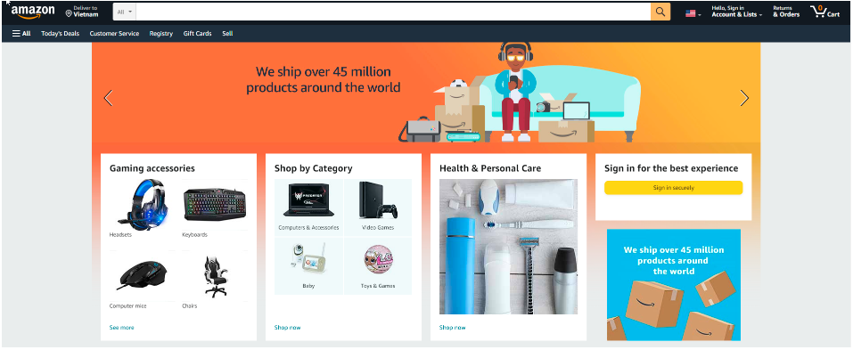
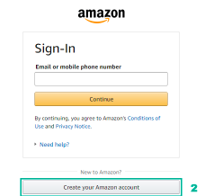
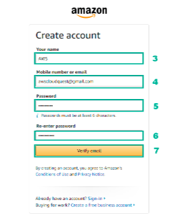

.. raw:: html

   <h1 class="center-title">Create an Account on Amazon</h1>

.. admonition:: Info

   To log in, you must use an Amazon e-commerce account.
   If you don’t have one, follow the steps below.

Steps to Create an Amazon Account
---------------------------------

1. Visit https://www.amazon.com/

2. Select Create a new Amazon account

3. Enter User name
4. Enter Mobile number and Email address to connect
5. Enter Password
6. Enter Re-enter password
7. Next, select Verify

8. New page appears, enter six-digit OTP in the space provided
9. Select Create your Amazon account

.. image:: pictures/imager4.png
   :align: center
   :width: 200px

.. note::

   Before creating an account, make sure you are using a valid mobile number because adding a mobile number is required to create a new account on Amazon.in, while adding a location email only is optional.

You can sign in to Your Account at any time by clicking Your Account at the top of each page. You just need to enter the same Mobile number or Email address and Password to access your account.

