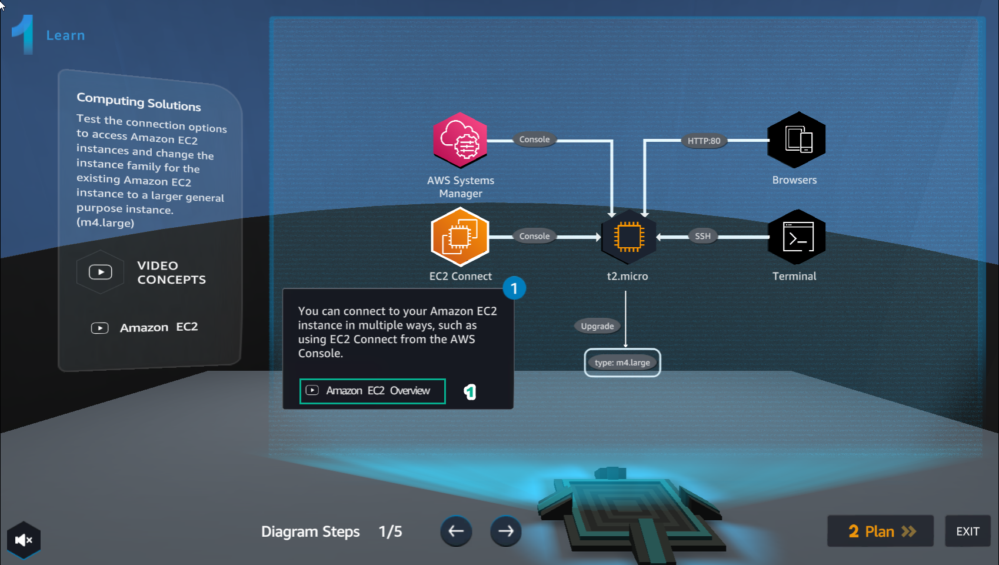
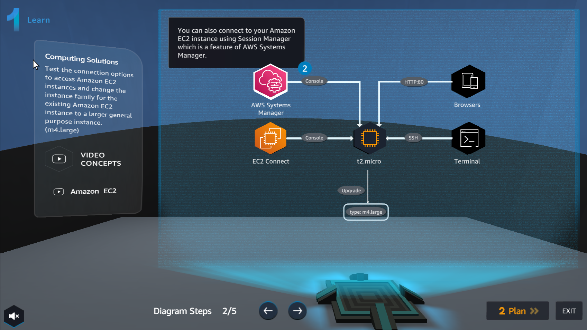
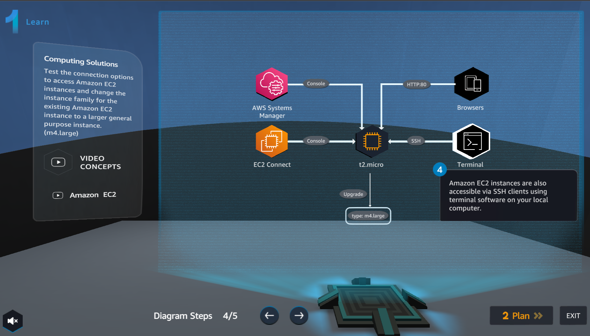
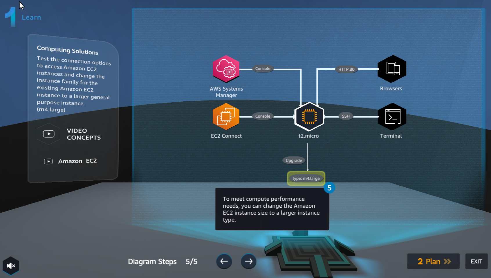

## Learn

Learn helps players understand more about Amazon EC2 theory  
Learn

1. After entering the Learn interface, select **Amazon EC2 Overview**  

2. Watch **VIDEO CONCEPTS**, then select **X**  

.. image:: pictures/0002-learn.png
   :align: center
   :width: 7000px

3. In the Learn interface, select the **right arrow** to view **step 2** of Diagram Steps  

4. Continue to select the **right arrow** to see **step 3** of Diagram Steps  

.. image:: pictures/0004-learn.png
   :align: center
   :width: 7000px

5. Continue to select the **right arrow** to see **step 4** of Diagram Steps  

6. Continue to select the **right arrow** to see **step 5** of Diagram Steps  

