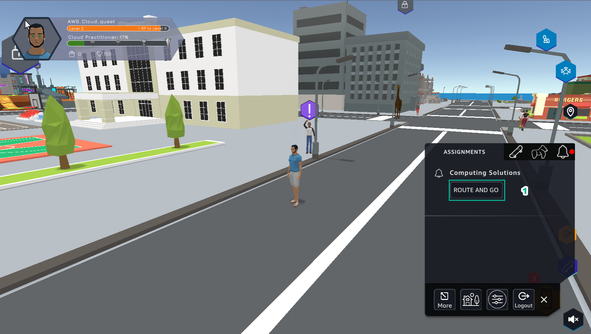
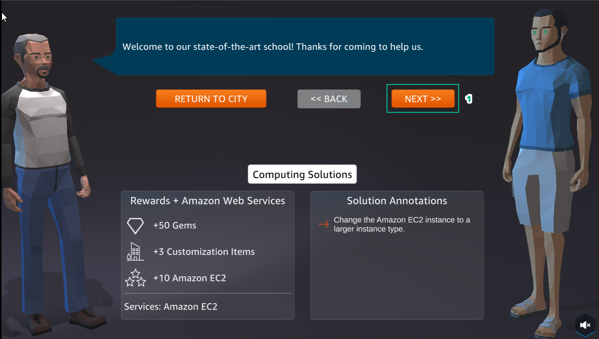
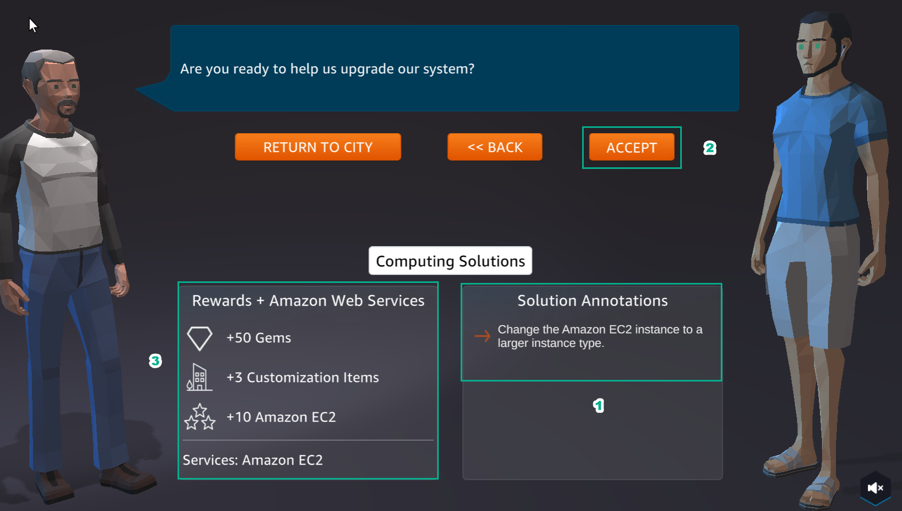
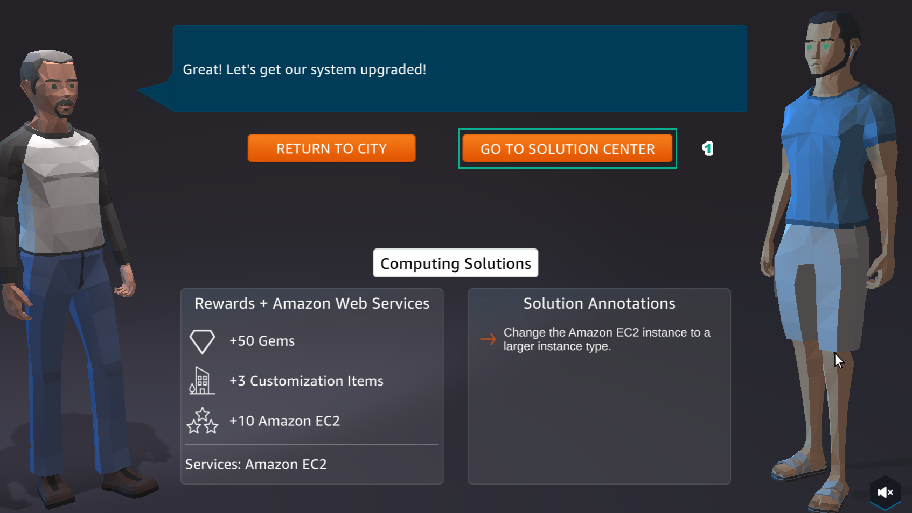
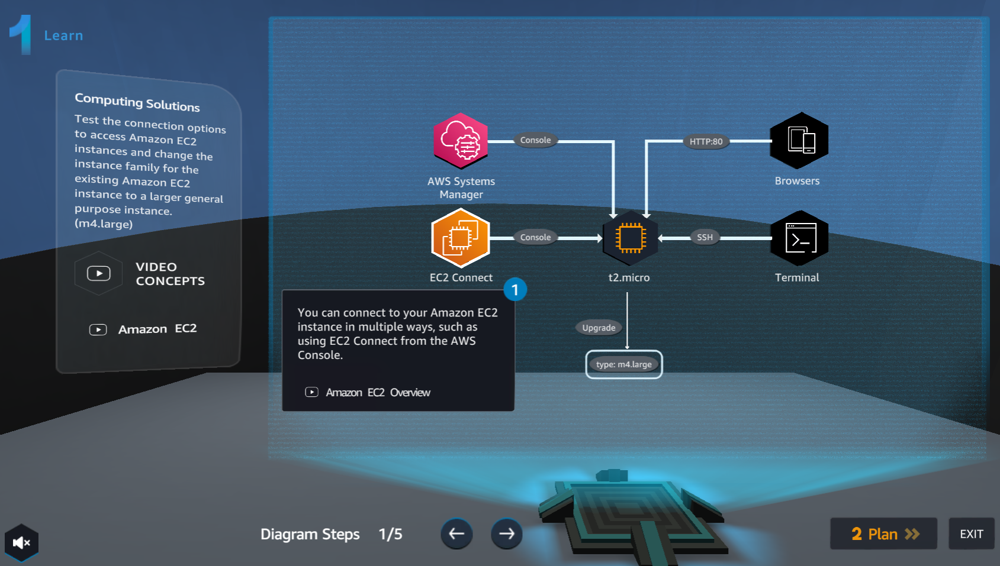

 A3 - Connect to an EC2 Instance
**Lab #3 of AWS Cloud Quest: Cloud Practitioner**  
**Title:** Connect to an EC2 Instance

---

🏆 After completing Assignment 2:
Continue with the following steps to complete Assignment 3.

---

 ✅ Step-by-Step Instructions

1. In **ASSIGNMENT**, select **ROUTE AND GO**  
   

2. Select **NEXT**  
   

3. Read **Computing Solutions** and select **ACCEPT**  
   

4. Select **GO TO SOLUTION CENTER**  
  

5. In **Getting Started**, select **Learn**  
   

