DIY
========

.. admonition:: Info

  After completing the lab, the player does DIY

1. In the AWS Console interface

- Find Amazon DynamoDB
- Select Amazon DynamoDB
- Select Create table

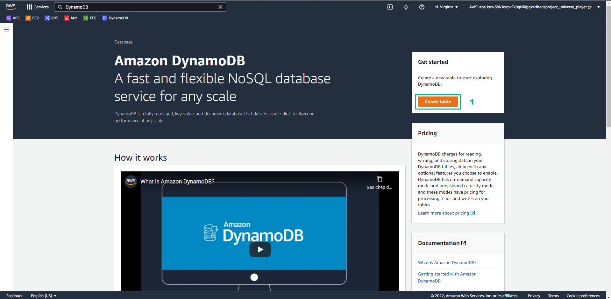

2. In the DynamoDB interface

- Select Update settings
- Select UserVideoHistory
- Select Actions
- Select Create item

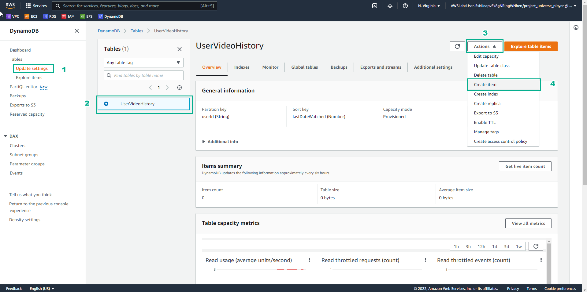

3. In the Create item interface

- In userId, enter 12345-abcd-6785
- In lastDateWatched, enter 1619156407

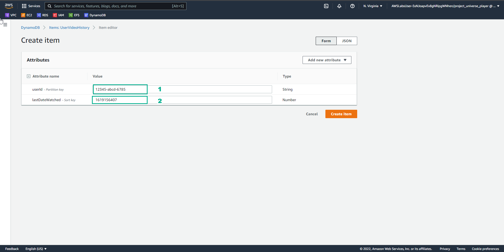

4. In the Create item interface

- Select Add new attribute
- Select Number

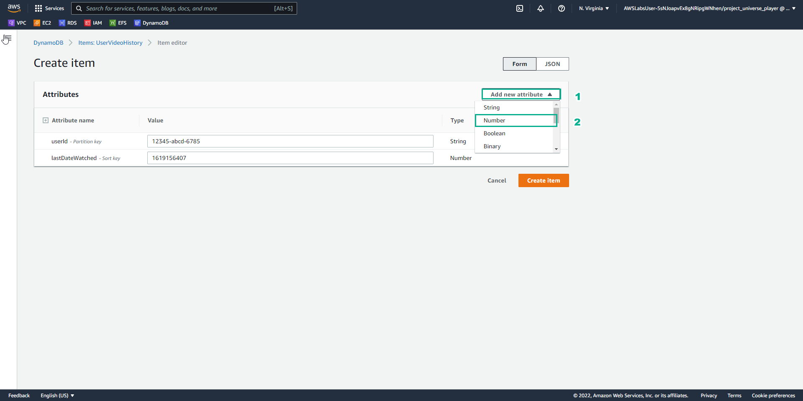

5. In the Create item interface

- Attribute name, enter Rating ** (note to lowercase)**
- Value, enter 5
- Select Create item

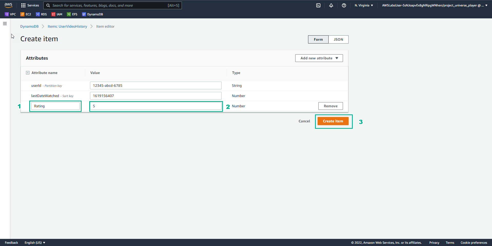

6. In the DynamoDB interface

- View Items returned

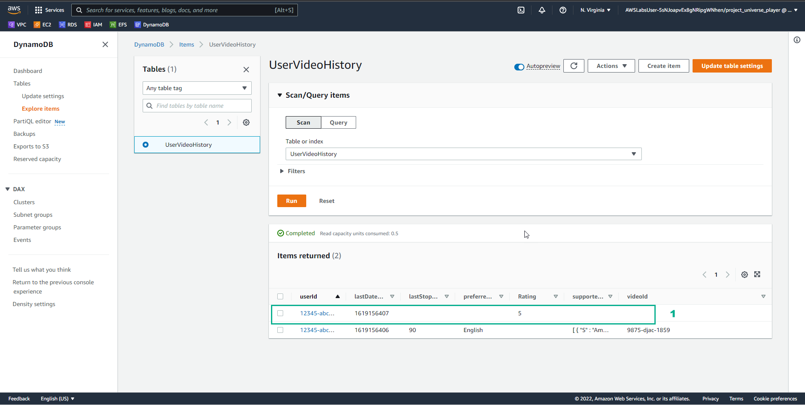

7. In the Item editor interface

- In Attribute name, enter rating
- Select Save changes

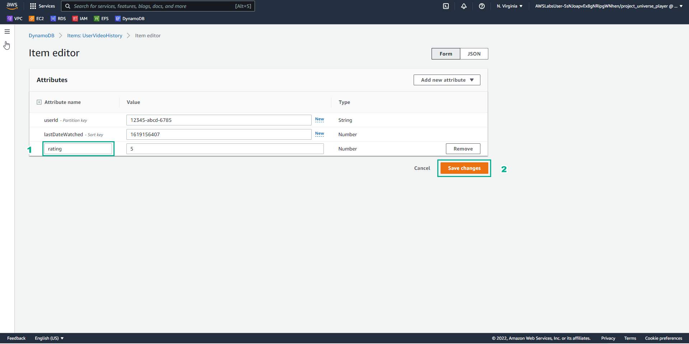

8. In the DIY interface

- Enter UserVideoHistory into DynamoDB table name
- Enter *12345-abcd-6785 in Item User Id
- Select VALIDATE
- After selecting VALIDATE, VALIDATION MESSAGE appears The DynamoDB record has been correctly configured! Good job!…

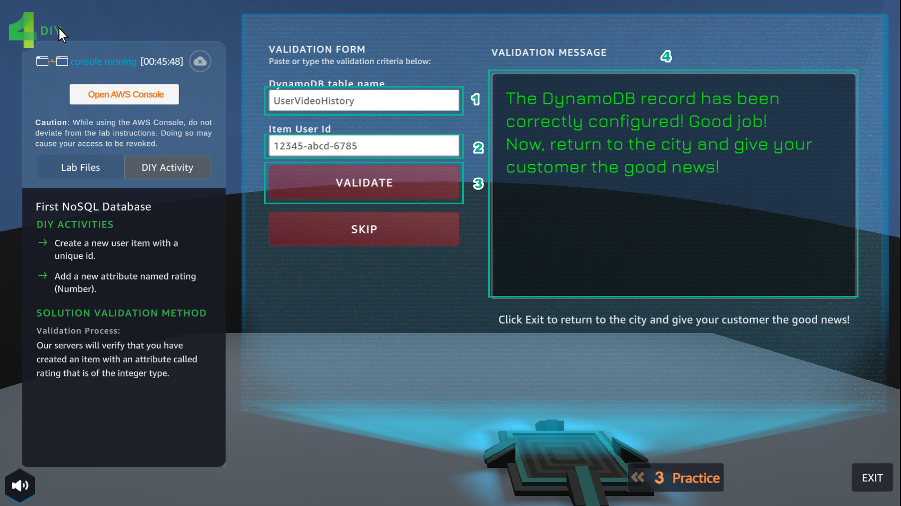

9. In the DIY interface

- Select EXIT to exit

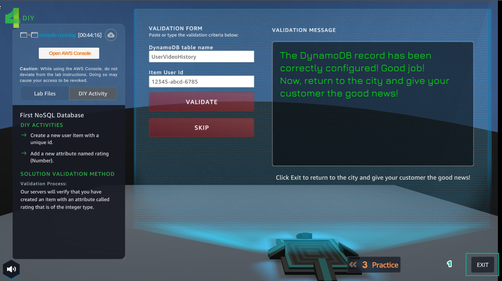

10. In the city interface

- Select ASSIGNMENTS
- Select COLLECT

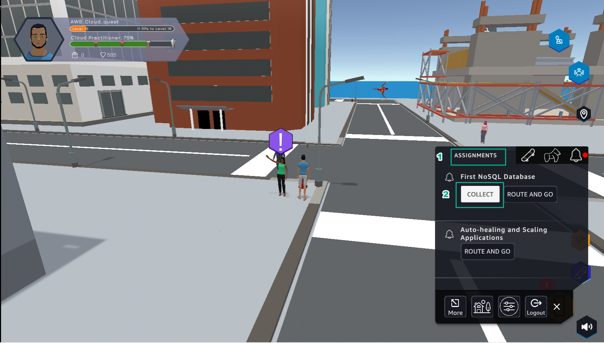

11. Select NEXT

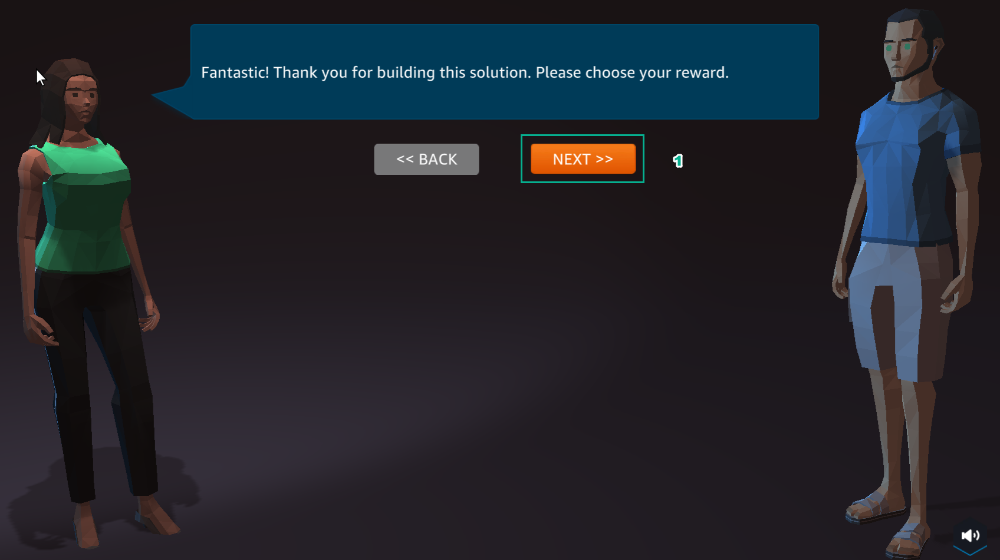

12. Select COLLECT 

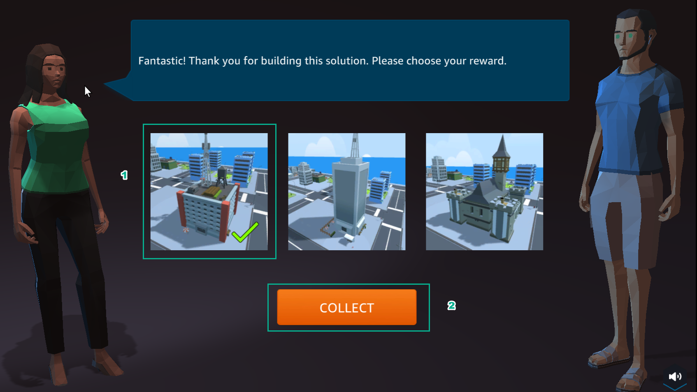

13. Congratulations on completing DIY

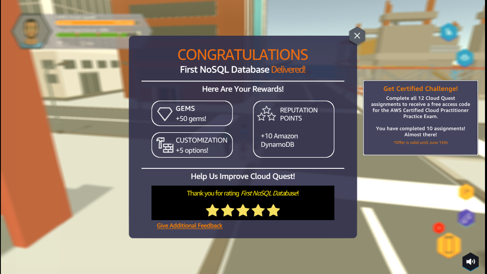

