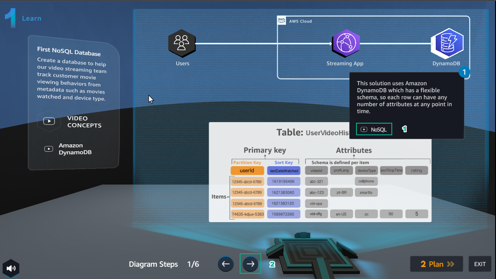
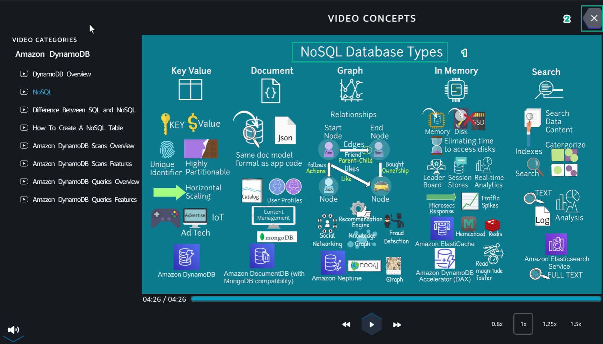
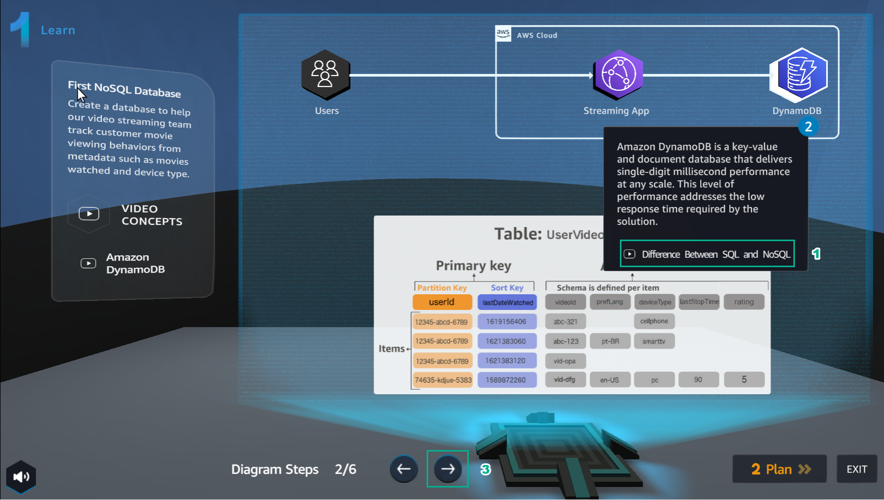
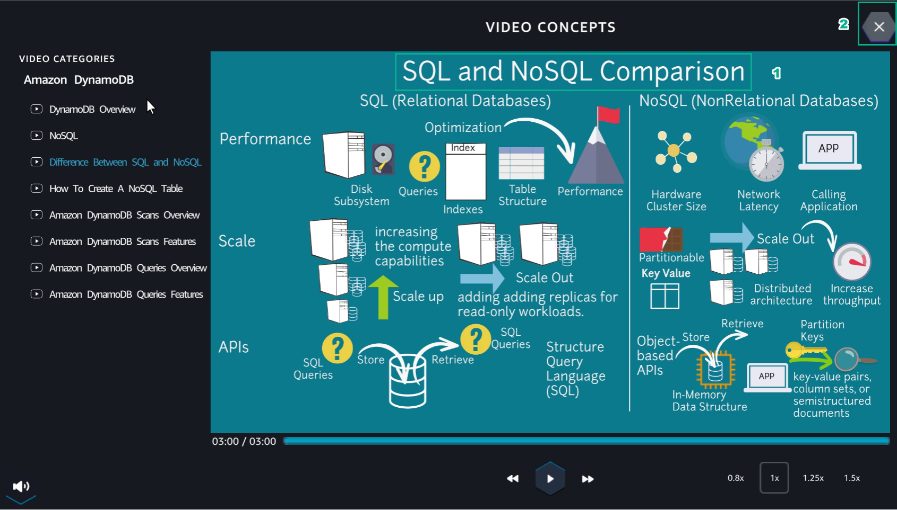
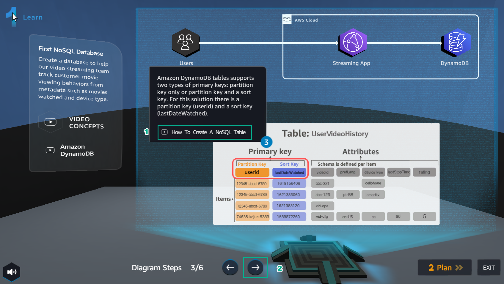
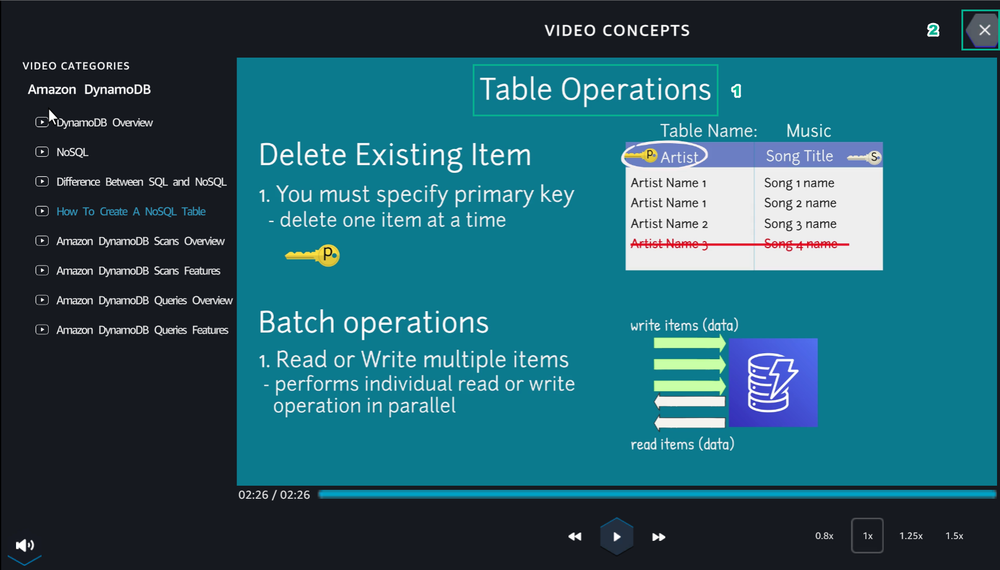
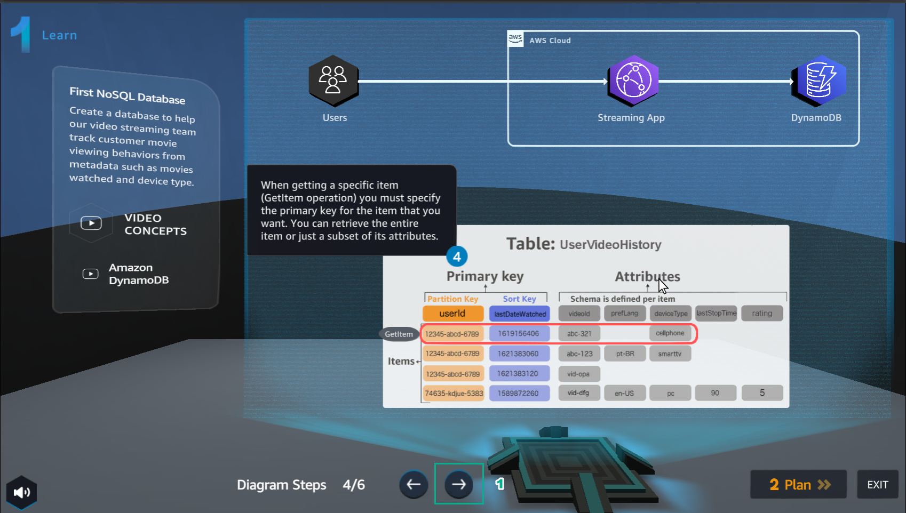
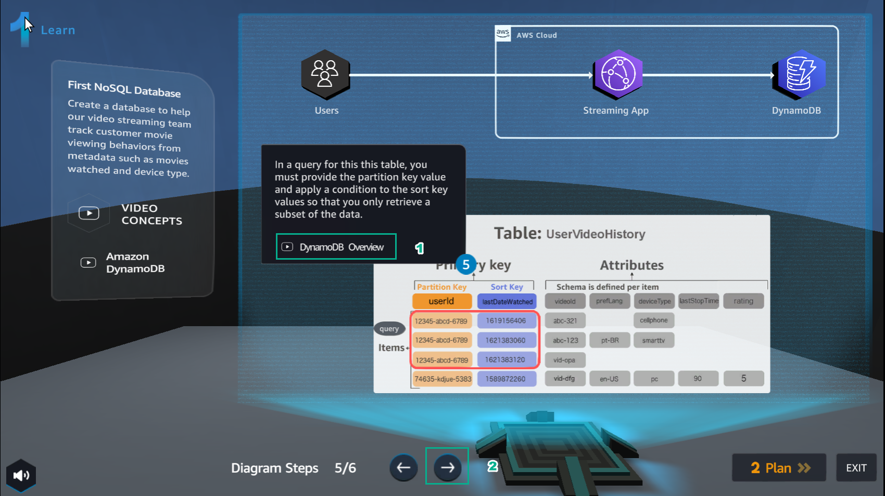
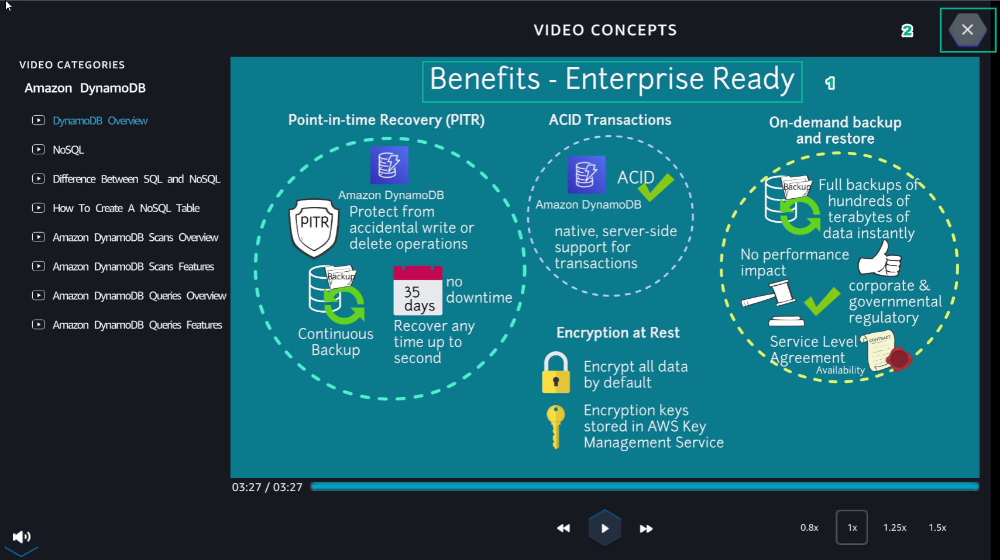
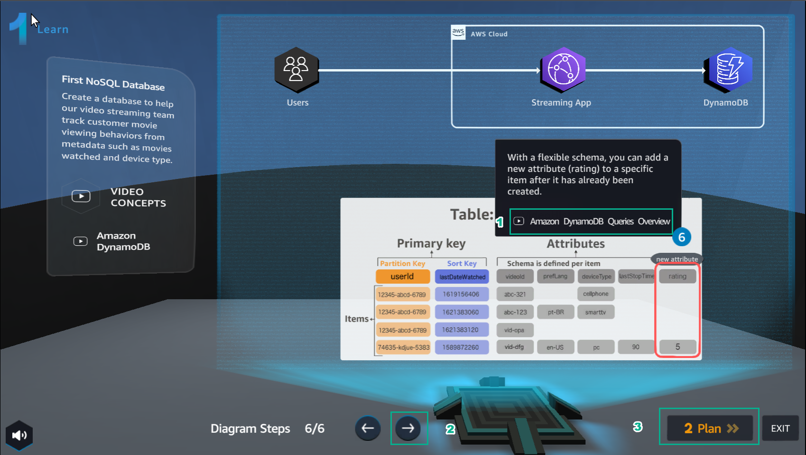

Learn
========

.. admonition:: Info

  Learn helps players to understand more theory about

1. In the Learn interface

- Select NoSQL

2. In the VIDEO CONCEPTS interface

- Watch video NoSQL
- Select X to exit

3. In the Learn interface

- Select Difference Between SQL and NoSQL

4. In the VIDEO CONCEPTS interface

- Watch video Difference Between SQL and NoSQL
Select X

5. In the Learn interface

- Select How ​​To Create A NoSQL Table

6. In the VIDEO CONCEPTS interface

- Watch the video How ​​To Create A NoSQL Table
- Select X to exit

7. See step 4 of Diagram Steps

8. In the Learn interface

- Select DynamoDB Overview

9. In the VIDEO CONCEPTS interface

- Watch video DynamoDB Overview

10. In the Learn interface

- Select Amazon DynamoDB Queries Overview
- After watching the video, select X to exit
- Select Plan

