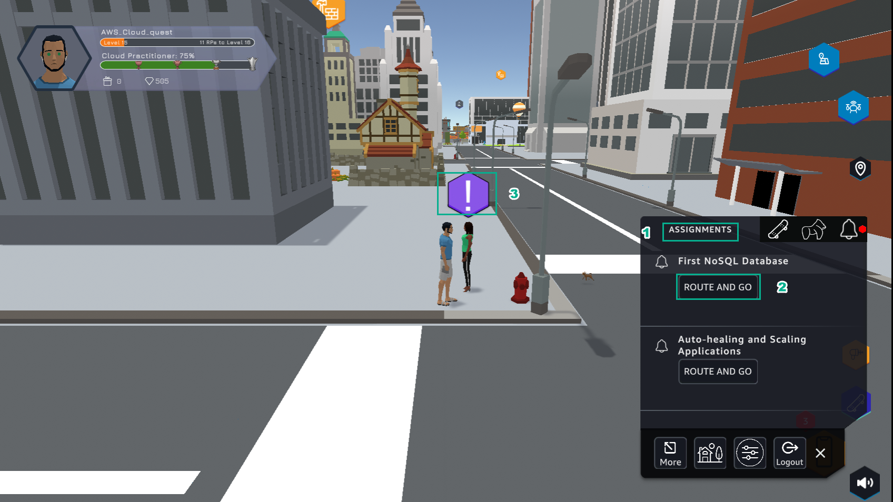
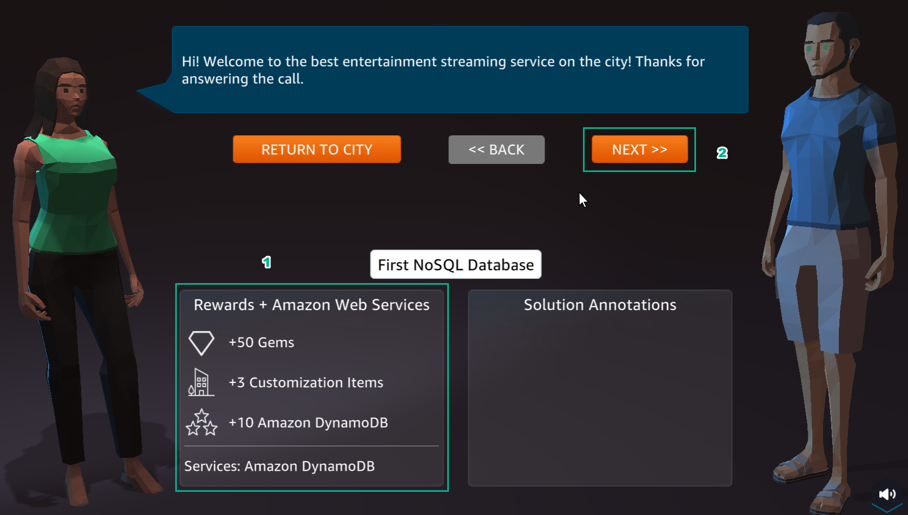
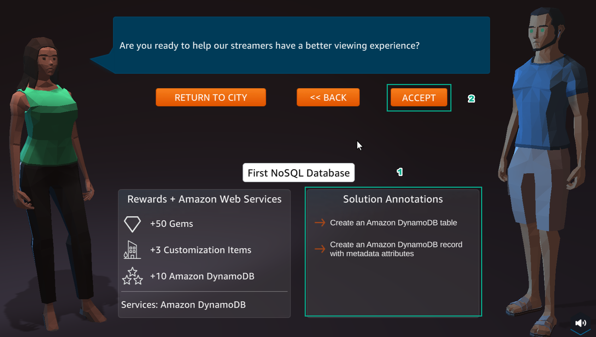
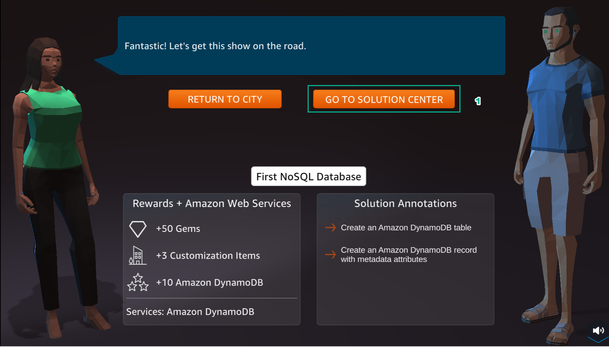

A10 - NOSQL DATABASES
============

**Overview**

AWS Cloud Quest: Cloud Practitioner’s 10th lab is Creating and Querying an Amazon DynamoDB Table

1. In the city interface

- Select ASSIGNMENTS
- Select ROUTE AND GO
- Select !

2. In the First NoSQL Database interface

- View Rewards
- Select NEXT

3. In the First NoSQL Database interface

- See Solution Annotations
- Select ACCEPT

4. Select GO TO SOLUTION CENTER

