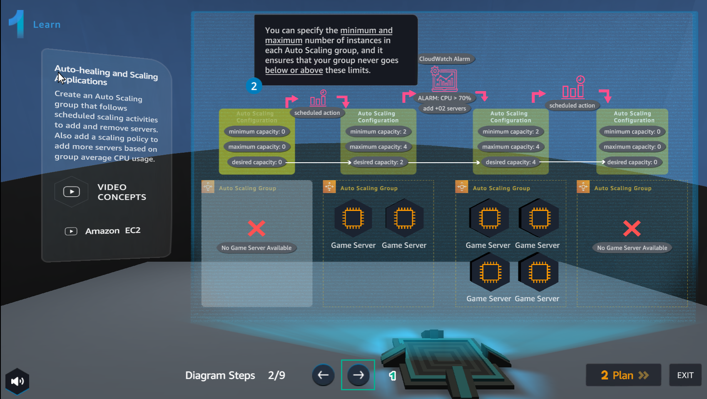
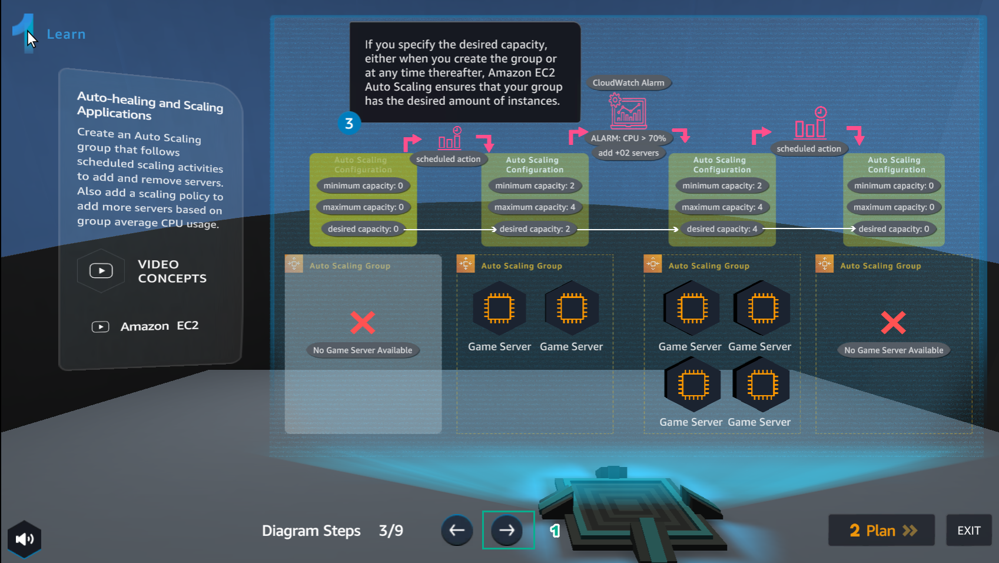
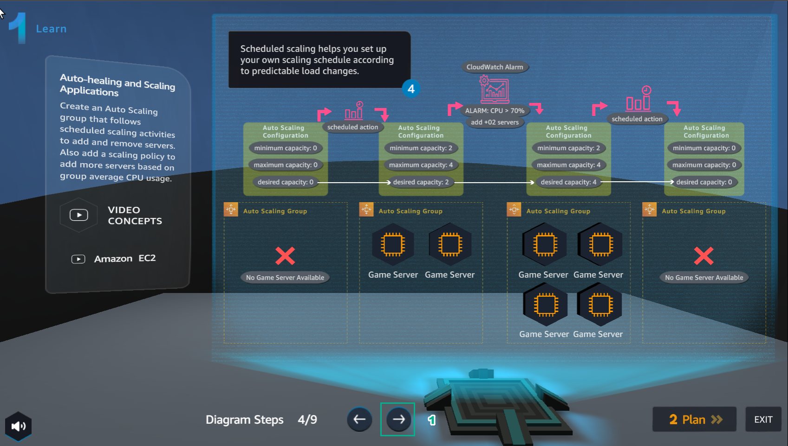
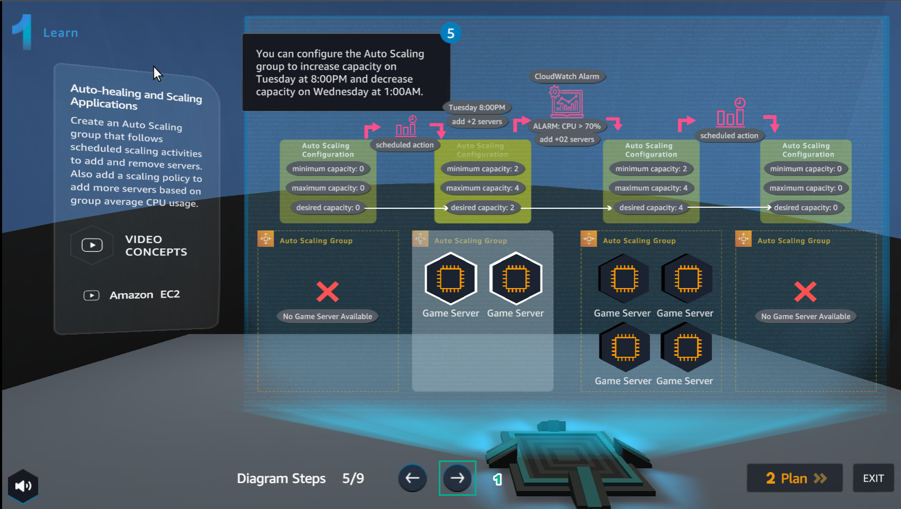
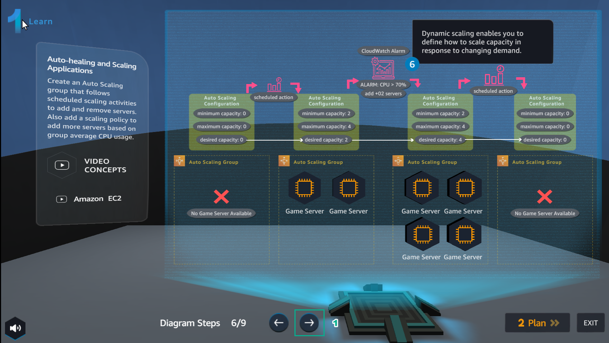
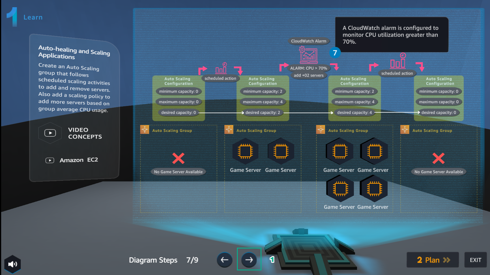
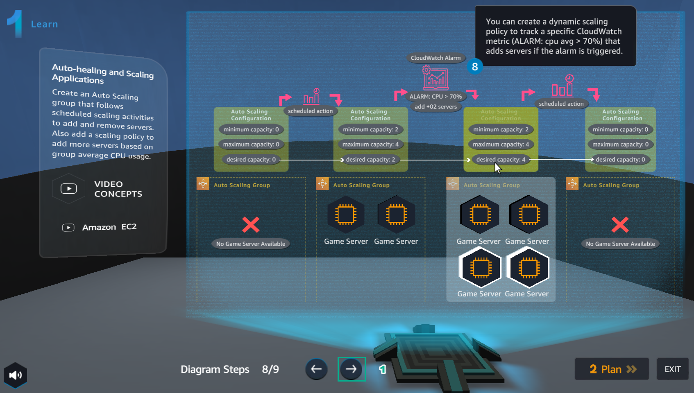
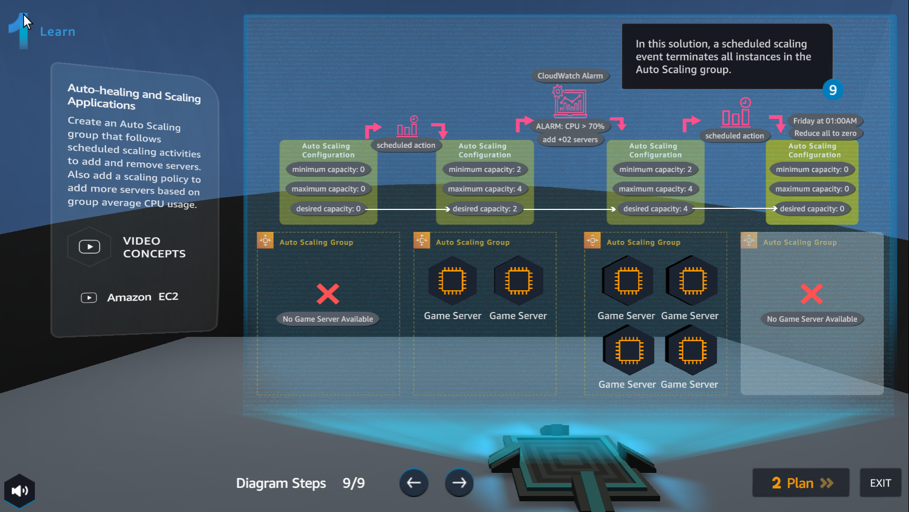

Learn
===========

.. admonition:: Info

  Learn helps players to understand more theory about Auto-healing and Scaling Applications

1. In the Learn interface

- See step 1 of Auto-healing and Scaling Applications

.. image:: pictures/0001-learn11.png
   :align: center
   :width: 7000px

2. In the Learn interface

- See step 2 of Auto-healing and Scaling Applications

3. In the Learn interface

- See step 3 of Auto-healing and Scaling Applications

4. In the Learn interface

- See step 4 of Auto-healing and Scaling Applications

5. In the Learn interface

- See step 5 of Auto-healing and Scaling Applications

6. In the Learn interface

- See step 6 of Auto-healing and Scaling Applications

7. In the Learn interface

- See step 7 of Auto-healing and Scaling Applications

8. In the Learn interface

- See step 8 of Auto-healing and Scaling Applications

9. In the Learn interface

- See step 9 of Auto-healing and Scaling Applications

