Practice
===========

.. admonition:: Info

After watching Plan, the player prepares for Practice


1. In the Practice interface

- Read step 1 of Auto-healing and Scaling Applications
- Read CONCEPT
- Select START LAB
- Select the arrow to the right to see the next steps


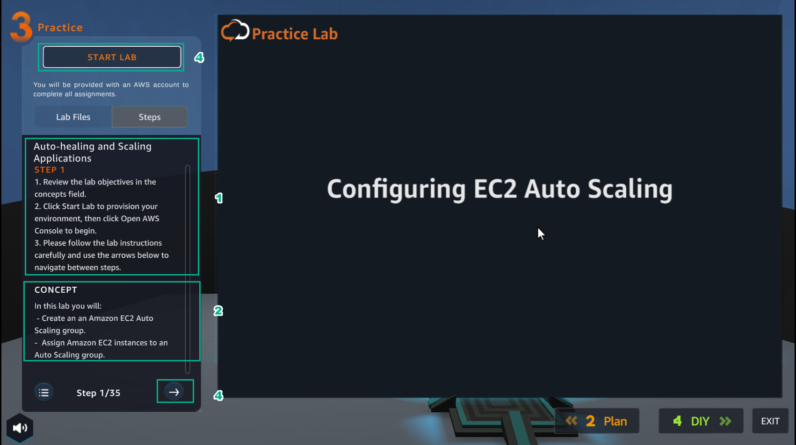


2. In the Practice interface

- Read step 2 of Auto-healing and Scaling Applications
- Read CONCEPT
- Select Open AWS Console
- Select the arrow to the right to see the next steps


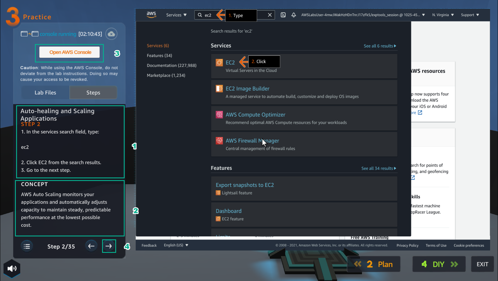


3. In the AWS Console interface
- Find EC2
- Select EC2


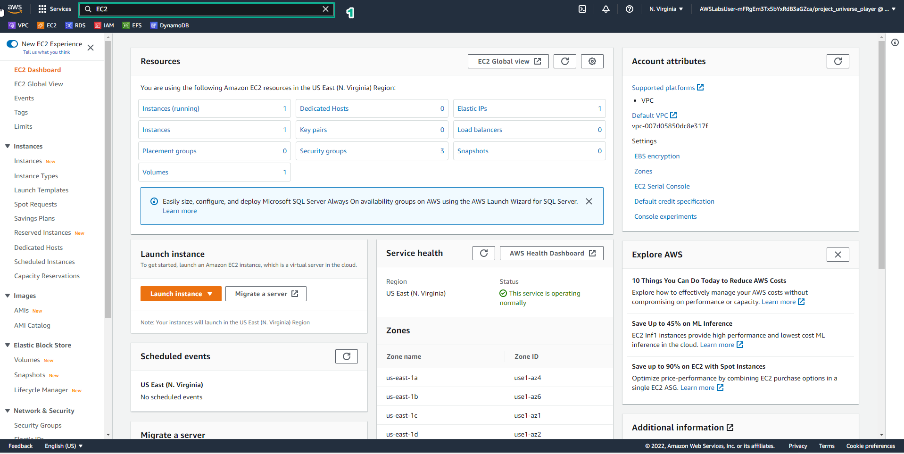


4. In the Practice interface
- Read step 3 of Auto-healing and Scaling Applications
- Read CONCEPT
- Select the arrow to the right to see the next steps


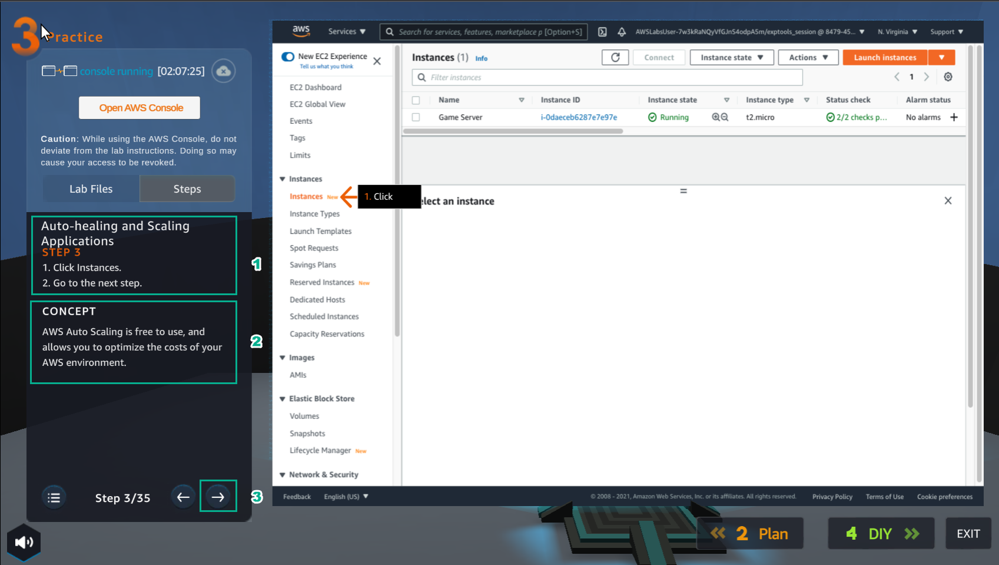


5. In the EC2 interface

- Select Instances


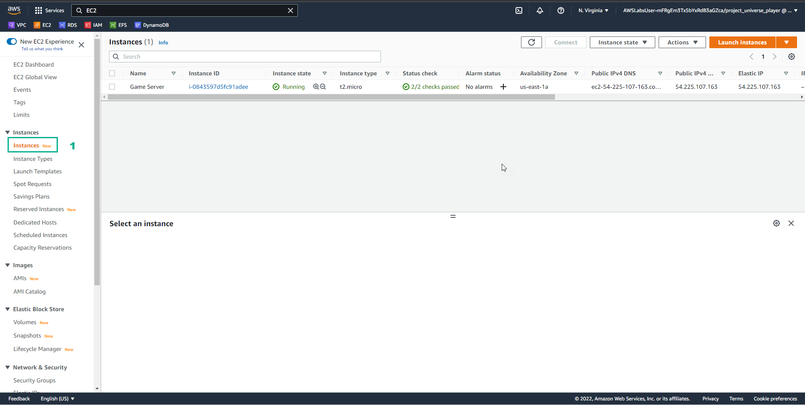


6. In the Practice interface

- Read step 4 of Auto-healing and Scaling Applications
- Read CONCEPT
- Select the arrow to the right to see the next steps


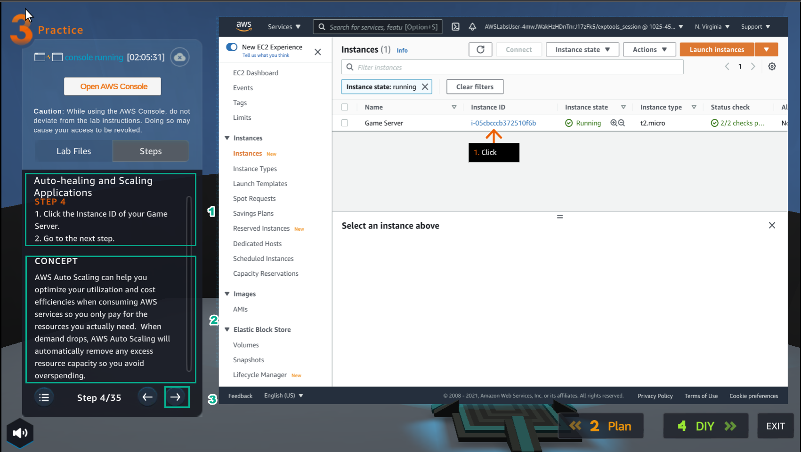


7. In the Instances interface

- Select Game Server


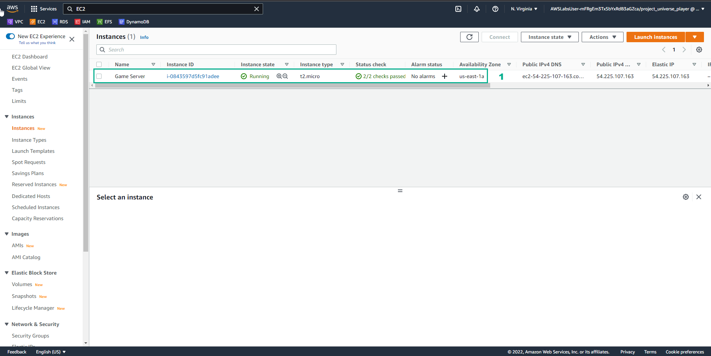


8. In the Practice interface

- Read step 5 of Auto-healing and Scaling Applications
- Read CONCEPT
- Select the arrow to the right to see the next steps


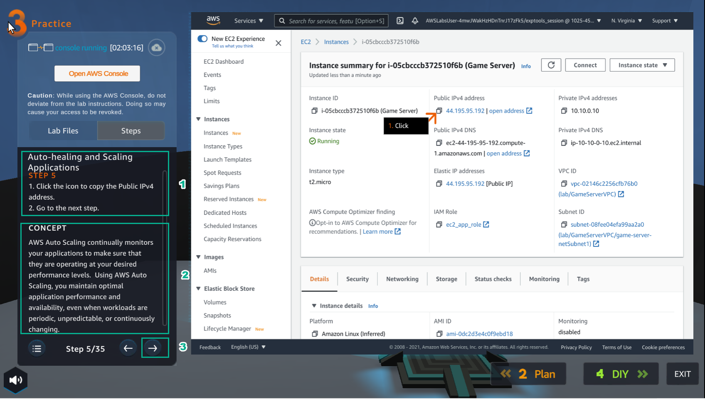


9. In the Instances interface

- View details Game Server
- Copy Public IPv4 address


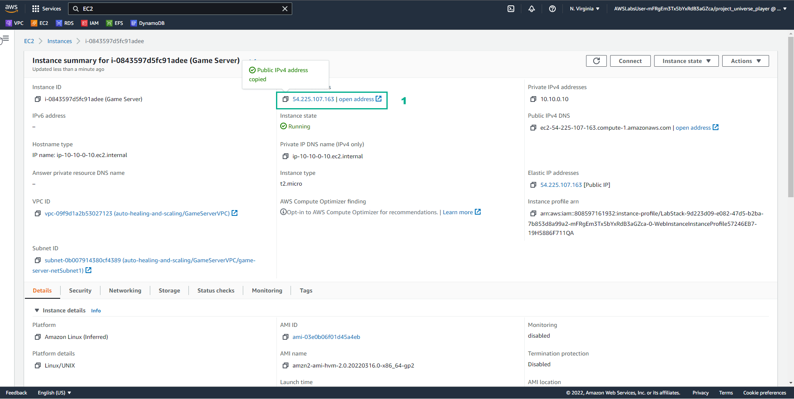


10. Open the browser

- Paste Public IPv4 address
- Select Enter
- View results


.. image:: pictures/00010-practice11.png
   :align: center
   :width: 7000px


11. In the Practice interface

- Read step 7 of Auto-healing and Scaling Applications
- Read CONCEPT
- Select the arrow to the right to see the next steps


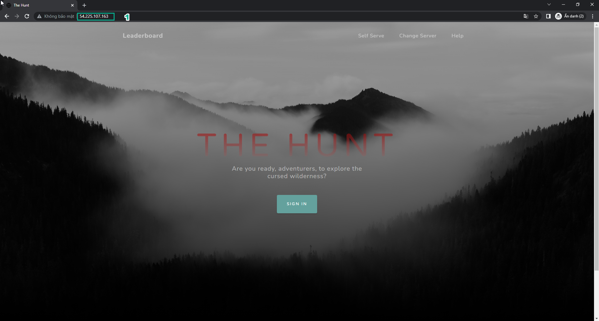


12. In the EC2 interface

- Select Instances
- Select Game Server
- Select Actions
- Select Image and templates
- Select Create image


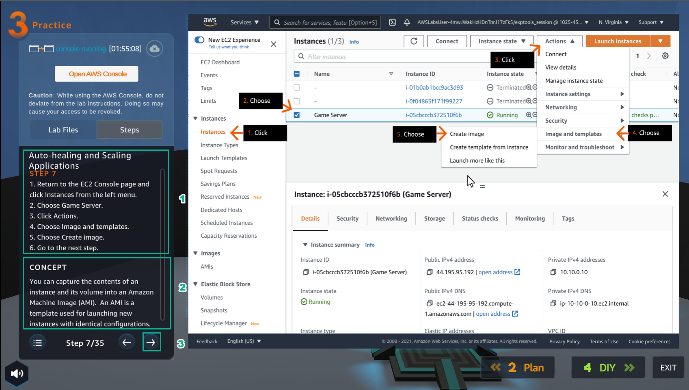


13. In the Practice interface

- Read step 8 of Auto-healing and Scaling Applications
- Read CONCEPT
- Select the arrow to the right to see the next steps


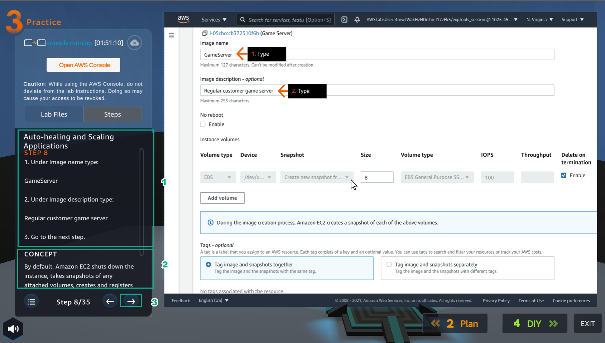


14. In the Create image interface

- Image name, enter ```Game Server````
- Image description, enter Regular customer game server


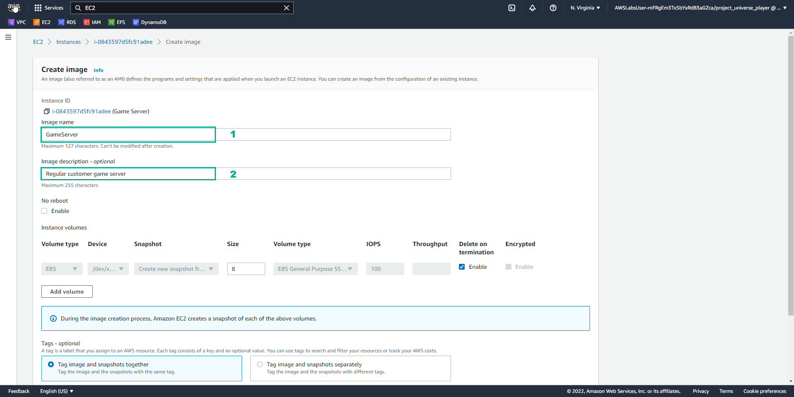


15. In the Practice interface

- Read step 9 of Auto-healing and Scaling Applications
- Read CONCEPT
- Select the arrow to the right to see the next steps


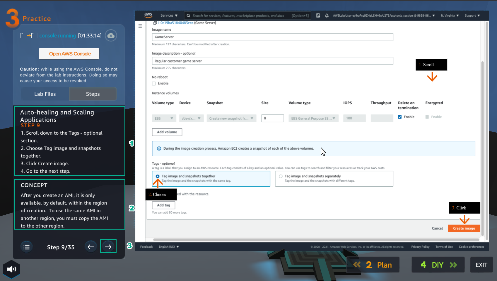


16. In the Create image interface

- Tag, select Tag image and snapshots together
- Select Create image


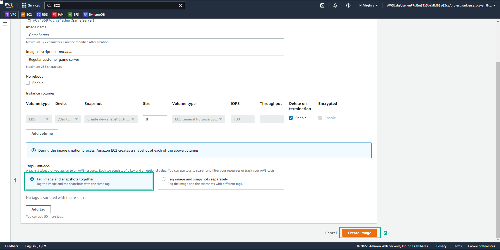


17. In the Practice interface

- Read step 10 of Auto-healing and Scaling Applications
- Select the arrow to the right to see the next steps


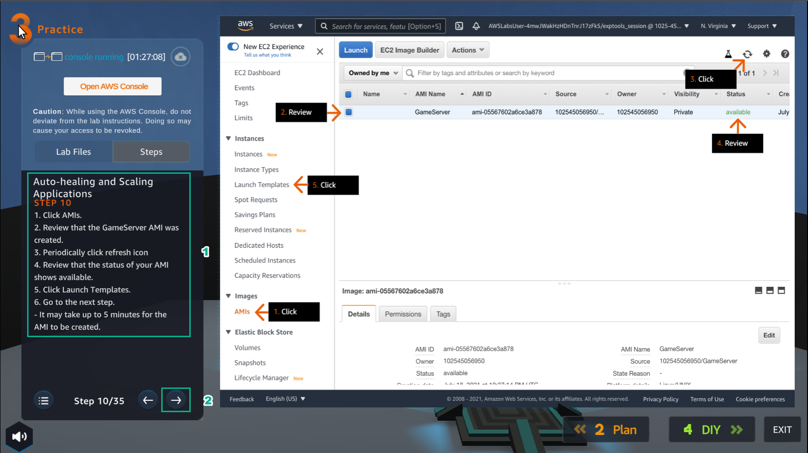


18. In the EC2 interface

- Select AMIs*
- Select Game Server
- Select refresh
- View Status
- Select Launch Templates


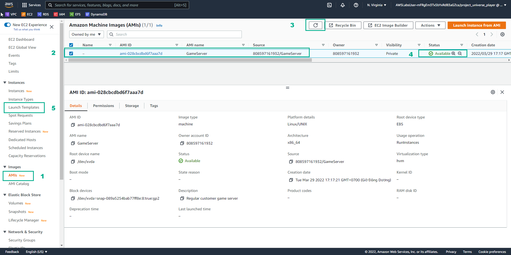


19. In the Practice interface

- Read step 11 of Auto-healing and Scaling Applications
- Read CONCEPT
- Select the arrow to the right to see the next steps


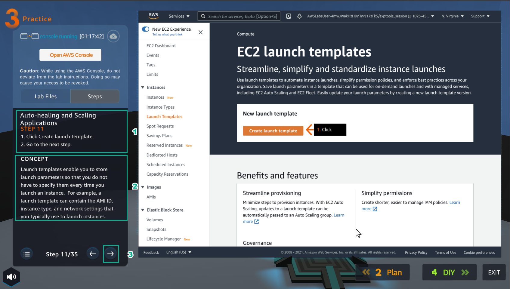


20. In the EC2 launch templates interface

- Select Create launch templates


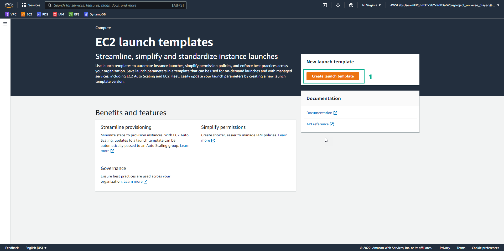


