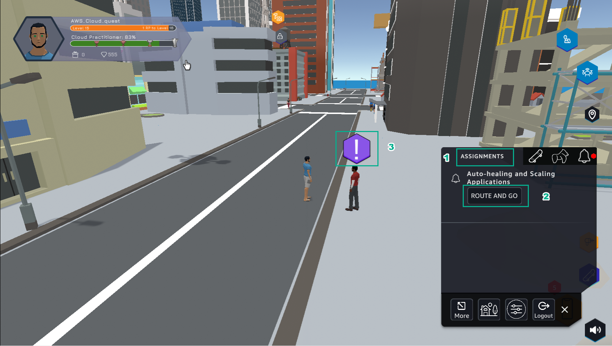
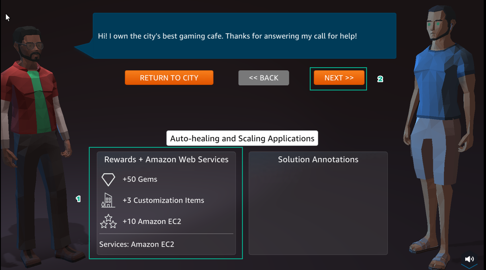
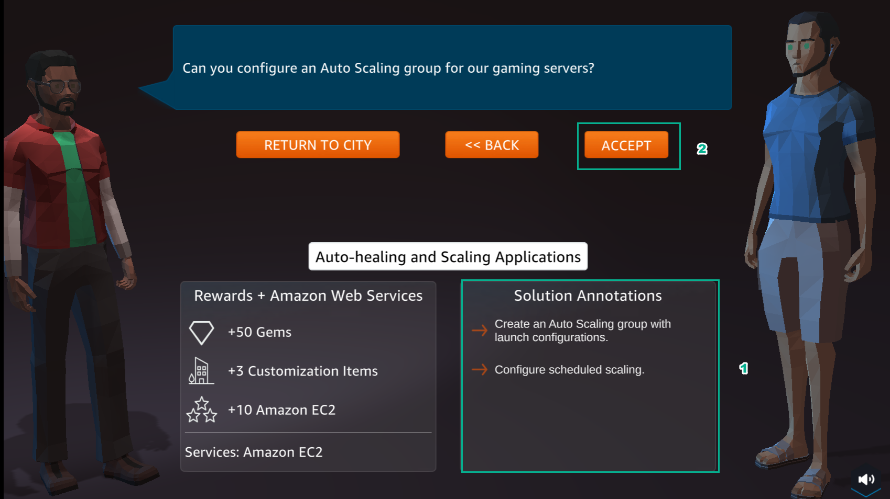
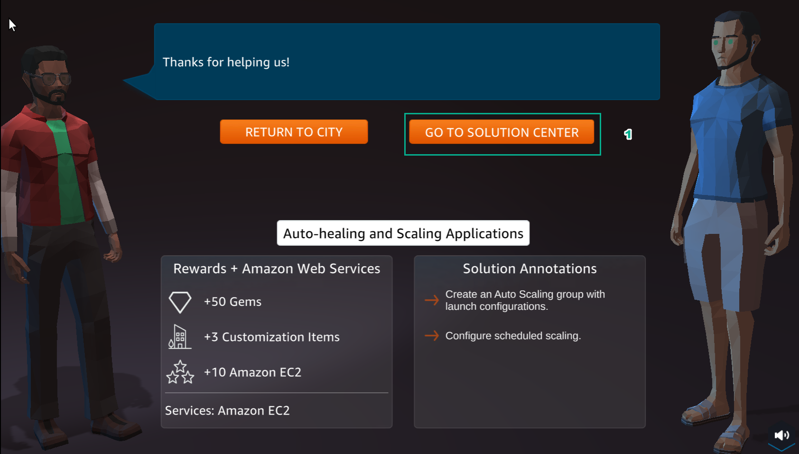

A11 - SCALING
============

**Overview**

The 11th lab of AWS Cloud Quest: Cloud Practitioner is Configuring EC2 Auto Scaling

1. In the city interface

- Select ASSIGNMENTS
- Select ROUTE AND GO

2. In the Auto-healing and Scaling Applications interface

- View Rewards
- Select NEXT

3. Select ACCEPT

4. Select GO TO SOLUTION CENTER

.. toctree::
   :maxdepth: 1
   

   a11_learn
   a11_plan
   a11_practice
   a12_diy

