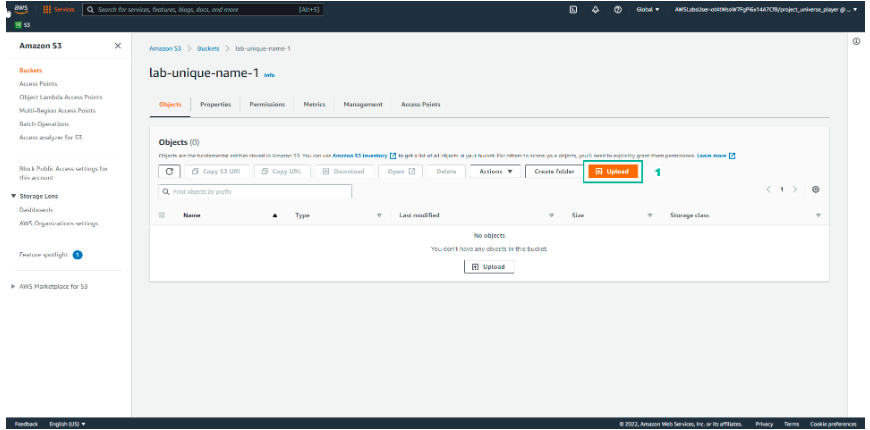
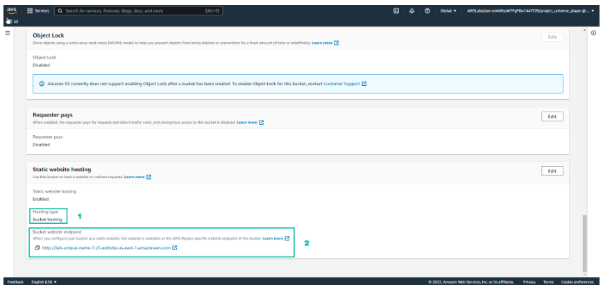

Practice
===========

.. admonition:: Info

  After watching **Plan**, the player prepares for **Practice**

1. In the **Practice** interface.

- Read step 1 of **Cloud Computing Essentials**
- Read **CONCEPT**
- Select **START LAB**
- Select the arrow to the right to see the next step

.. image:: pictures/imagepractice1.png
   :align: center
   :width: 7000px

2. In the **Practice** interface.

- Read step 2 of Cloud Computing Essentials
- Select Open AWS Console

3. In the **Practice** interface.

- Select **Lab Files**
- Download **labcode.zip** to your device
- After downloading, extracting files will be as shown

4. In the **Practice** interface.

- Read step 3 of **Cloud Copunting Essentials**
- Select the arrow to the right to see the next steps

5. In the **Practice** interface.

- Read step 4 of **Cloud Computing Essentials**
- Read **CONCEPT**
- Select the arrow to the right to see the next steps

6. In the **Amazon S3** interface.

- Find **S3**
- Select **S3**

.. image:: pictures/imagepractice6.png
   :align: center
   :width: 7000px

7. In the **Practice** interface.

- Read step 5 of **Cloud Computing Essentials**
- Read **CONCEPT**
- Select the arrow to the right to see the next steps

8. In the **Amazon S3** interface. 

- Select **Buckets**
- Select **Create bucket**

9. In the **Practice** interface.

- Read step 6 of **Cloud Computing Essentials**
- Read **CONCEPT**
- Select the arrow to the right to see the next steps

.. image:: pictures/imagepractice9.png
   :align: center
   :width: 7000px

10. In the **Create bucket** interface:

- **Bucket name**, enter ``lab-unique-name-1``
- **AWS Region**, enter **US East (N. Virginia)** ``us-east-1``

.. note::

   The bucket name is unique, once the name has been set, it cannot be reset.

.. image:: pictures/imagepractice10.png
   :align: center
   :width: 1000px

11. In the **Practice** interface.

- Read step 7 of **Cloud Computing Essentials**
- Select the arrow to the right to see the next steps

12. In **Object Ownership**.

- Select **ACLs enabled**
- Select **Object writer**

13. In the **Practice** interface.

- Read step 8 of **Cloud Computing Essentials**
- Read **CONCEPT**
- Select the arrow to the right to see the next steps

14. In the **Amazon S3** interface.

- Uncheck **Block all public access**
- Select I **acknowledge…**

15. In the **Practice** interface.

- Read step 9 of **Cloud Computing Essentials**
- Read **CONCEPT**
- Select the arrow to the right to see the next steps

16. In the **Amazon S3** interface.

- In the **Default encryption** section, select **Enable**
- Select **Amazon S3-managed keys (SSE-S3)
- Select **Create bucket**

17. In the **Practice** interface.

- Read step 10 of **Cloud Computing Essentials**
- Read **CONCEPT**
- Select the arrow to the right to see the next steps

18. In the **Amazon S3** interface.

- Select **View details**

19. In the **Practice** interface.

- Read step 11 of **Cloud Computing Essentials**
- Read **CONCEPT**
- Select the arrow to the right to see the next steps

20. In the **Amaozon S3** interface.

- Select **Upload**

21. In the **Practice** interface.

- Read step 12 of **Cloud Computing Essentials**
- Select the arrow to the right to see the next steps

22. In the **Amazon S3** interface.

- Select **Add files**
- Select uploaded files extracted from **labcode.zip**
- Select **Upload**

.. image:: pictures/imagepractice22.png
   :align: center
   :width: 7000px

23. In the **Practice** interface.

- Read step 13 of **Cloud Computing Essentials**
- Read **CONCEPT**
- Select the arrow to the right to see the next steps

24. In the **Amazon S3** interface.

- View successfully uploaded files
- Select **Close**

25. In the **Practice** interface.

- Read step 14 of **Cloud Computing Essentials**
- Select the arrow to the right to see the next steps

26. In the **Amazon S3** interface.

- Select and view files
- Select **Actions**
- View the **Edit actions**

27. In the **Practice** interface.

- Read step 15 of **Cloud Computing Essentials**
- Read **CONCEPT**
- Select the arrow to the right to see the next steps

28. In the **Amazon S3** interface.

- Select **Properties**

29. In the **Practice** interface.

- Read step 16 of **Cloud Computing Essentials**
- Bury arrow to the right to see next steps

30. In the **Amazon S3** interface.

- Select **Edit**

31. In the **Practice** interface.

- Read step 17 of **Cloud Computing Essentials**
- Read **CONCEPT**
- Select the arrow to the right to see the next steps

32. In the interface **Edit static website hosting**:

   - Select **Enable**
   - Select **Host a static website**
   - In **Index document**, enter ``index.html``

33. In the **Practice** interface.

- Read step 18 of **Cloud Computing Essentials**
- Select the arrow to the right to see the next steps

34. In the **Amazon S3** interface.

- Select **Save changes**

35. In the **Practice** interface.

- Read step 19 of **Cloud Computing Essentials**
- Read **CONCEPT**
- Select the arrow to the right to see the next steps

36. In the **Amazon S3** interface.

- Select **Permissions**
- View **Block all public access**
- Select **Edit**

37. In the **Practice** interface.

- Read step 20 of **Cloud Computing Essentials**
- Read **CONCEPT**
- Select the arrow to the right to see the next steps

38. In the **Edit bucket policy** interface.

- Copy **Bucket RNA**
- Remove **Policy**

39. In the **Practice** interface.

- Read step 21 of **Cloud Computing Essentials**
- Select the arrow to the right to see the next steps

.. image:: pictures/imagepractice39.png
   :align: center
   :width: 7000px

40. In the **Edit bucket policy** interface.

- Open the file **policy.text**
- Replace **Bucket ARN** into **Resource**
- Copy the contents of the file **policy.txt**
- Paste in **Policy**

41. In the **Practice** interface.

- Read step 22 of **Cloud Computing Essentials**
- Select the arrow to the right to see the next steps

.. image:: pictures/imagepractice41.png
   :align: center
   :width: 7000px

42. In the **Amazon S3** interface.

- Copy the contents of the file p**olicy.txt**

43. In the **Practice** interface.

- Read step 23 of **Cloud Computing Essentials**
- Select the arrow to the right to see the next steps

44. In the **Amazon S3** interface.

- Select **Save changes**

45. In the **Practice** interface.

- Read step 24 of **Cloud Computing Essentials**
- Read **CONCEPT**
- Select the arrow to the right to see the next steps

46. ​​In the **Amazon S3** interface.

- Select **Properties**

47. In the **Practice** interface.

- Read step 25 of **Cloud Computing Essentials**
- Select the arrow to the right to see the next steps

48. In the **Amazon S** interface.

- See **Hosting type**
- Copy **Bucket website endpoint**

49. In the **Practice** interface.

- Read step 26 of **Cloud Computing Essentials**
- Select the arrow to the right to see the next steps

50. Open a browser.

- Paste **Bucket website endpoint into the browser**
- Select **Enter**
- View results

51. Congratulations to the player on completing the lab

