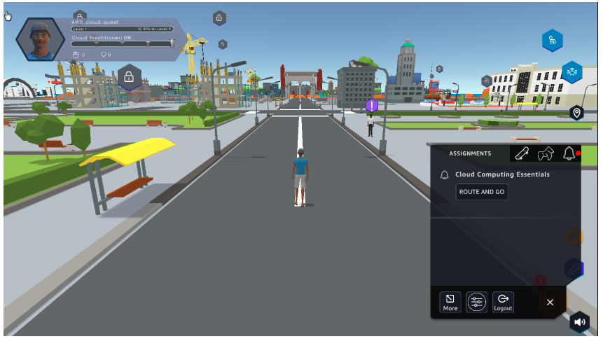
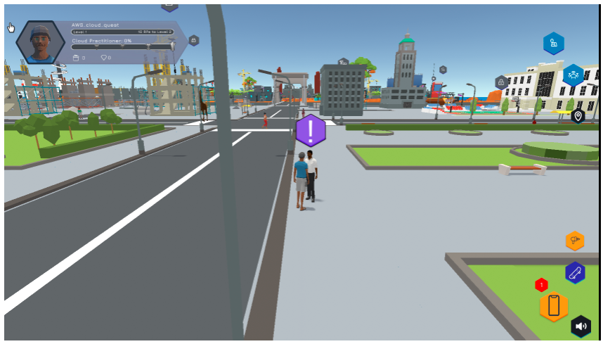
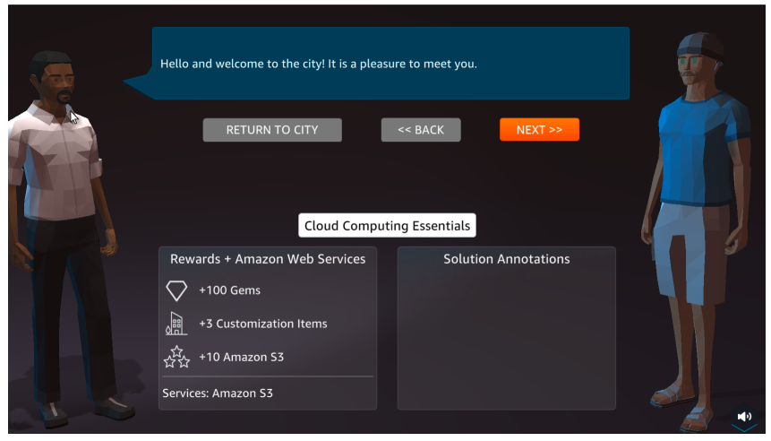
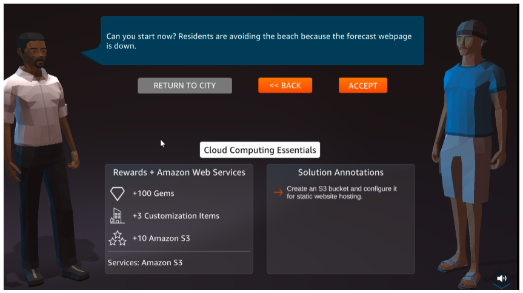
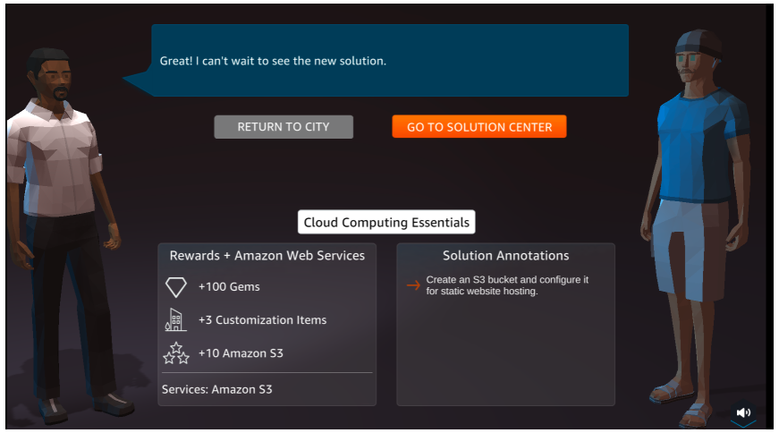
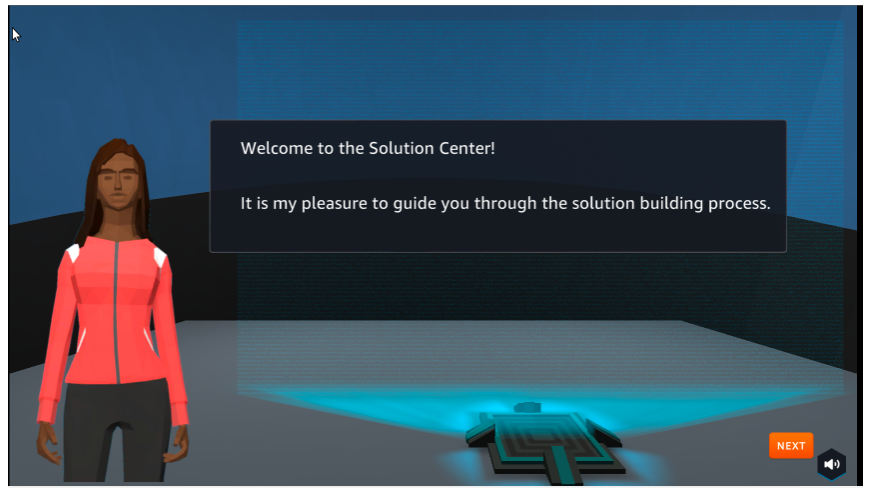
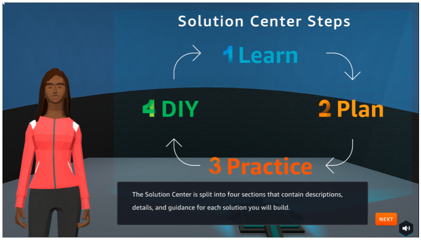

A1 - STATIC WEB HOSTING
======================

**Overview**

In this step we will take the first challenge in **Cloud Quest**.

**Content**

- Learn
- Plan
- Practice
- DIY

**Perform**

1. In the city interface.

- Select ASSIGNMENT
- In Cloud Computing Essentials, select ROUTE AND GO

2. Select the ! icon to go to the next step.

3. Select **NEXT**.

4. In the preparation interface.

- View Rewards
- See Solution Annotations
- Select ACCEPT

5. Select GO TO SOLUTION CENTER.

6. Welcome to Solution Center.

.. toctree::
   :maxdepth: 1
   

   a1_learn

7. Steps of Solution Center Steps.

