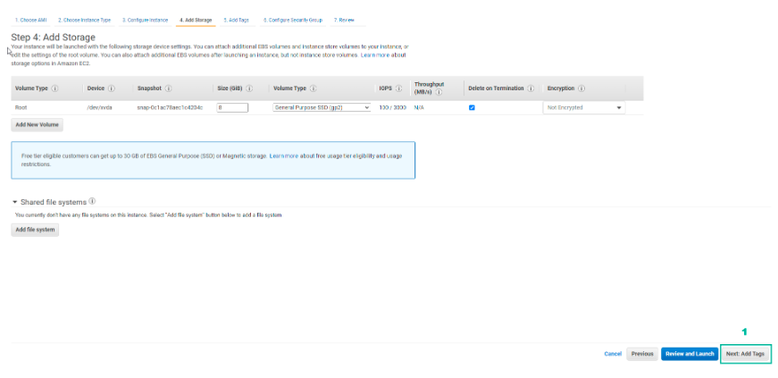

DIY
===========

.. admonition:: Info

  After completing the lab, the player does **DIY**

1. Select **DIY** to make.

2. In the **Plan** interface.

- Read **DIY ACTIVITIES**
- Read **SOLUTION VALIDATION METHOD**
- Select **Open AWS Console**

3. In **AWS Console**, find and select **EC2**.

4. Select **Launch instance**.

5. In **Choose an Amazon Machine Image (AMI)**.

- Select **Amazon Linux 2 AMI (HVM) - Kernel 5.10, SSD Volume Type**
- Select **Select**

6. In **Choose an Instance Type**.

- Select **t2.micro**
- Then select **Next: Configure Instance Details**

.. image:: pictures/imagec6.png
   :align: center
   :width: 7000px

7. In **Configure Instance Details**.

- Select **VPC**
- Choose **Subnet different from the subnet of Practice**

8. In **Advanced Details**.

- Select **As file**
- Select **Select file** and download the file **user-data**
- Select **Next: Add Storage**

9. In **Add Storage**, select **Next: Add Tags**.

10. In **Add Tags**, select **Next: Configure Security Group**.

.. image:: pictures/imagec10.png
   :align: center
   :width: 7000px

11. In **Configure Security Group**, create a security group.

- **Security group name**, enter ``Security-Group-Lab-2``
- **Description**, enter ``HTTP Group Lab 2``
- **Rule**, select **HTTP**
- Select **Review and Launch**

.. image:: pictures/imagec11.png
   :align: center
   :width: 7000px

12. In **Review Instance Launch**, double check and select **Launch**.

13. In **Select an existing key pair or create a new key pair**.

- Select **Proceed without a key pair**
- Select **I acknowledge…**
- Select **Launch Instances**

14. Select **View Instances**.

15. Result of creating 2 **Amazon EC2 Instance**.

16. After creating 2 **Amazon EC2 Instance**, copy both **Instance ID**.

- Paste in **Instance ID in AZ1**
- Paste in **Instance ID in AZ2**
- Select **VALIDATE**

17. After selecting **VALIDATE**, if **VALIDATION MESSAGE** contains **Success!** … is complete.

18. Select **EXIT**.

19. In **ASSIGNMENT** select **COLLECT**.
  

20. Select **NEXT**.

21. Select **COLLECT**.

22. Get **rewarded**.

