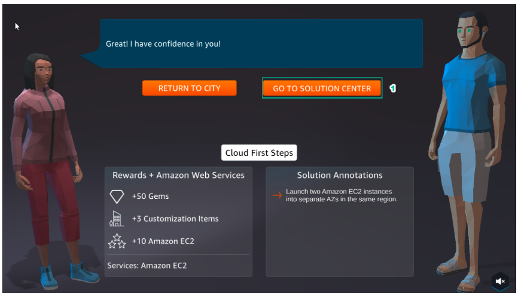

A2 - LAUNCH AN AMAZON EC2 INSTANCE
==================================

Lab #2 of **AWS Cloud Quest: Cloud Practitioner is Launch one EC2 instance**.

.. admonition:: Info
  
  After receiving the Assignment 1 award, continue to perform the following steps to perform Assignment 2

1. Go to **ASSIGNMENTS**, under **Cloud First Steps**, select **ROUTE AND GO**.

2. Select the icon as shown.

3. After entering the **Cloud First Steps** interface, select **NEXT** to see more about **Amazon EC2**, **Availability Zone, AWS Region**.

4. Select **ACCEPT**.

5. Select **GO TO SOLUTION CENTER** to move to the next steps of Assignment.

.. toctree::
   :maxdepth: 1
   

   a2_learn
   a2_plan
   a2_practice

