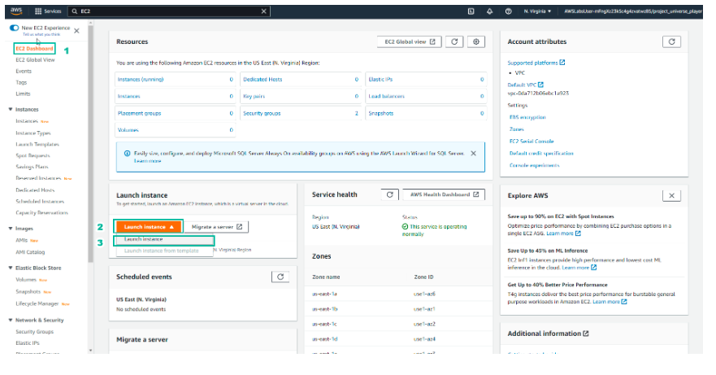
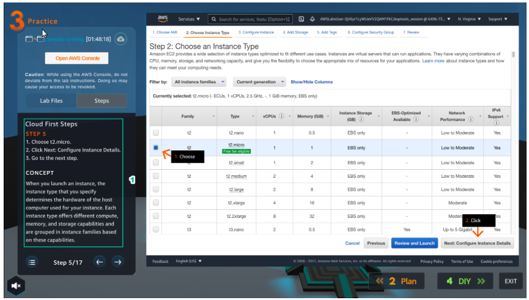
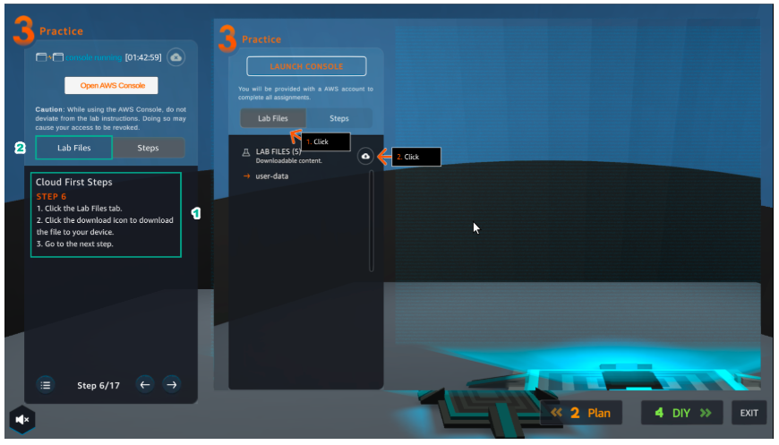
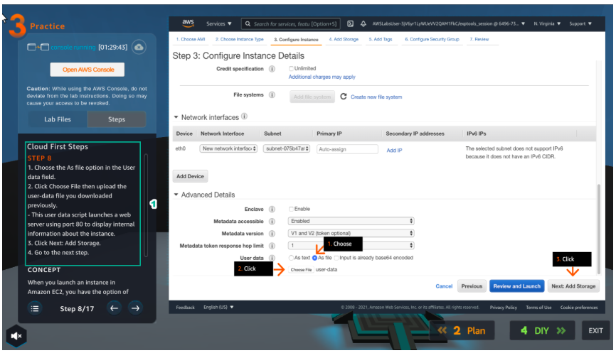
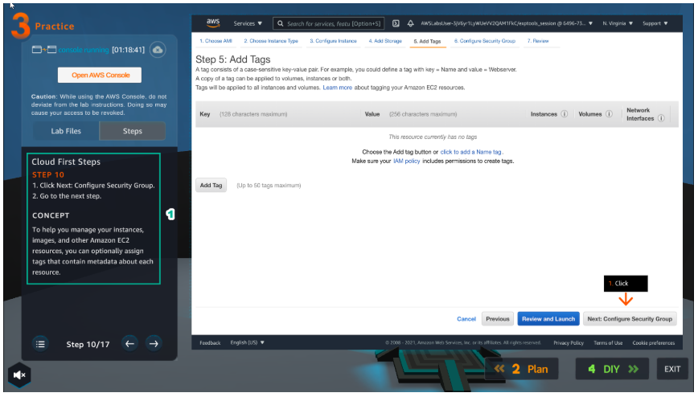
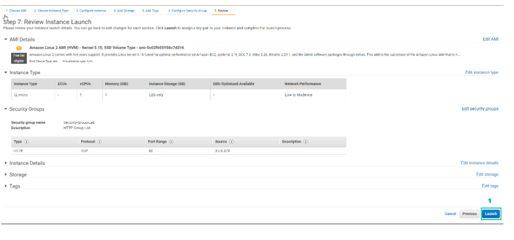
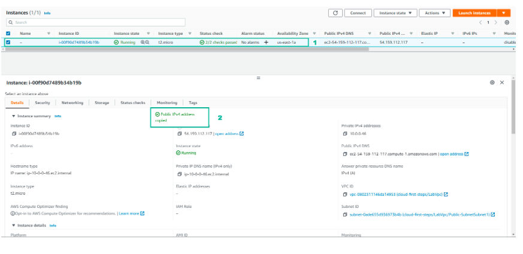

Practice
==============

.. admonition:: Info

  After watching **Plan**, the player prepares for **Practice**

1. Select **Practice** to perform the lab.

2. Read the first step of **Cloud First Steps** and **CONCEPT**.

- Select **START LAB**
- Select the arrow to the right to perform the next steps

3. Select **Open AWS Console**.

- Read step 2 of **Cloud First Steps**

4. Go to **AWS Console** page.

- Find **EC2** service and select

5. Read step 3 of **Cloud First Steps**.

- Select the arrow to the right to view and take the next step

6. Go to **AWS Console** page.

- Select **EC2 Dashboard**
- Select **Launch instance**
- Continue to select **Launch instance**

7. Read step 4 of **Cloud First Steps**.

8. Go to **AWS Console** page.

- Select **Amazon Linux 2 AMI**

9. Read step 5 of **Cloud First Steps**.

10. Go to **AWS Console** page.

- Choose an **Instance Type**, select **t2.micro**
- Select **Next: Configure Instance Details**

11. Read step 6 of **Cloud First Steps**

- Select **Lab Files**

12. After selecting **Lab Files**, select **user-data** and download it.

13. Read step 7 of **Cloud First Steps**.

14. Go to **AWS Console**.

- Select **VPC**
- Select **Subnet**

15. Read step 8 of **Cloud First Steps**.

16. In the **Configure Instance Details** section.

- In **Advanced Details**, select **As file**
- Select **Select file**, and load the file **user-data**
- Then, select **Next: Add Storage**

17. Read step 9 of **Cloud First Steps**.

18. Select **Next: Add Tags**.

19. Read step 10 of **Cloud First Steps**.

20. Select **Next: Configure Security Group**.

21. Read step 11 of **Cloud First Steps**.

22. Create a security group

- **Security group name**, enter ``Security-Group-Lab``
- **Description**, enter ``HTTP Group Lab``
- **Rule**, select **HTTP**
- Select **Review and Launch**

.. image:: pictures/imagep22.png
   :align: center
   :width: 7000px

23. Read step 12 of **Cloud First Steps**.

24. Double check and select **Launch**.

25. Read step 13 of **Cloud First Steps**.

26. Select **Proceed without a key pair**.

- Select **I acknowledge…**
- Select **Launch Instances**

27. Read step 14 of **Cloud First Steps**.

28. Select **View Instance**.

29. Read step 15 of **Cloud First Steps**.

30. Select the **Amazon EC2 instance** just created.

- Find and copy **Public(IPv4) DNS name**

31. Read step 16 of **Cloud First Steps**.

32. Paste **Public(IPv4) DNS name** into the browser and **Enter**.

- View results

33. Congratulations to the player on completing the lab

