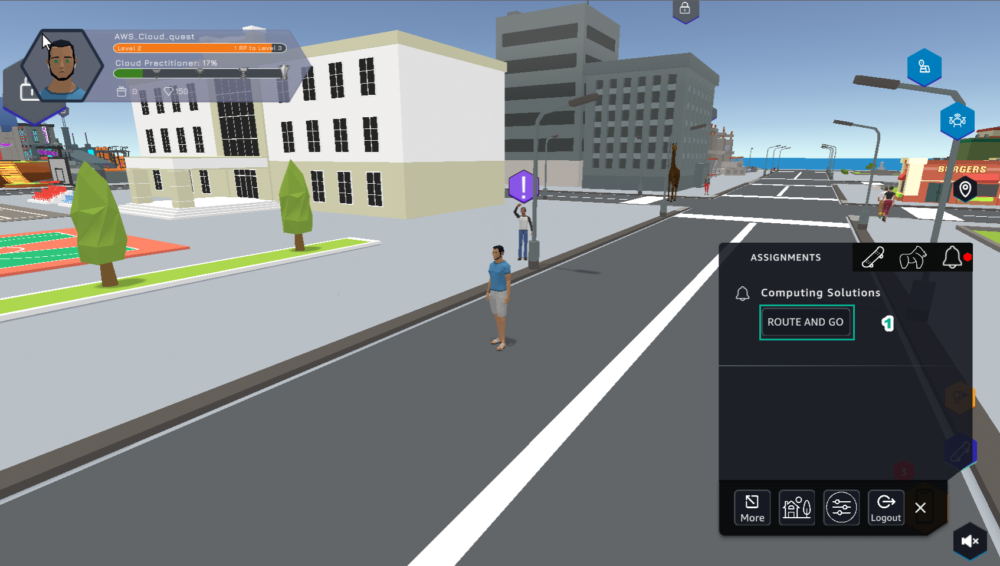
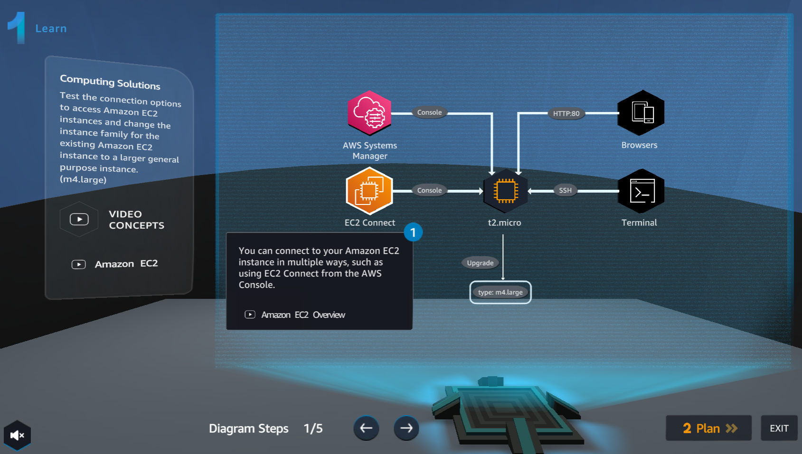

A3 - CONNECT TO AN EC2 INSTANCE
==================================

Lab #3 of **AWS Cloud Quest: Cloud Practitioner**  

.. admonition:: Info

  After receiving the Assignment 2 award, continue to perform the following steps to perform Assignment 3

1. In **ASSIGNMENT**, select **ROUTE AND GO**.
   

2. Select **NEXT**. 
   
.. image:: pictures/a3.2.png
   :align: center
   :width: 7000px

3. Read **Computing Solutions** and select **ACCEPT**.  
   
.. image:: pictures/A3.3.png
   :align: center
   :width: 7000px

4. Select **GO TO SOLUTION CENTER**.  
  
.. image:: pictures/a3.4.png
   :align: center
   :width: 7000px

5. In **Getting Started**, select **Learn**.  
   

.. toctree::
   :maxdepth: 1
   

   a3_learn
   a3_plan
   a3_practice
   a3_diy

