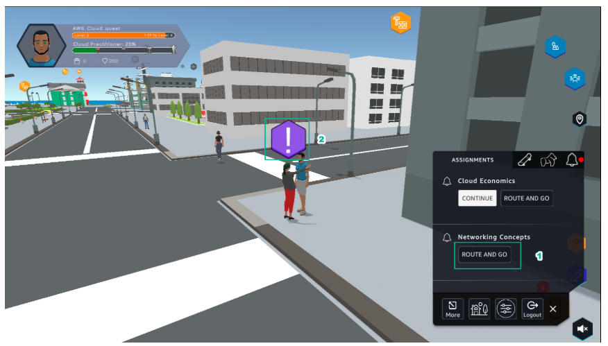

A4 - INTERNET ACCESS FOR VPC RESOURCES
==========================================

**Overview**

Lab #4 of AWS Cloud Quest: Cloud Practitioner is Internet Access for VPC Resources

**Content**

- Learn
- Plan
- Practice
- DIY

.. admonition:: Info

  After receiving the Assignment 3 award, continue to perform the following steps to perform Assignment 4

1. In ASSIGNMENT.

- In Networing Concepts, select ROUTE AND GO
- Select the icon as shown

2. View Rewards and select NEXT.

.. image:: pictures/a.png
   :align: center
   :width: 7000px

3. View Solution Annotations and select ACCEPT.

4. Select GO TO SOLUTION CENTER, to proceed to the next steps

.. toctree::
   :maxdepth: 1
   

   a4_learn
   a4_Plan
   a4_Practice
   a4_diy

