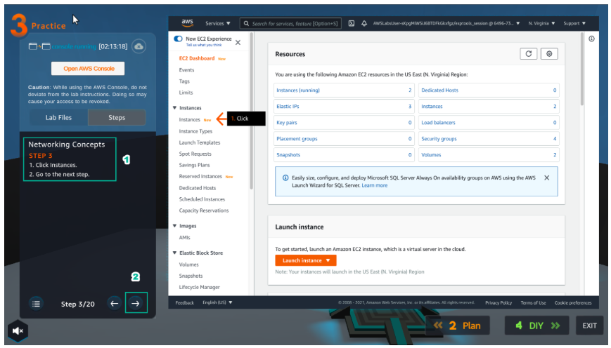
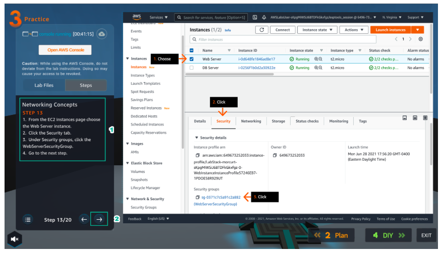

Practice
=========

.. admonition:: Info

  After watching Plan, the player prepares for Practice

1. Select Practice to perform the lab.

2. In the Practice interface.

- Read step 1 of Networking Concepts
- Read CONCEPT
- Select START LAB
- Select the arrow to the right to see the next steps

  

3. In the Practice interface.

- Read step 3 of *Networking Concepts
- Read CONCEPT
- Select Open AWS Console
- Select the arrow to the right to see the next steps

4. In the AWS Console interface.

- Find and select EC2

5. In the Learn interface.

- Read step 3 of Networking Concepts
- Select the arrow to the right to see the next steps

6. In the EC2 interface.

- Select Instances

  
7. In the Learn interface.

- Read step 4 Networking Concepts
- Select the arrow to the right to see the next steps

8. In the EC2 interface.

- Select Web Server instance
- Copy Public IPv4 address

9. In the Learn interface.

- Read step 5 Networking Concepts
- Select the right arrow to see the next steps

10. Open the browser.

- Paste Public Ipv4 address and browser
- View returned results

11. In the Learn interface.

- Read step 6 Networking Concepts
- Read CONCEPT
- Select the arrow to the right to see the next step

12. In the EC2 interface.

- Select Web Server instance
- Select Networking
- In Networking details, see details Public IPv4 address and Private IPv4 addressses

13. In the Practice interface.

- Read step 7 of Networking Concepts
- Read CONCEPT
- Select the right arrow to see the next steps

14. In the EC2 interface.

- Select Web Server instance
- Select Networking
- Select Subnet ID

15. In the Practice interface.

- Read step 8 of Networking Concepts
- Read CONCEPT
- Select the right arrow to see the next steps

  
16. In the Subnet interface.

- Select network-concepts
- Select Route table
- Choose the name Route table

17. In the Practice interface.

- Read step 9 of Networking Concepts
- Read CONCEPT
- Select the right arrow to see the next steps

18. In the Route tables interface.

- Choose the name Route table
- Select Routes
- View details about Routes
- Select Edit routes

19. In the Practice interface.

- Read step 10 of Networking Concepts
- Read CONCEPT
- Select the right arrow to see the next steps

20. In the Edit routes interface.

- View NAT gateway
- Select Remove

21. In the Practice interface.

- Read step 11 of Networking Concepts
- Read CONCEPT
- Select the right arrow to see the next steps

22. In the Edit routes interface.

- Select Add route
- In Destination, enter ``0.0.0.0/0``
- In Target, select Internet Gateway
- Select igw-xxxxxxx(network-concepts/VPC)
- Select Save changes

23. In the Practice interface.

- Read step 12 of Networking Concepts
- Read CONCEPT
- Select the right arrow to see the next steps

24. In the Route Tables interface.

- View details Route table
- Select Services

25. In the Practice interface.

- Read step 13 of Networking Concepts
- Select the right arrow to see the next steps

26. In the EC2 interface.

- Select Web Server instance
- Select Security
- Select Security group

27. In the Practice interface.

- Read step 14 of Networking Concepts
- Read CONCEPT
- Select the right arrow to see the next steps

28. In the Security Groups interface.

- Select Edit inbound rules

29. In the Practice interface.

- Read step 15 of Networking Concepts
- Read CONCEPT
- Select the right arrow to see the next steps

30. In the Edit inbound rules interface.

- Select Add rule

31. In the Practice interface.

- Read step 15 of Networking Concepts
- Read CONCEPT
- Select the right arrow to see the next steps

.. image:: pictures/a446.png
   :align: center
   :width: 7000px

32. In the Edit inbound rules interface.

- Type, select HTTP
- Source, select Anywhere-IPv4
- Select Save rules

33. In the Practice interface.

- Read step 16 of Networking Concepts
- Read CONCEPT
- Select the right arrow to see the next steps

34. In the EC2 interface.

- Select Instances

35. In the Practice interface.

- Read step 18 of Networking Concepts
- Select the right arrow to see the next steps

36. In the EC2 interface.

- Select Web Server instance
- Select Networking
- Select and copy Public IPv4 address

37. In the Practice interface.

- Read step 19 of Networking Concepts
- Read CONCEPT
- Select the right arrow to see the next steps

38. Open a browser.

- Paste Public Ipv4 address
- Results returned

39. Congratulations to the player on completing the lab.

