DIY
========

.. admonition:: Info

  After completing the lab, the player does DIY

1. In the DIY interface

- Read DIY ACTIVITIES
- Read SOLUTION VALIDATION METHOD

.. image:: pictures/0001-diy7.png
   :align: center
   :width: 7000px

2. In the AWS Console interface

- Find RDS
- Select RDS

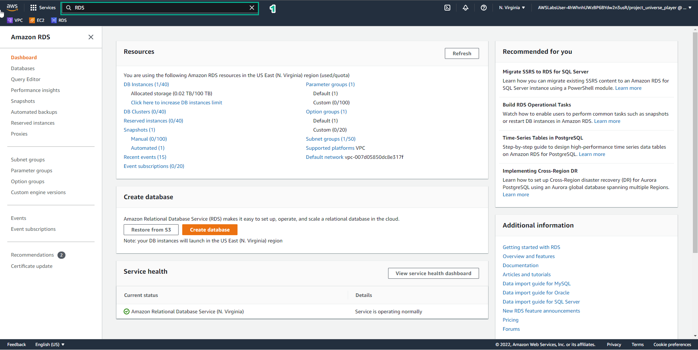

3. In the Amazon RDS interface

- Select Databases

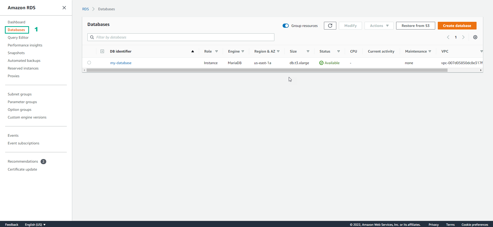

4. In the Databases interface

- Select my-database
- Select Actions
- Select Create read replica

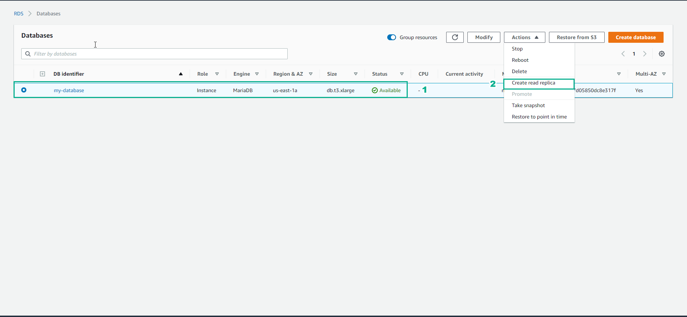

5. In the Create read replica DB instance interface

- In DB instance class, select db.t3.xlarge-4 vCPU
- In Multi-AZ deployment, select Yes
- In Storage type, select General Purpose (SSD)

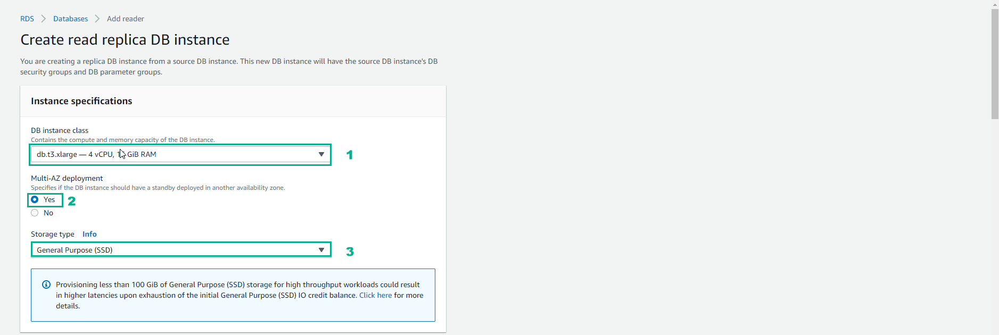

6. In the Network & Security interface

- In Destination region, select US East (N. Virginia)
- In Destination DB subnet group, select default-vpc
- In Publicly accessible, select No
- In VPC security groups, select default

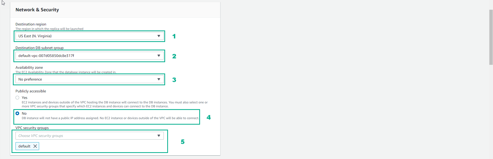

7. In the RDS interface

- In Read replica source, enter my-database
- In DB instance identifier, enter my-database-read-replica
- In Database options interface, in Database port, enter 3306
- Select Copy tags to snapshots

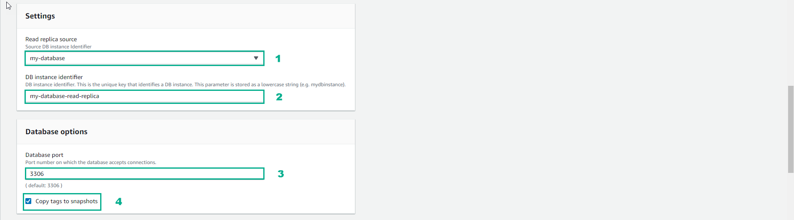

8. In the RDS interface

- In Monitoring, uncheck Disable enhanced monitoring
- In Performance Insights, uncheck Disable Performance Insights

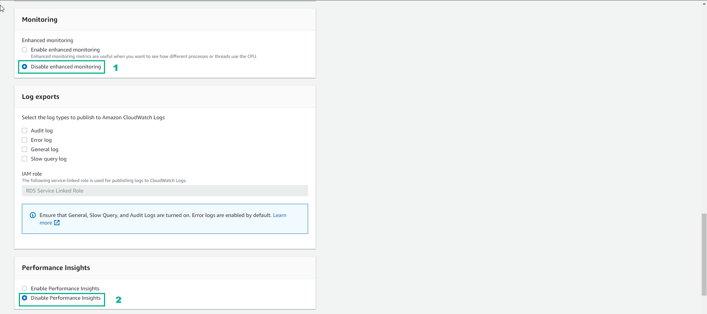

9. In the RDS interface

- In Maintenance, select No
- Select Create read replica

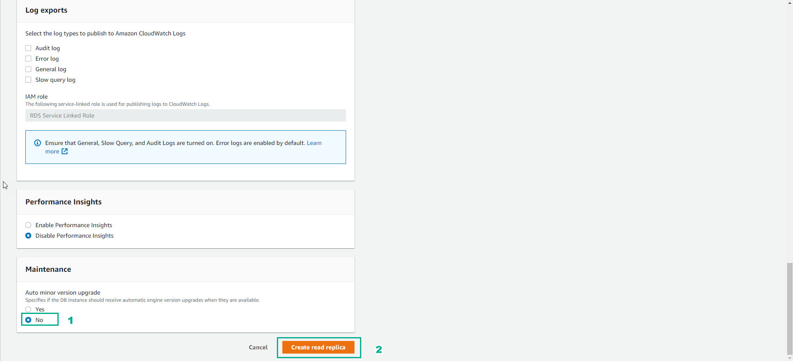

10. View initialization results

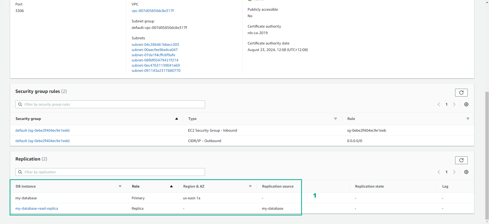

11. In the DIY interface

- Copy and paste Your RDS DB identifier
- Copy and paste ypur read replica DB identifier
- Select VALIDATE

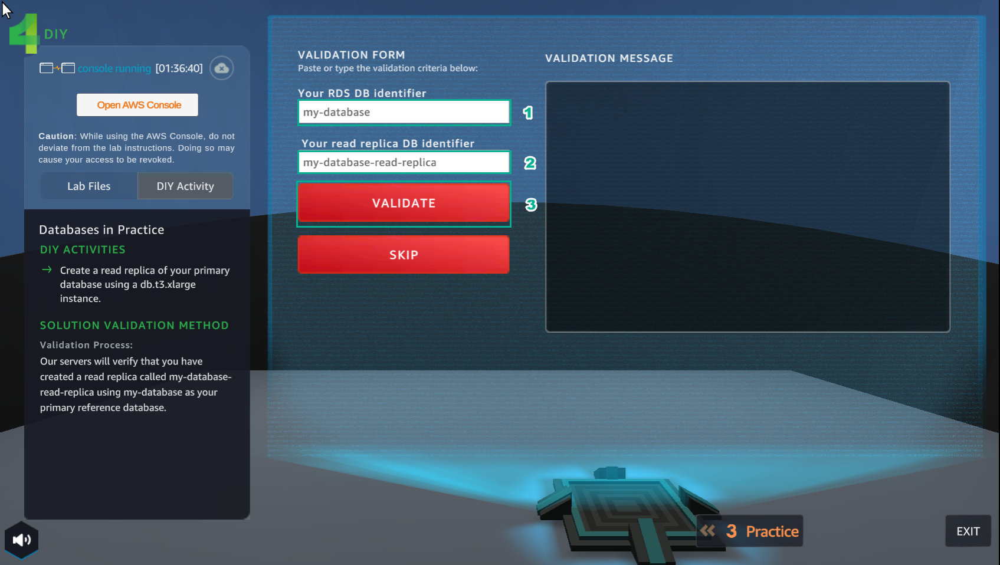

12. In the DIY interface

- After selecting VALIDATE, the VALIDATION MESSAGE interface appears Nice. you have a read replica running properly…
- Complete the lesson DIY
- Select EXIT to exit and return to the city interface

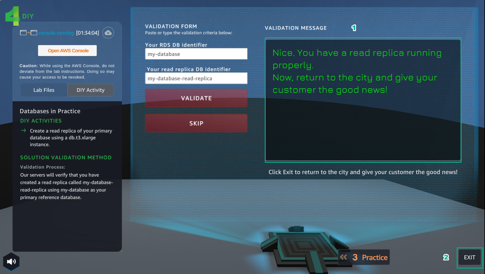

13. After returning to the city interface

- Select NEXT

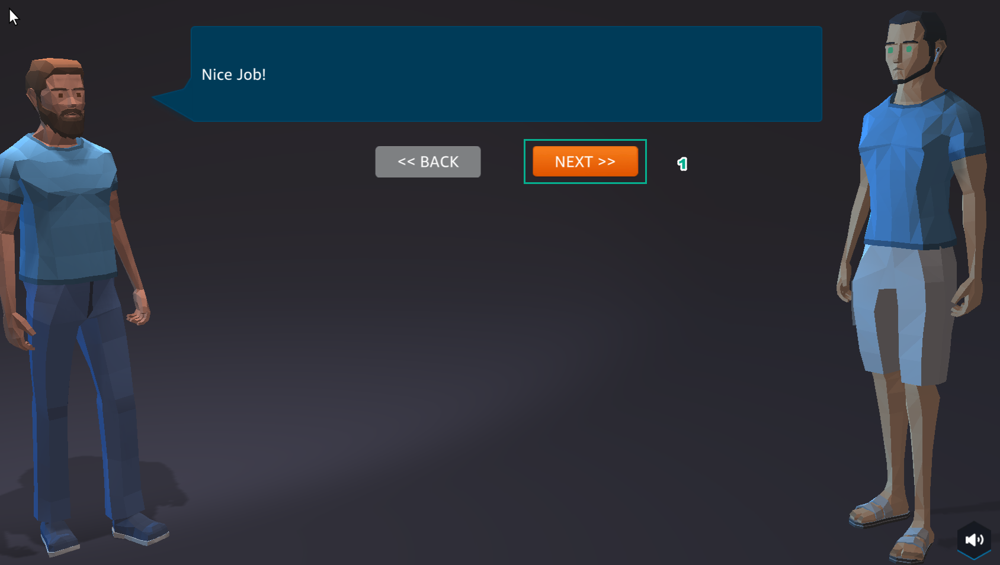

14. Select COLLECT

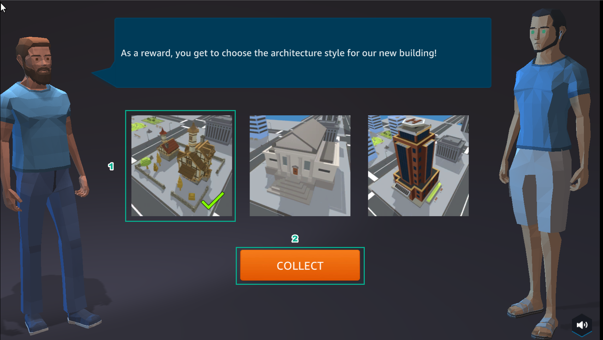

15. Congratulations to the player on completing the lab

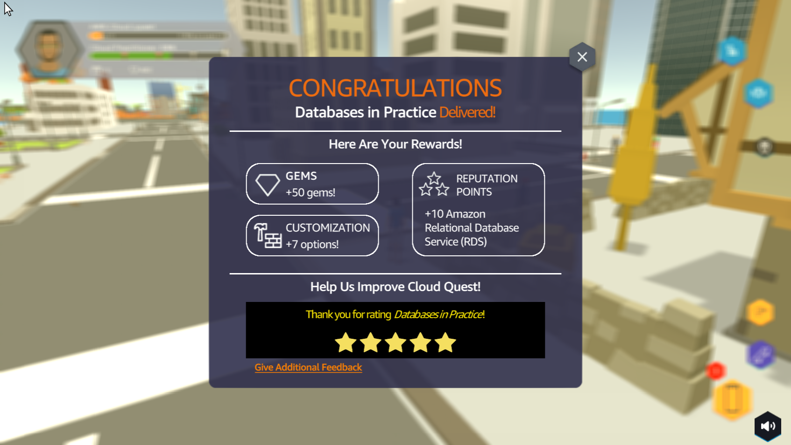

