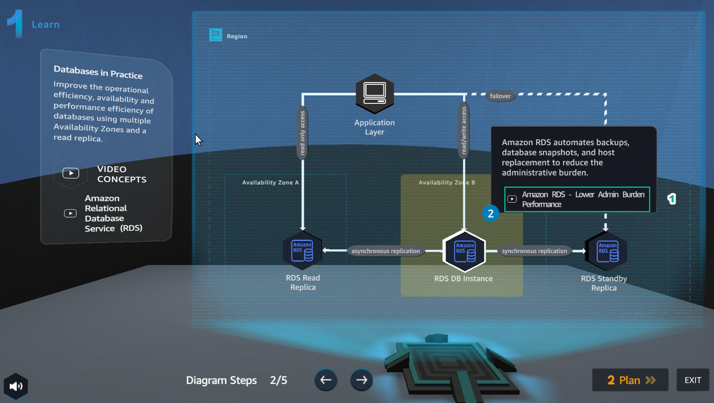

LEARN
========

.. admonition:: Info

  Learn helps players to understand more theory about

1. In the Learn interface

- Read step 1 of Diagram Steps
- Select Amazon RDS Overview

.. image:: pictures/0a7-learn.png
   :align: center
   :width: 7000px

2. In the VIDEO CONCEPTS interface

- Watch video Amazon RDS Overview
- Select X to exit

.. image:: pictures/a7-learn.png
   :align: center
   :width: 7000px

3.In the Learn interface

- Read step 2 of Diagram Steps
- Select Amazon RDS - Lower Admin Burden Performance

4.In the VIDEO CONCEPTS interface

- Watch the video Amazon RDS - Lower Admin Burden Performance
- Select X to exit

.. image:: pictures/0004-learn7.png
   :align: center
   :width: 7000px

5.In the Learn interface
- Read step 3 of Diagram Steps
- Select Amazon RDS - Availability & Durability

.. image:: pictures/000-learn7.png
   :align: center
   :width: 7000px

