PRACTICE
========

.. admonition:: Info

  After watching Plan, the player prepares for Practice

1. In the Practice interface

- Read step 1 of Database in Practice
- Read CONCEPT
- Select START LAB
- Select the arrow to the right to see the next steps

.. image:: pictures/0001-practice7.png
   :align: center
   :width: 7000px

2. In the Learn interface

- Read step 2 of Database in Practice
- Read CONCEPT
- Select Open AWS Console

.. image:: pictures/0002-practice7.png
   :align: center
   :width: 7000px

3. In the AWS Console interface

- Find RDS
- Select RDS

.. image:: pictures/0003-practice7.png
   :align: center
   :width: 7000px

4. In the Practice* interface

- Read step 3 of Database in Practice
- Select CONCEPT
- Select the arrow to the right to see the next steps

.. image:: pictures/0004-practice7.png
   :align: center
   :width: 7000px

5. In the Practice interface

- Read step 4 of Database in Practice
- Read CONCEPT
- Select the arrow to the right to see the next steps

.. image:: pictures/0005-practice7.png
   :align: center
   :width: 7000px

6. In the RDS interface

- Select Databases
- Select Create database
- In Choose a database creation method, select Standard create
- In Engine options, select MariaDB

.. image:: pictures/0006-practice7.png
   :align: center
   :width: 7000px

7. In the Practice interface

- Read step 5 of Database in Practice
- Read CONCEPT
- Select the arrow to the right to see the next steps

.. image:: pictures/0007-practice7.png
   :align: center
   :width: 7000px

8. In the RDS interface

- Version, select MariaDB 10.4.13
- Templates, select Dev/Test

.. image:: pictures/0008-practice7.png
   :align: center
   :width: 7000px

8. In the RDS interface

- Version, select MariaDB 10.4.13
- Templates, select Dev/Test

.. image:: pictures/0008-practice72.png
   :align: center
   :width: 7000px

9. In the Practice interface

- Read step 6 of Databases in Practice
- Read CONCEPT
- Select the arrow to the right to see the next steps

.. image:: pictures/0009-practice7.png
   :align: center
   :width: 7000px

10. In the RDS interface

- DB instance identifier, enter my-database
- Master username, enter admin
- Master password, enter 123456789admin
- Confirm password, enter 123456789admin

.. image:: pictures/00010-practice7.png
   :align: center
   :width: 7000px

11. In the Practice interface

- Read step 7 of Databases in Practice
- Read CONCEPT
- Select the arrow to the right to see the next steps

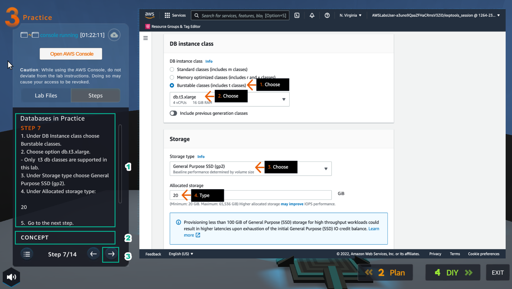

12. In the RDS interface

- In DB instance class, select Burstable classes (includes t classes)
- Select db.t3.large
- In Storage type, select General Purpose SSD (gp2)
- In Allocated storage, enter 20

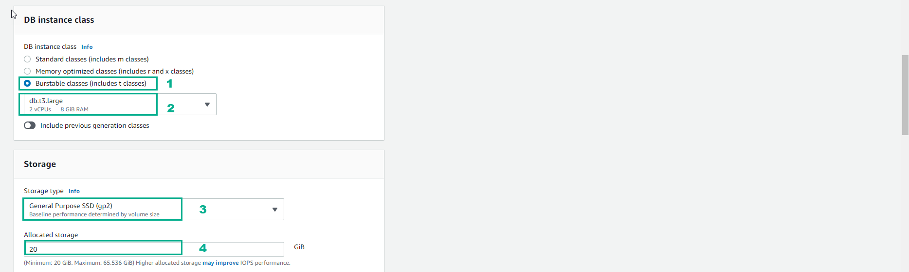

13. In the Practice interface

- Read step 8 of Databases in Practice
- Select CONCEPT
- Select the arrow to the right to see the next steps

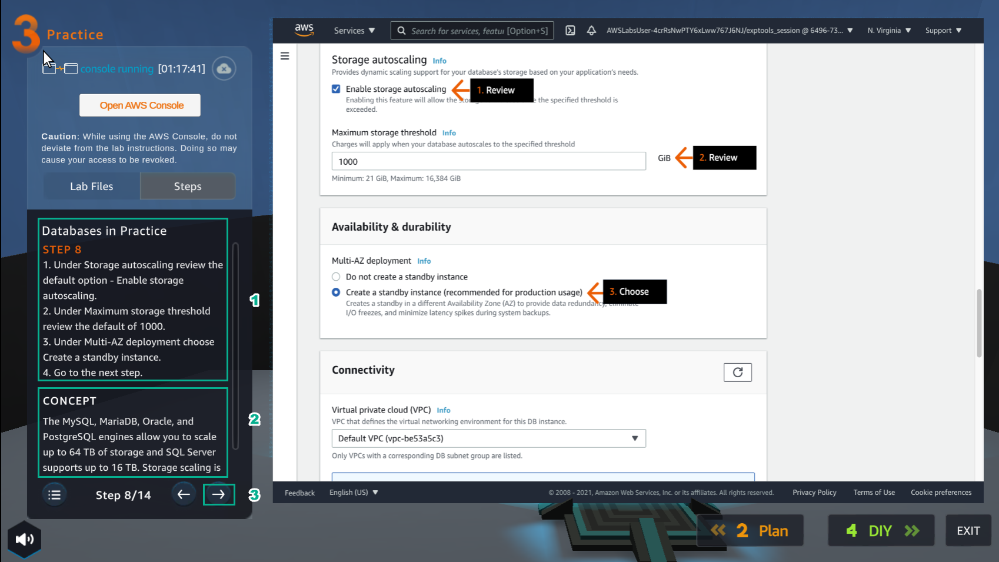

14. In the RDS interface

- In Storage autoscaling, select Enable storage autoscaling
- In Maximum storage threshold, enter 1000
- In Multi-AZ deployment, select Create a standby instance (recommended production usage)

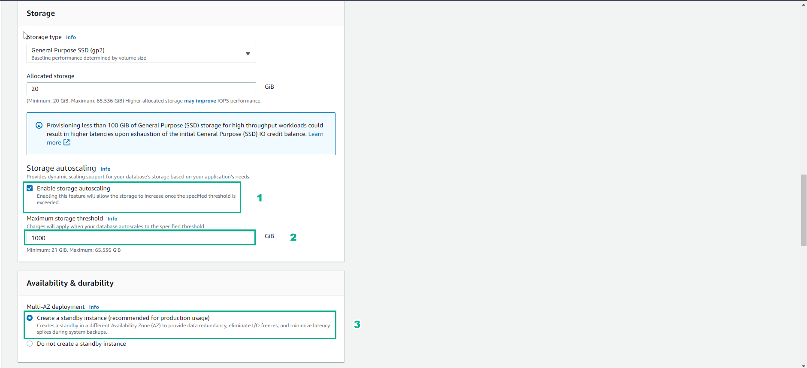

15. In the Practice interface

- Read step 9 of Databases in Practice
- Read CONCEPT
- Select the arrow to the right to see the next steps

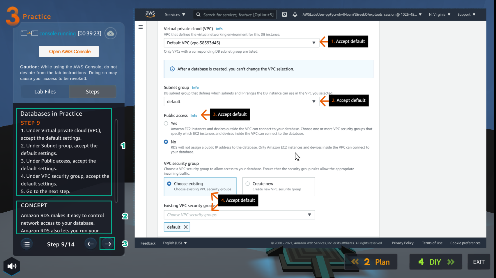

16. In the Connectivity interface

- Choose the default VPC
- Select the default Subnet group
- In Public access, select No
- In VPC security group, select Choose existing
- In Existing VPC security groups, select default

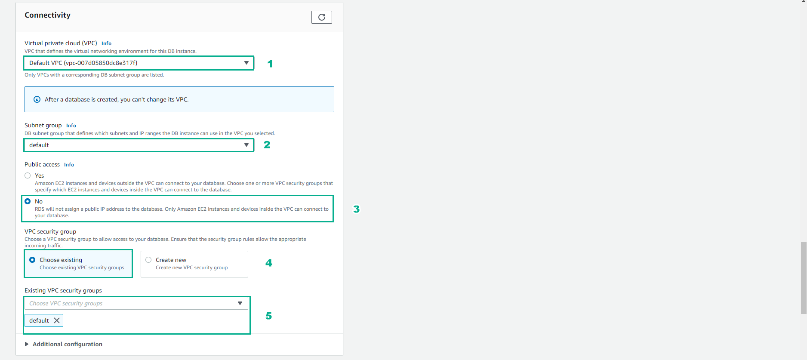

17. In the Practice interface

- Read step 10 of Databases in Practice
- Read CONCEPT
- Select the arrow to the right to see the next steps

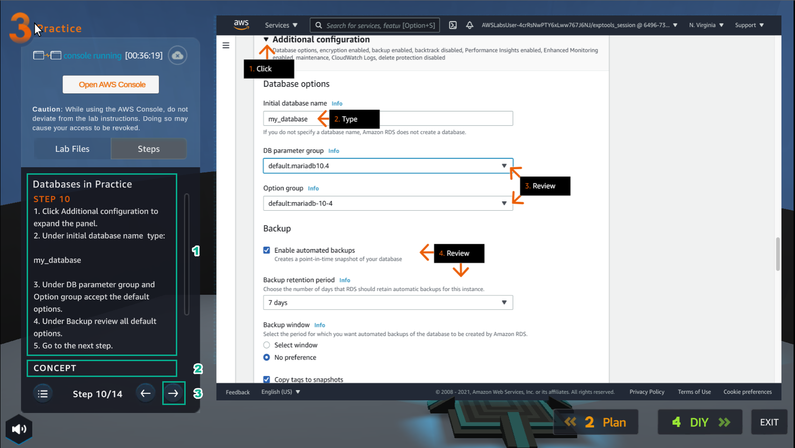

18. In the Additional configuration interface

- In Initial database name, enter my_database
- In DB parameter group, select default:mariadb-10-4
- In Option group, select default:mariadb-10-4
- In Backup, select Enable automated backups
- In Backup window, select No preference
- Select Copy tags to snapshots

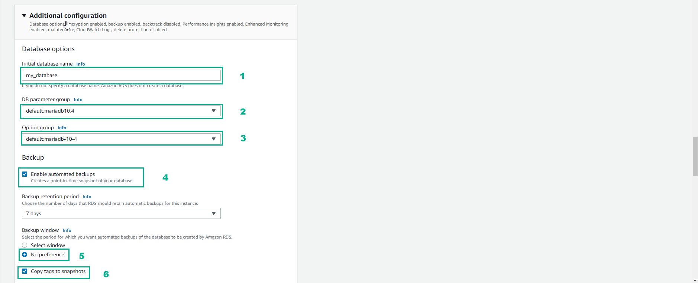

19. In the Practice interface

- Read step 11 of Databases in Practice
- Select the arrow to the right to see the next steps

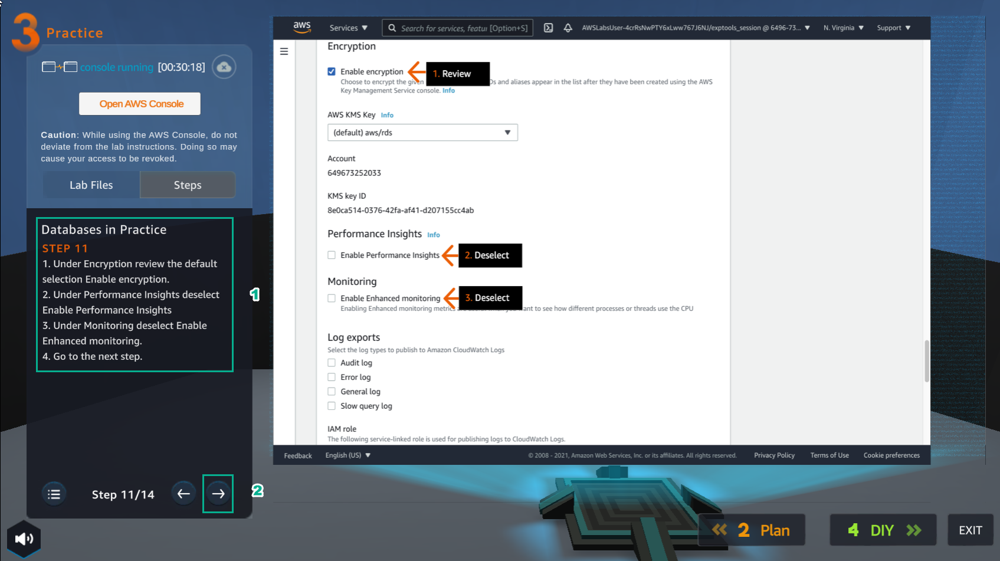

20. In the RDS interface

- In Encrytion, select Enable encrytion
- In Performance Insights, uncheck Enable Performance Insights
- In Monitoring, uncheck Enable Enhanced monitoring

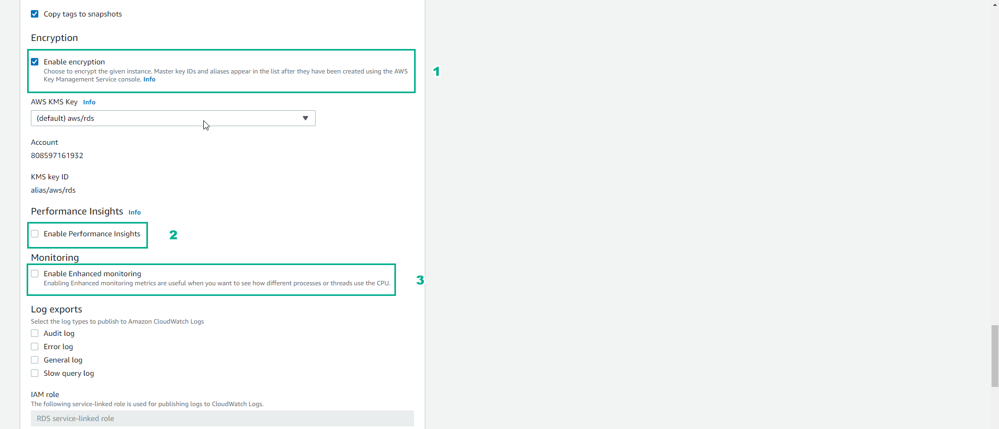

21. In the Practice interface

- In step 12 of Databases in Practice
- Select the arrow to the right to see the next steps

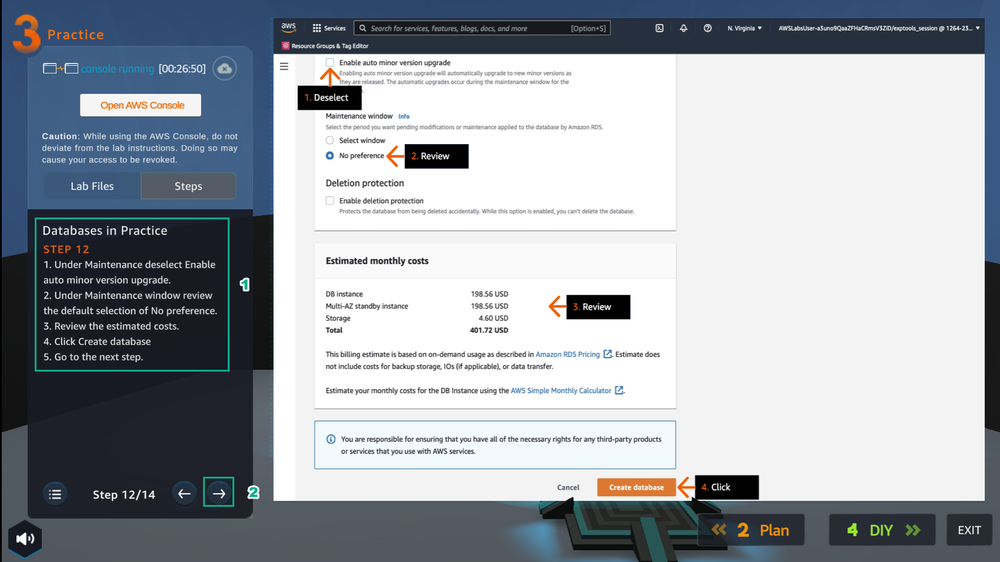

22. In the Create database interface

- In Maintenance, uncheck Enable auto minor version upgrade
- In Maintenance window, select No preference
- View Estimated monthly costs
- Select Create database

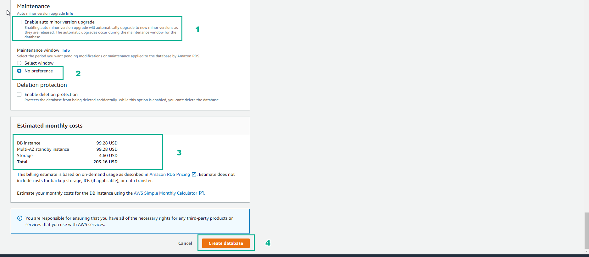

23. In the Practice interface

- Read step 13 of Databases in Practice
- Select the right arrow to see the next steps

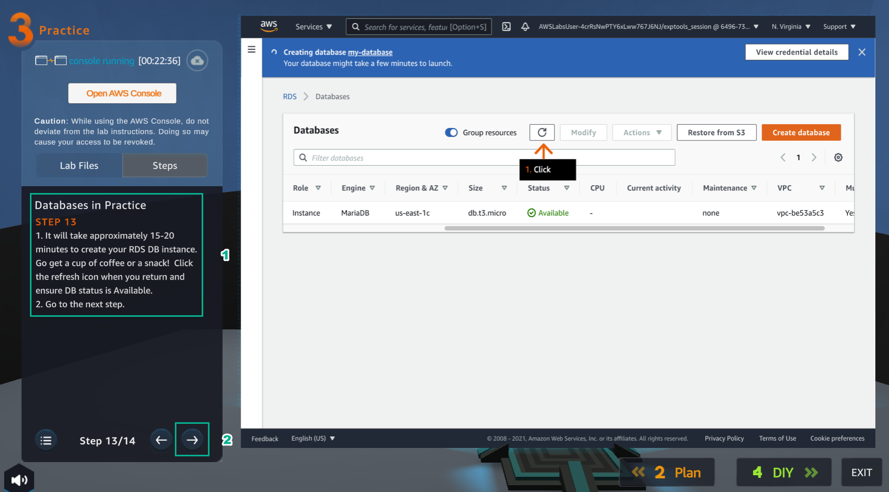

24. Congratulations to the player on completing the lab

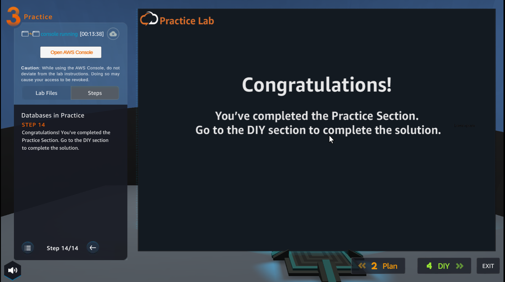

25. Review my-database just created

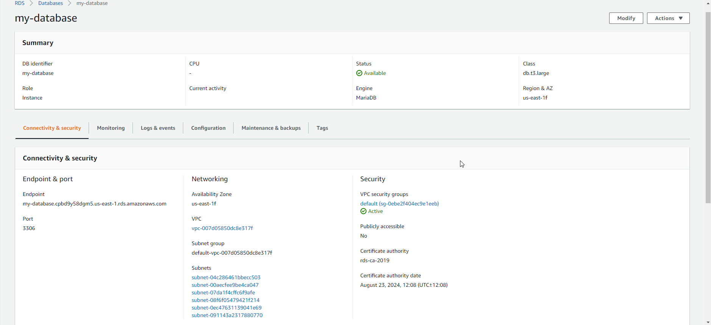

