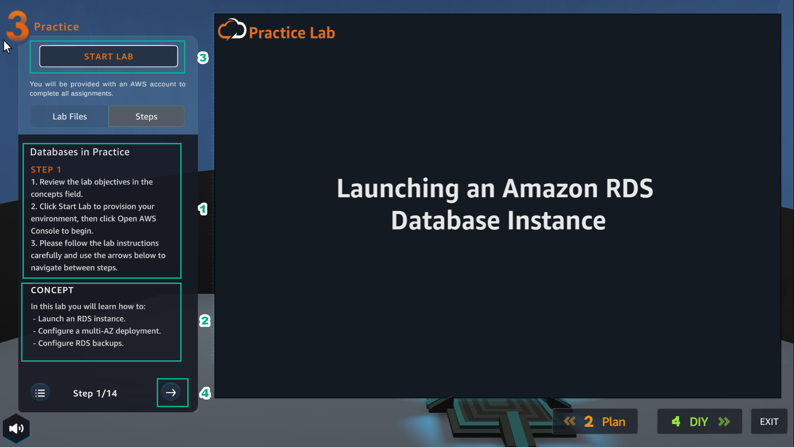

PRACTICE
========

.. admonition:: Info

  After watching Plan, the player prepares for Practice

1. In the Practice interface

- Read step 1 of Database in Practice
- Read CONCEPT
- Select START LAB
- Select the arrow to the right to see the next steps

2. In the Learn interface

- Read step 2 of Database in Practice
- Read CONCEPT
- Select Open AWS Console

.. image:: pictures/0002-practice7.png
   :align: center
   :width: 7000px

3. In the AWS Console interface

- Find RDS
- Select RDS

4. In the Practice* interface

- Read step 3 of Database in Practice
- Select CONCEPT
- Select the arrow to the right to see the next steps

.. image:: pictures/0004-practice7.png
   :align: center
   :width: 7000px

5. In the Practice interface

- Read step 4 of Database in Practice
- Read CONCEPT
- Select the arrow to the right to see the next steps

6. In the RDS interface

- Select Databases
- Select Create database
- In Choose a database creation method, select Standard create
- In Engine options, select MariaDB

.. image:: pictures/0006-practice7.png
   :align: center
   :width: 7000px

7. In the Practice interface

- Read step 5 of Database in Practice
- Read CONCEPT
- Select the arrow to the right to see the next steps

.. image:: pictures/0007-practice7.png
   :align: center
   :width: 7000px

8. In the RDS interface

- Version, select MariaDB 10.4.13
- Templates, select Dev/Test

8. In the RDS interface

- Version, select MariaDB 10.4.13
- Templates, select Dev/Test

.. image:: pictures/0008-practice72.png
   :align: center
   :width: 7000px

9. In the Practice interface

- Read step 6 of Databases in Practice
- Read CONCEPT
- Select the arrow to the right to see the next steps

10. In the RDS interface

- DB instance identifier, enter my-database
- Master username, enter admin
- Master password, enter 123456789admin
- Confirm password, enter 123456789admin

.. image:: pictures/00010-practice7.png
   :align: center
   :width: 7000px

