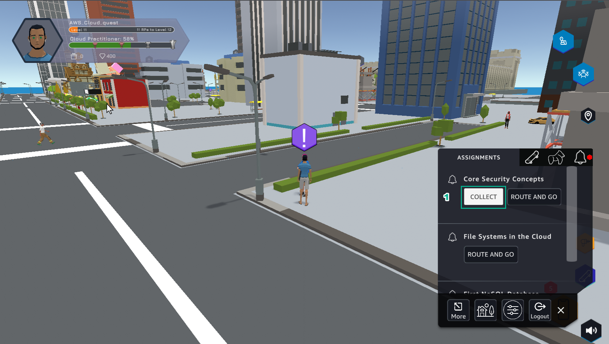
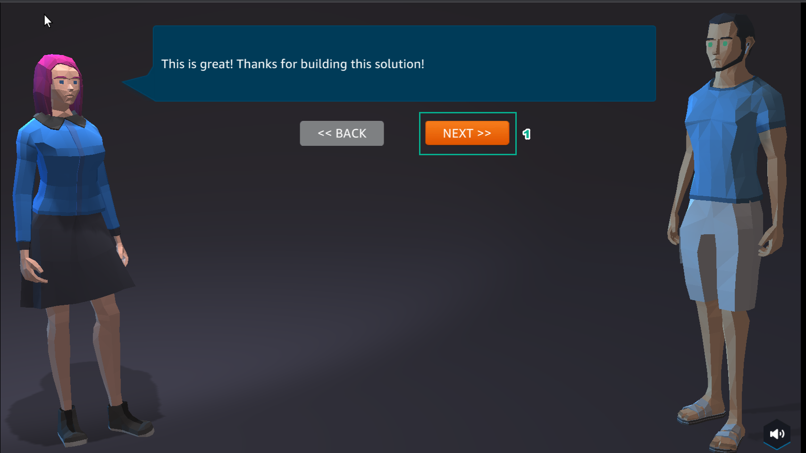

DIY
========

.. admonition:: Info

 After completing the lab, the player does DIY

1. In the AWS Console interface

- Find IAM
- Select IAM

.. image:: pictures/0001-diy8.png
   :align: center
   :width: 7000px

2. In the IAM interface

- Select User groups
- Select Permissions
- Find AmazonEC2ReadOnlyAccess
- Select AmazonEC2ReadOnlyAccess
- Select Add permissions

.. image:: pictures/0002-diy8.png
   :align: center
   :width: 7000px

3. In the IAM interface

- in Add permissions, select Attach policies

.. image:: pictures/0003-diy8.png
   :align: center
   :width: 7000px

4. In the IAM interface

- Find RDSReadOnlyAccess
- Select AmazonRDSReadOnlyAccess
- Select Add permissions

.. image:: pictures/0004-diy8.png
   :align: center
   :width: 7000px

5. In the IAM interface

- Select User groups
- Select Permissions
- View the Policy name

.. image:: pictures/0005-diy8.png
   :align: center
   :width: 7000px

6. In the DIY interface

- Enter SupportEngineers
- Select VALIDATE

.. image:: pictures/0006-diy8.png
   :align: center
   :width: 7000px

7. In the DIY interface

- After selecting VALIDATE, VALIDATION MESSAGE appears You have granted the correct permissions… is completed DIY
- Select EXIT to exit

.. image:: pictures/0007-diy8.png
   :align: center
   :width: 7000px

8. In the city interface

- Select ASSIGNMENT
- Select COLLECT

9. Select NEXT

10. Select COLLECT

.. image:: pictures/00010-diy8.png
   :align: center
   :width: 7000px

11. Congratulations to the award winning player

.. image:: pictures/00011-diy8.png
   :align: center
   :width: 7000px

