PRACTICE
========

.. admonition:: Info

 After watching Plan, the player prepares for Practice

1. In the Practice interface

- Read step 1 of Core Security Concepts
- Read CONCEPT
- Select START LAB
- Select the arrow to the right to see the next steps

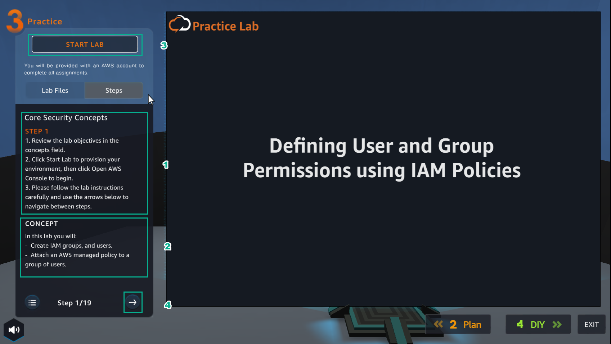

2. In the Practice interface

- Read step 2 of Core Security Concepts
- Read CONCEPT
- Select Open AWS Console
- Select the arrow to the right to see the next steps

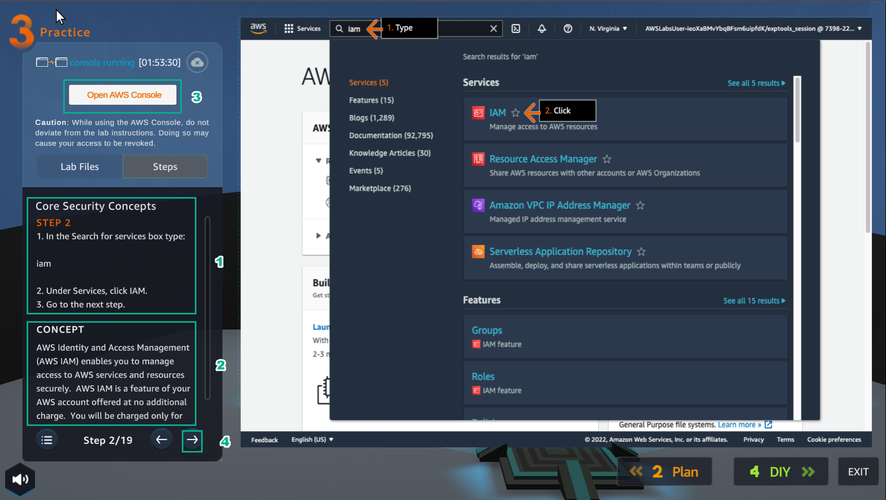

3. In the AWS Console interface

- Find IAM
-  IAM

.. image:: pictures/0003-practice8.png
   :align: center
   :width: 7000px

4. In the Practice interface

- Read step 3 of Core Security Concepts
- Read CONCEPT
- Select the arrow to the right to see the next steps

.. image:: pictures/0004-practice8.png
   :align: center
   :width: 7000px

5. In the IAM interface

- Select Use groups
- Select Create group

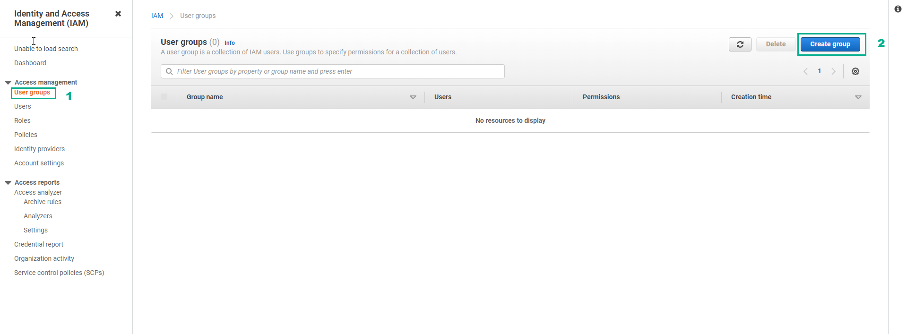

6. In the Practice interface

- Read step 4 of Core Security Concepts
- Read CONCEPT
- Select the arrow to the right to see the next steps

.. image:: pictures/0006-practice8.png
   :align: center
   :width: 7000px

7. In the Create user group interface

- In User group name, enter SupportEngineers

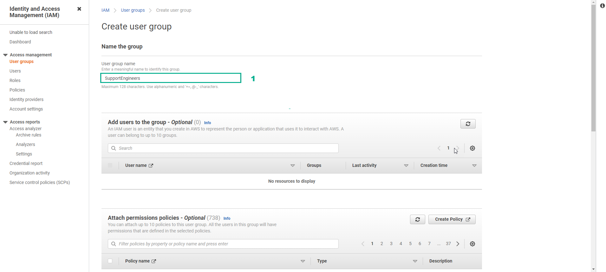

8. In the Practice interface

- Read step 5 of Core Security Concepts
- Read CONCEPT
- Select the arrow to the right to see the next steps

.. image:: pictures/0008-practice8.png
   :align: center
   :width: 7000px

9. In the IAM interface

- Find AmazonEC2ReadOnlyAccess
- Select Enter
- Select AmazonEC2ReadOnlyAccess
- Select Create group

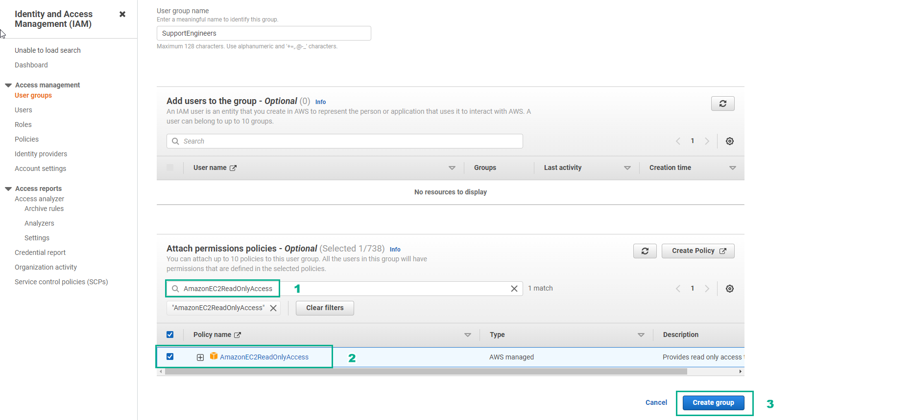

10. Initialization result

.. image:: pictures/00010-practice8.png
   :align: center
   :width: 7000px

11. In the Practice interface

- Read step 6 of Core Security Concepts
- Read CONCEPT
- Select the arrow to the right to see the next steps

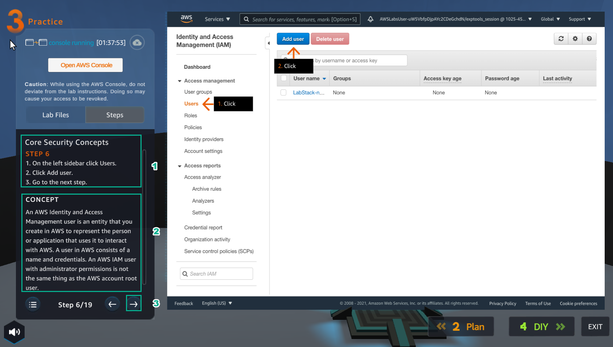

12. In the IAM interface

- Select Users
- Select Add users

.. image:: pictures/00012-practice8.png
   :align: center
   :width: 7000px

13. In the Add user interface

- In User name, enter support-engineer-1
- In Select AWS credential type, select Access key - Programmatic access
- Select Password - AWS Management Console access
- Select Custom password, enter supportPassword!123
- Uncheck Require password reset

.. image:: pictures/00013-practice8.png
   :align: center
   :width: 7000px

14. In the Practice interface

- Read step 1 of Core Security Concept
- Read CONCEPT
- Select the arrow to the right to see the next steps

.. image:: pictures/00014-practice8.png
   :align: center
   :width: 7000px

15. In the IAM* interface

- Select Add user to group
- Select SupportEngineers
- View Attached policies
- Select Next Tags

.. image:: pictures/00015-practice8.png
   :align: center
   :width: 7000px

16. In the Practice interface

- Read step 1 of Core Security Concepts
- Read CONCEPT
- Select the arrow to the right to see the next steps

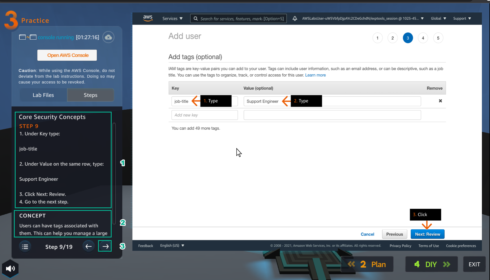

17. In the Add user interface

- Key, enter job-title
- Value, enter Support Engineer
- Select Next: Review

.. image:: pictures/00017-practice8.png
   :align: center
   :width: 7000px

18. In the Practice interface

- Read step 1 of Core Security Concepts
- Read CONCEPT
- Select the arrow to the right to see the next steps

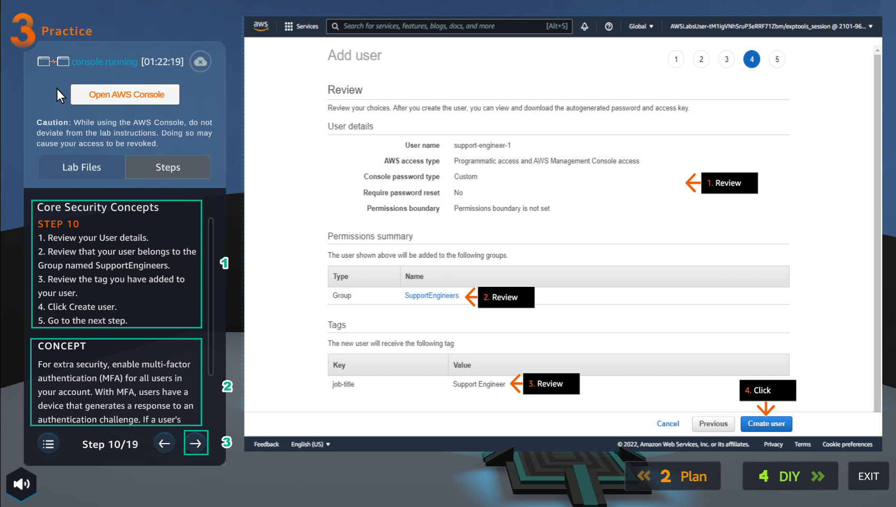

19. In the Add user interface

- View User details
- View Permissions summary
- View Tags
- Select Create user

.. image:: pictures/00019-practice8.png
   :align: center
   :width: 7000px

20. In the Practice interface

- Read step 11 of Core Security Concepts
- Read CONCEPT
- Select the arrow to the right to see the next steps

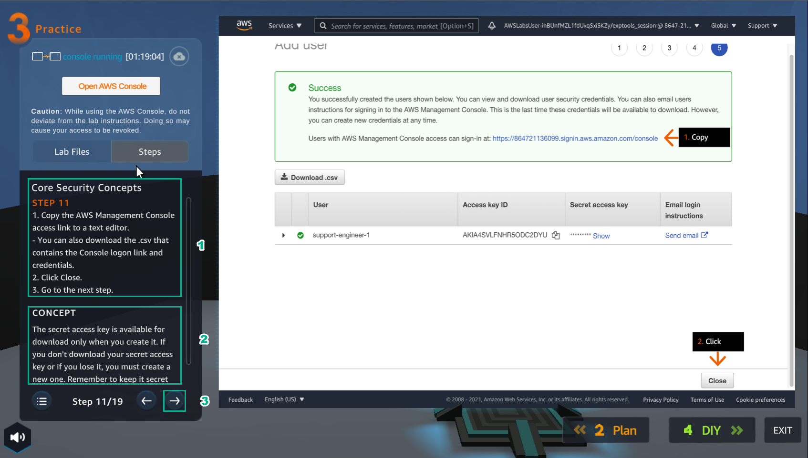

21. In the Add user interface

- See successful user initialization
- Choose the login path
- Select Close

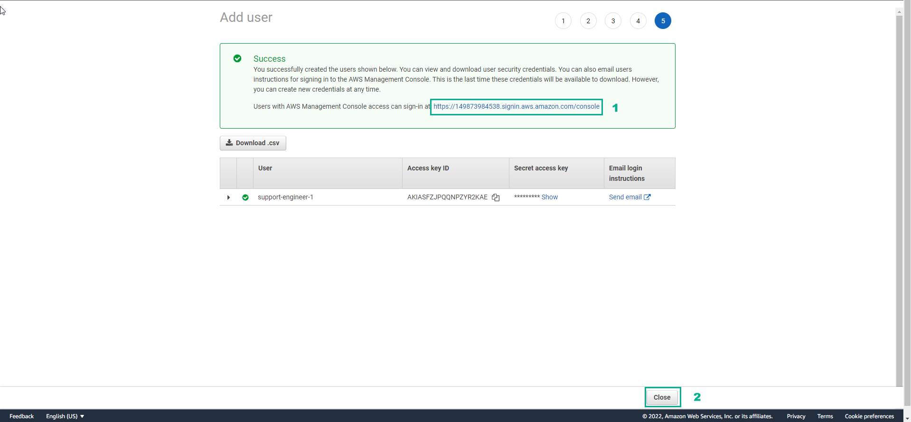

22. In the Practice interface

- Read step 12 of Core Security Concepts
- Select the arrow to the right to see the next steps

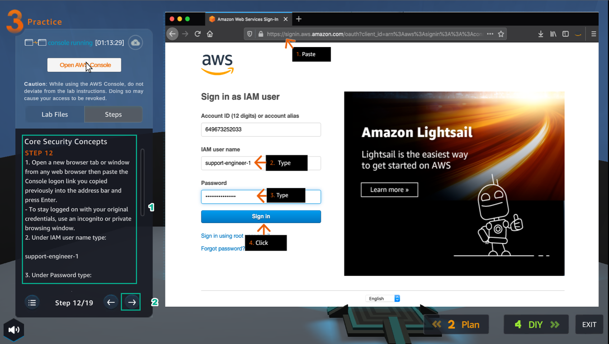

23. In the login interface

- Enter Account ID
- Enter IAM user name
- Enter Password
- Select Sign in

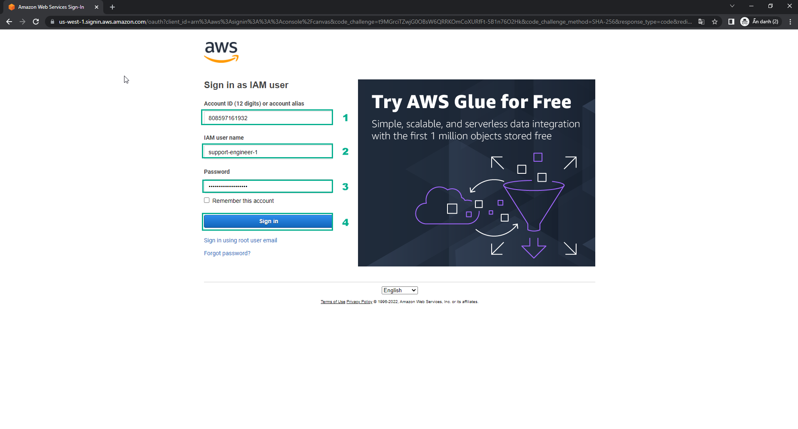

24. Successful login interface

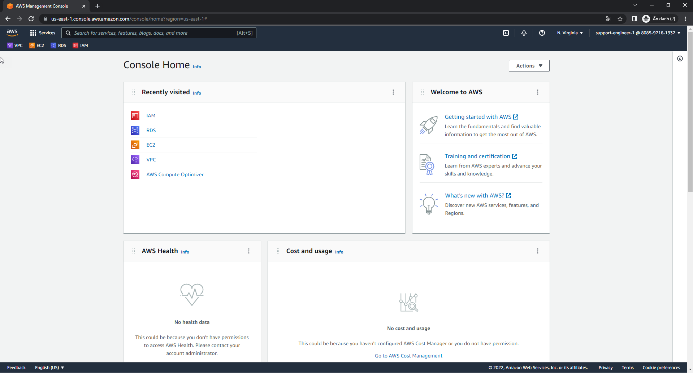

25. In the Practice interface

- Read step 13 of Core Security Concepts
- Read CONCEPT
- Select the arrow to the right to see the next steps

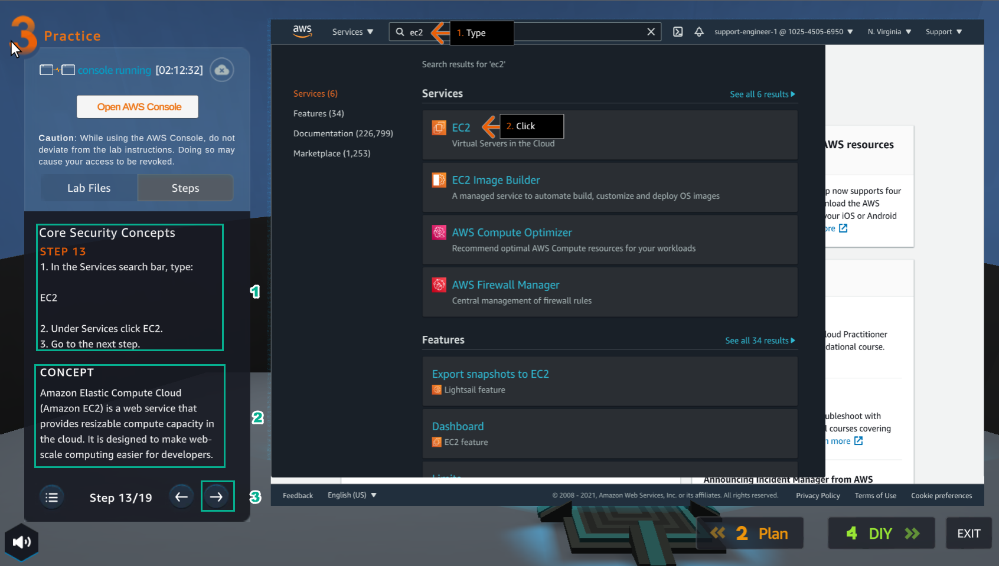

26. In the AWS Console interface

- Find EC2
- Select EC2

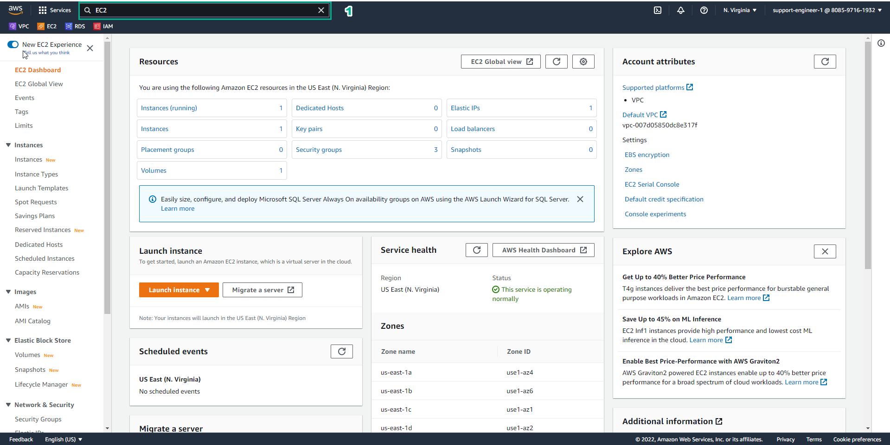

27. In the Practice interface

- Read step 14 of Core Security Concepts
- Select the arrow to the right to see the next steps

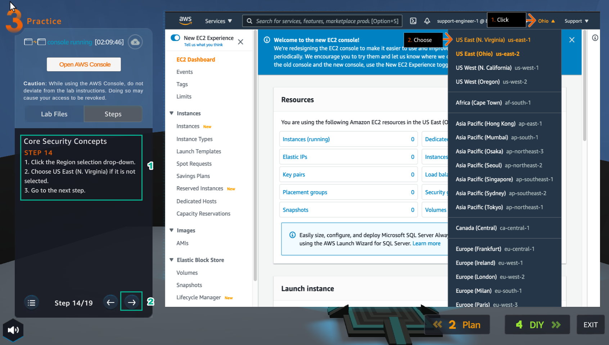

28. In the AWS Console interface

- Select Region N. Virginia

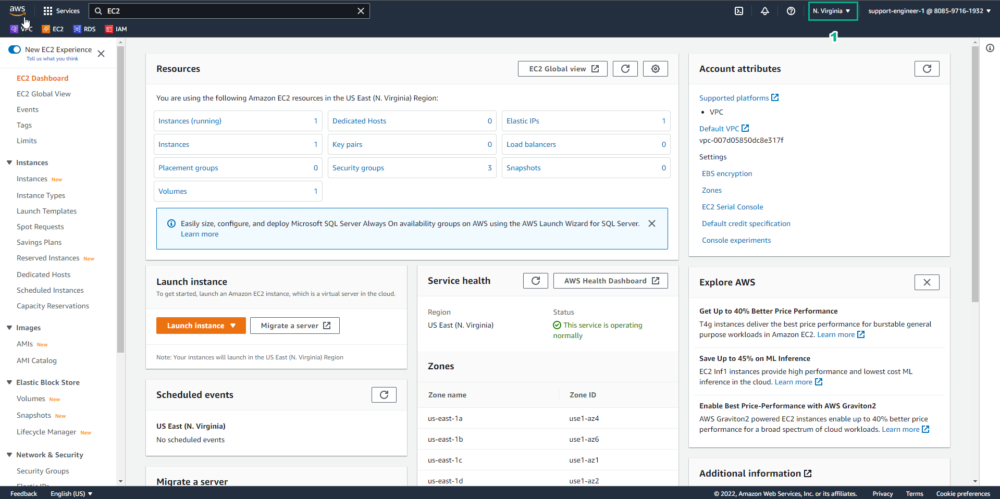

29. In the Practice interface

- Read step 15 of Core Security Concepts
- Read CONCEPT
- Select the arrow to the right to see the next steps

.. image:: pictures/00029-practice8.png
   :align: center
   :width: 7000px

30. In the EC2 interface

- Select Instances (running)

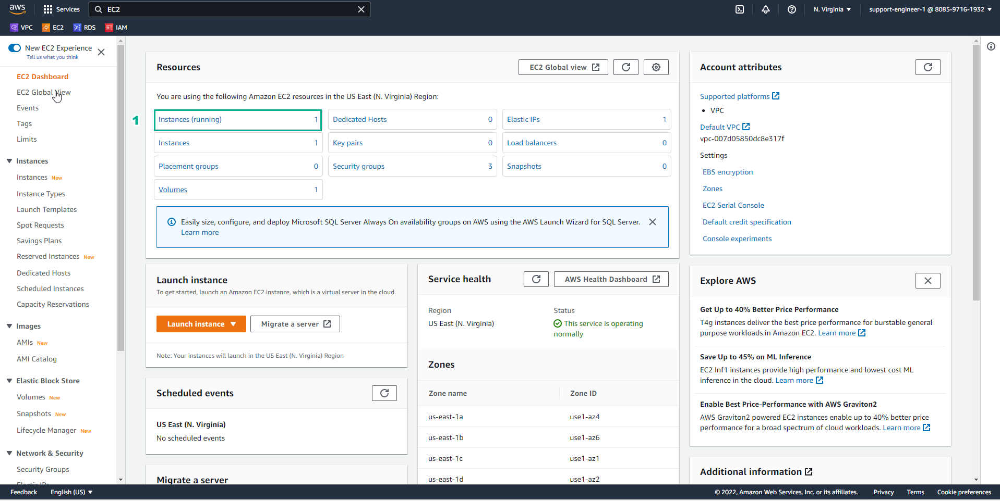

31. In the Practice interface

- Read step 16 of Core Security Concepts
- Read CONCEPT
- Select the arrow to the right to see the next steps

.. image:: pictures/00031-practice8.png
   :align: center
   :width: 7000px

32. In the EC2 interface

- Select Web Server
- Select Instance state
- Select Terminate instance

.. image:: pictures/00032-practice8.png
   :align: center
   :width: 7000px

33. In the Practice interface

- Read step 17 of Core Security Concepts
- Select the arrow to the right to see the next steps

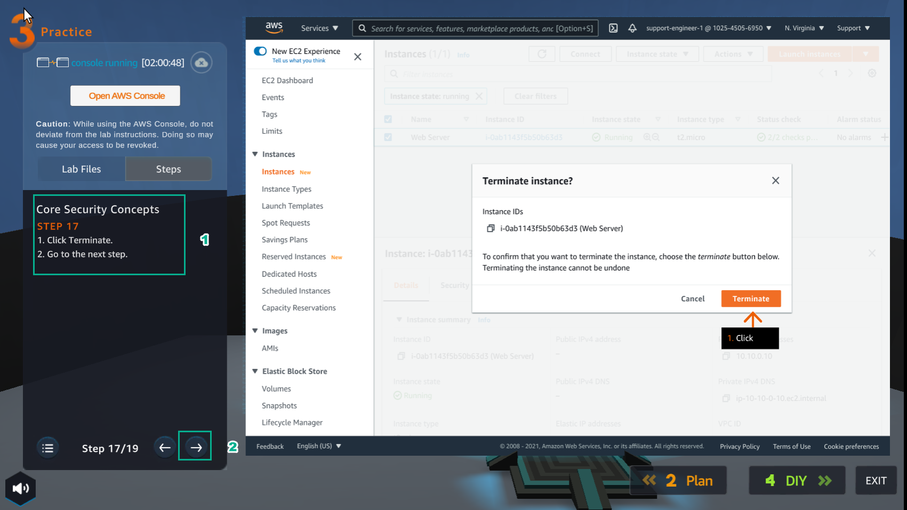

34. In the EC2 interface

- In Terminate instance, select Terminate

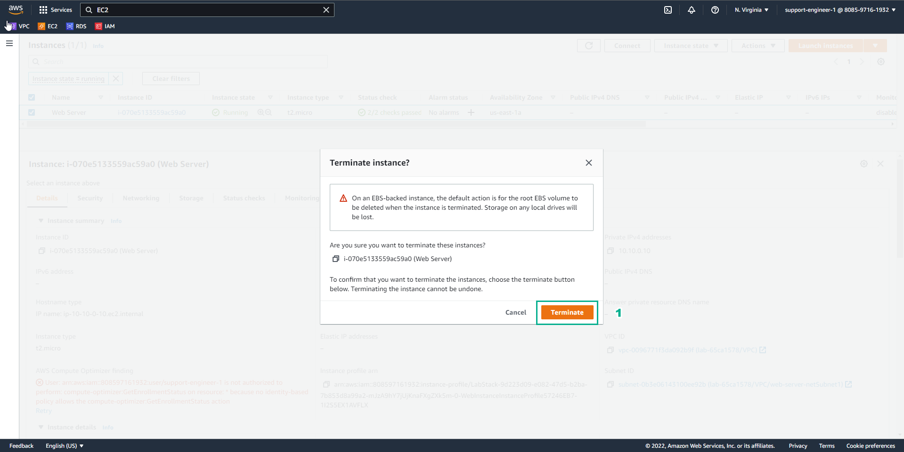

35. In the Practice interface

- Read step 18 of Core Security Concepts
- Read CONCEPT
- Select the arrow to the right to see the next steps

.. image:: pictures/00035-practice8.png
   :align: center
   :width: 7000px

36. Lab results

.. image:: pictures/00036-practice8.png
   :align: center
   :width: 7000px

37. Congratulations to the player on completing the lab

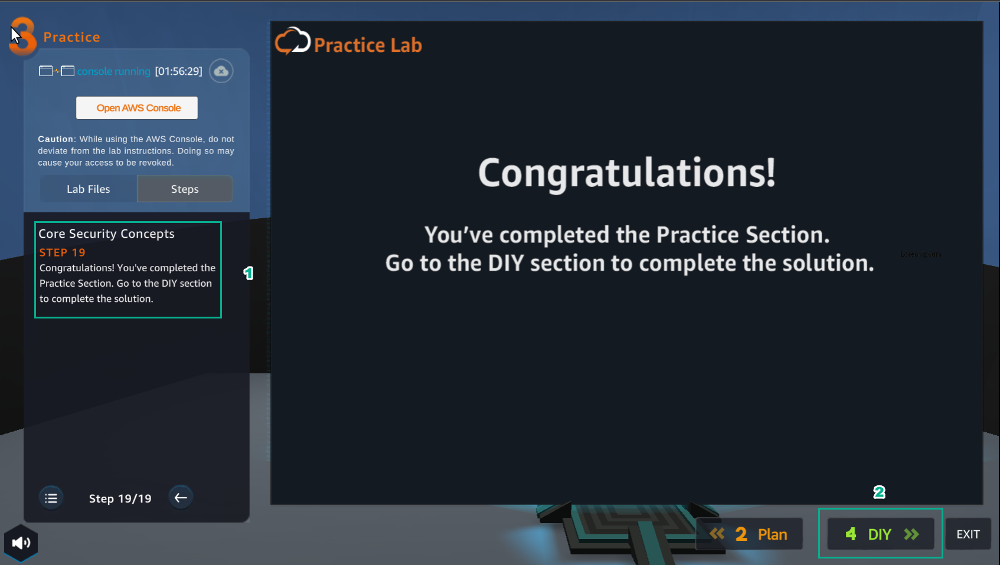

