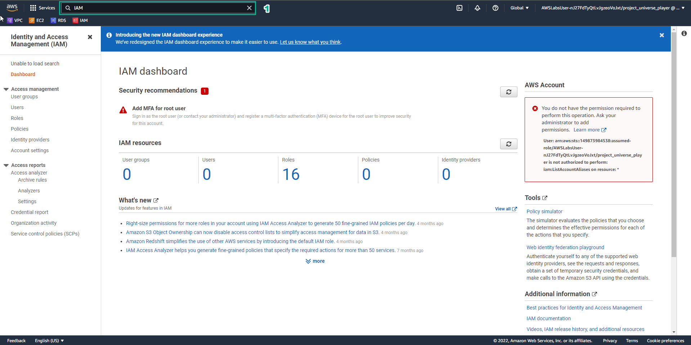
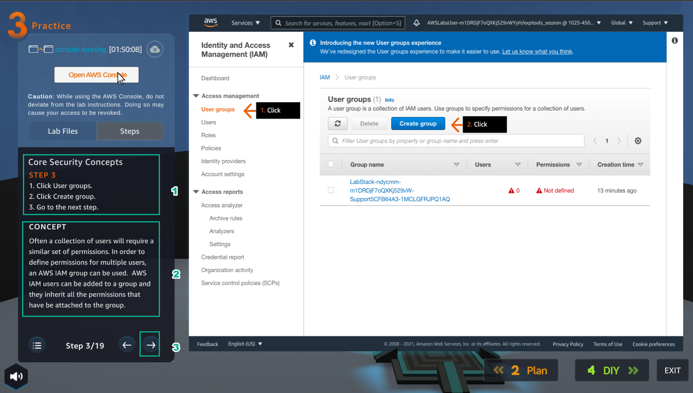
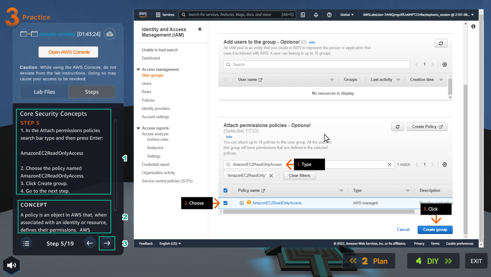
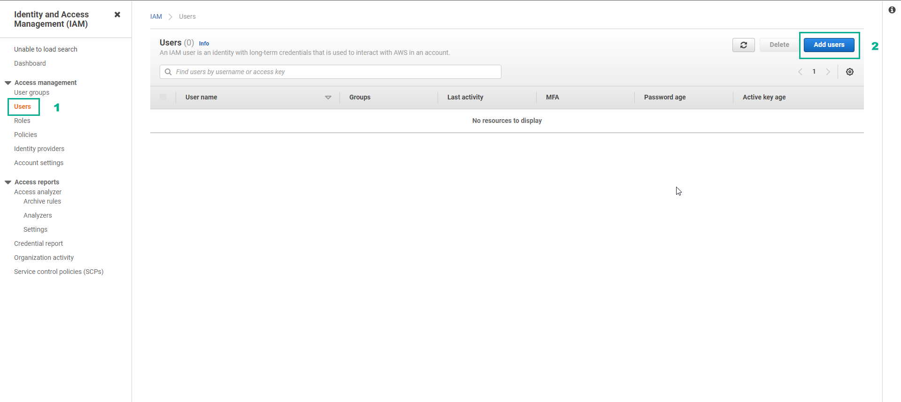
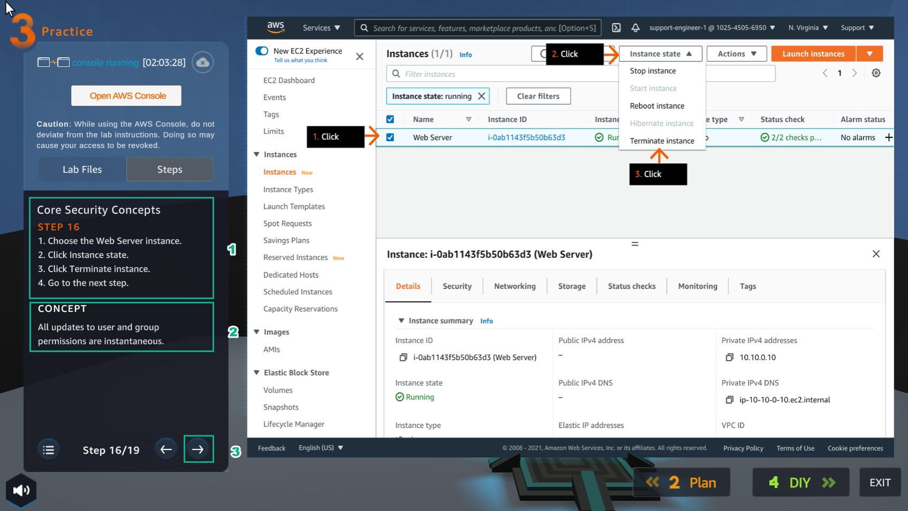
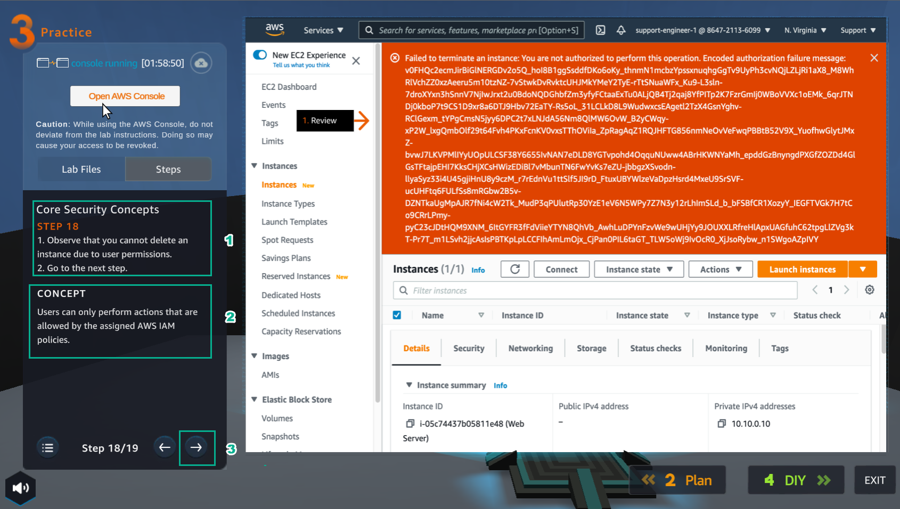
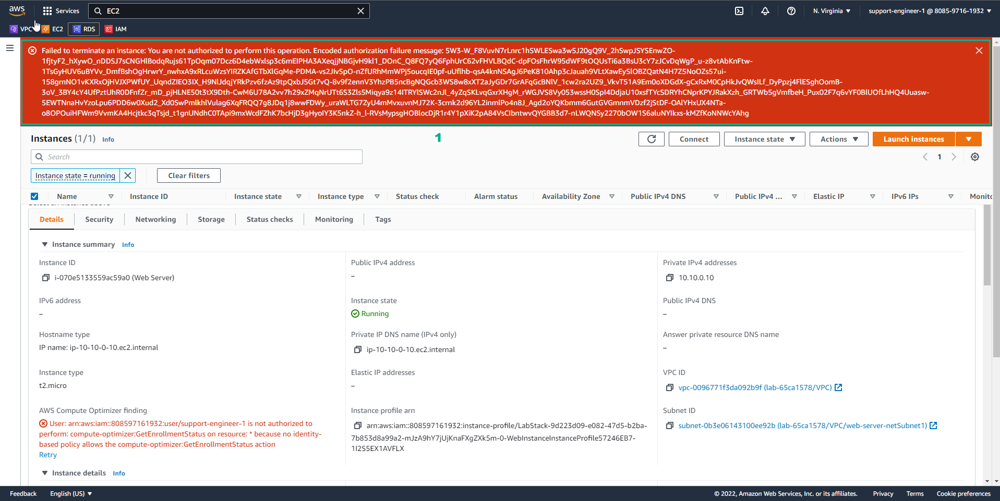

PRACTICE
========

.. admonition:: Info

 After watching Plan, the player prepares for Practice

1. In the Practice interface

- Read step 1 of Core Security Concepts
- Read CONCEPT
- Select START LAB
- Select the arrow to the right to see the next steps

2. In the Practice interface

- Read step 2 of Core Security Concepts
- Read CONCEPT
- Select Open AWS Console
- Select the arrow to the right to see the next steps

.. image:: pictures/0002-practice8.png
   :align: center
   :width: 7000px

3. In the AWS Console interface

- Find IAM
-  IAM

4. In the Practice interface

- Read step 3 of Core Security Concepts
- Read CONCEPT
- Select the arrow to the right to see the next steps

5. In the IAM interface

- Select Use groups
- Select Create group

6. In the Practice interface

- Read step 4 of Core Security Concepts
- Read CONCEPT
- Select the arrow to the right to see the next steps

.. image:: pictures/0006-practice8.png
   :align: center
   :width: 7000px

7. In the Create user group interface

- In User group name, enter SupportEngineers

.. image:: pictures/0007-practice8.png
   :align: center
   :width: 7000px

8. In the Practice interface

- Read step 5 of Core Security Concepts
- Read CONCEPT
- Select the arrow to the right to see the next steps

9. In the IAM interface

- Find AmazonEC2ReadOnlyAccess
- Select Enter
- Select AmazonEC2ReadOnlyAccess
- Select Create group

10. Initialization result

.. image:: pictures/00010-practice8.png
   :align: center
   :width: 7000px

11. In the Practice interface

- Read step 6 of Core Security Concepts
- Read CONCEPT
- Select the arrow to the right to see the next steps

12. In the IAM interface

- Select Users
- Select Add users

13. In the Add user interface

- In User name, enter support-engineer-1
- In Select AWS credential type, select Access key - Programmatic access
- Select Password - AWS Management Console access
- Select Custom password, enter supportPassword!123
- Uncheck Require password reset

.. image:: pictures/00013-practice8.png
   :align: center
   :width: 7000px

14. In the Practice interface

- Read step 1 of Core Security Concept
- Read CONCEPT
- Select the arrow to the right to see the next steps

.. image:: pictures/00014-practice8.png
   :align: center
   :width: 7000px

15. In the IAM* interface

- Select Add user to group
- Select SupportEngineers
- View Attached policies
- Select Next Tags

.. image:: pictures/00015-practice8.png
   :align: center
   :width: 7000px

16. In the Practice interface

- Read step 1 of Core Security Concepts
- Read CONCEPT
- Select the arrow to the right to see the next steps

.. image:: pictures/00016-practice8.png
   :align: center
   :width: 7000px

17. In the Add user interface

- Key, enter job-title
- Value, enter Support Engineer
- Select Next: Review

.. image:: pictures/00017-practice8.png
   :align: center
   :width: 7000px

18. In the Practice interface

- Read step 1 of Core Security Concepts
- Read CONCEPT
- Select the arrow to the right to see the next steps

.. image:: pictures/00018-practice8.png
   :align: center
   :width: 7000px

19. In the Add user interface

- View User details
- View Permissions summary
- View Tags
- Select Create user

.. image:: pictures/00019-practice8.png
   :align: center
   :width: 7000px

20. In the Practice interface

- Read step 11 of Core Security Concepts
- Read CONCEPT
- Select the arrow to the right to see the next steps

.. image:: pictures/00020-practice8.png
   :align: center
   :width: 7000px

21. In the Add user interface

- See successful user initialization
- Choose the login path
- Select Close

.. image:: pictures/00021-practice8.png
   :align: center
   :width: 7000px

22. In the Practice interface

- Read step 12 of Core Security Concepts
- Select the arrow to the right to see the next steps

.. image:: pictures/00022-practice8.png
   :align: center
   :width: 7000px

23. In the login interface

- Enter Account ID
- Enter IAM user name
- Enter Password
- Select Sign in

.. image:: pictures/00023-practice8.png
   :align: center
   :width: 7000px

24. Successful login interface

25. In the Practice interface

- Read step 13 of Core Security Concepts
- Read CONCEPT
- Select the arrow to the right to see the next steps

26. In the AWS Console interface

- Find EC2
- Select EC2

.. image:: pictures/00026-practice8.png
   :align: center
   :width: 7000px

27. In the Practice interface

- Read step 14 of Core Security Concepts
- Select the arrow to the right to see the next steps

28. In the AWS Console interface

- Select Region N. Virginia

.. image:: pictures/00028-practice8.png
   :align: center
   :width: 7000px

29. In the Practice interface

- Read step 15 of Core Security Concepts
- Read CONCEPT
- Select the arrow to the right to see the next steps

.. image:: pictures/00029-practice8.png
   :align: center
   :width: 7000px

30. In the EC2 interface

- Select Instances (running)

.. image:: pictures/00030-practice8.png
   :align: center
   :width: 7000px

31. In the Practice interface

- Read step 16 of Core Security Concepts
- Read CONCEPT
- Select the arrow to the right to see the next steps

32. In the EC2 interface

- Select Web Server
- Select Instance state
- Select Terminate instance

.. image:: pictures/00032-practice8.png
   :align: center
   :width: 7000px

33. In the Practice interface

- Read step 17 of Core Security Concepts
- Select the arrow to the right to see the next steps

34. In the EC2 interface

- In Terminate instance, select Terminate

35. In the Practice interface

- Read step 18 of Core Security Concepts
- Read CONCEPT
- Select the arrow to the right to see the next steps

36. Lab results

37. Congratulations to the player on completing the lab

