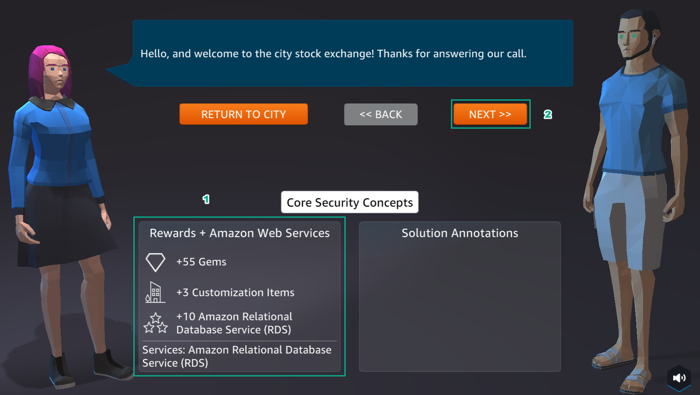

A8 - SECURITY
============

**Overview**

AWS Cloud Quest: Cloud Practitioner’s 8th lab is Defining Usr and Group Permissions using IAM Policies

1. In the city interface

- Select ASSIGNMENTS
- Select ROUTE AND GO
- Choose the icon !

.. image:: pictures/0001-security8.png
   :align: center
   :width: 7000px

2. In the city interface

- View Rewards
- Select NEXT

3. In the city interface

- See Solution Annotations
- Select ACCEPT

.. image:: pictures/0003-security8.png
   :align: center
   :width: 7000px

4. Select GO TO SOLUTION CENTER

.. toctree::
   :maxdepth: 1
   

   a8_learn
   a8_plan
   a8_practice
   a8_diy

