DIY
========

.. admonition:: Info

 After completing the lab, the player does DIY

1. In the AWS Console interface

- Find EC2
- Select EC2

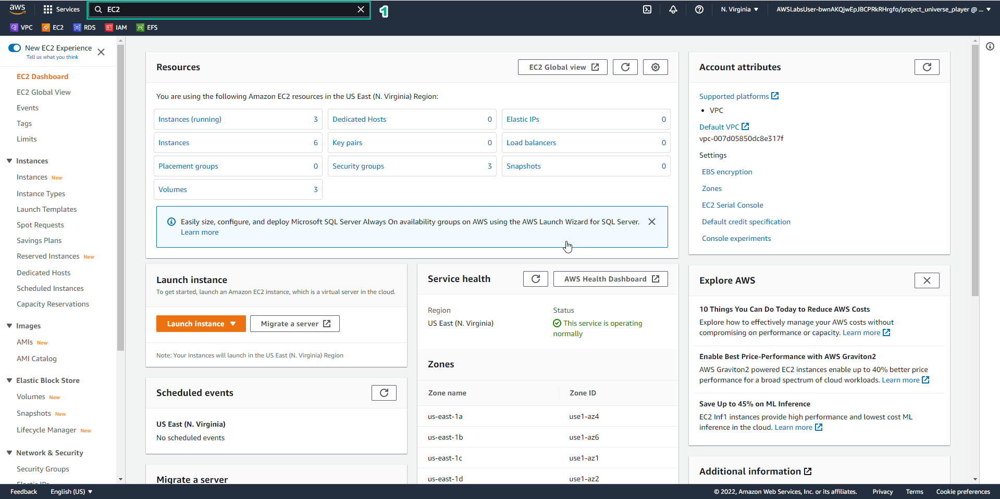

2. In the EC2 interface

- Select Instances
- View the instance

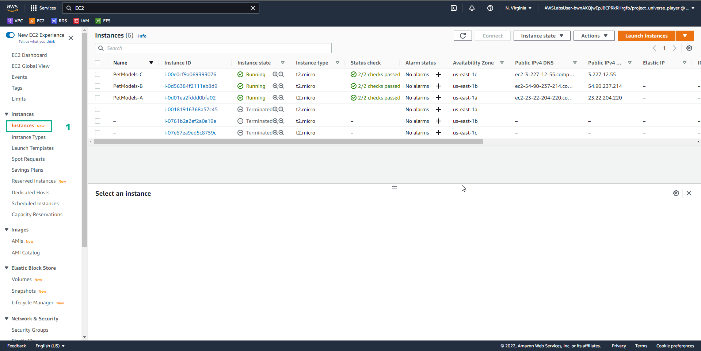

3. In EC2 interface

- Select Security Groups
- View Security Groups
- Select Create security group

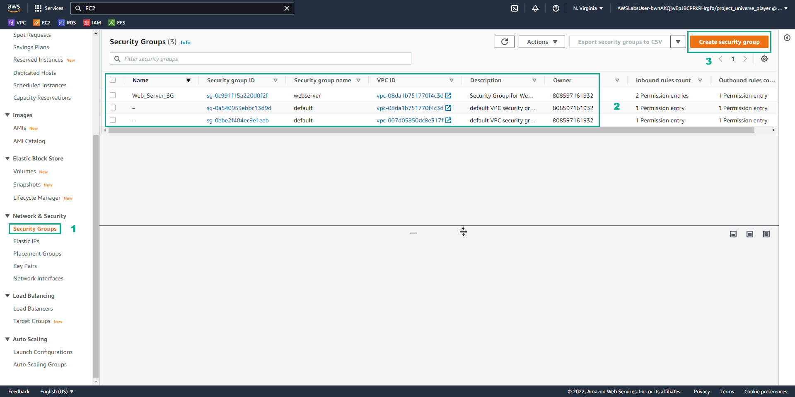

4. In the Create security group interface

- Security group name, enter PetModels-EFS-1-SG
- Description, enter Restric access to webservers only
- Select PetModels VPC

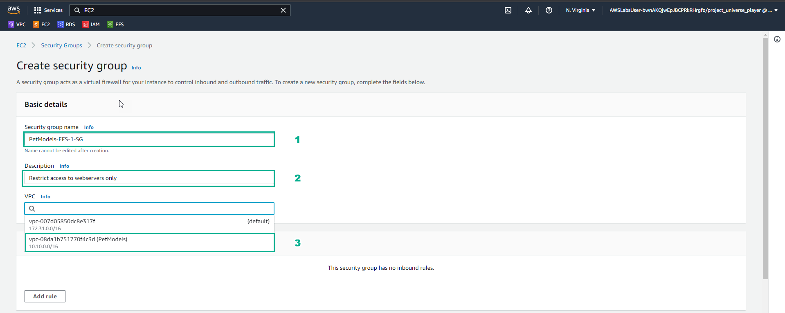

5. In the Create security group interface

- Select Add rule
- In Inbound rules, select NFS
- Select webserver Security group

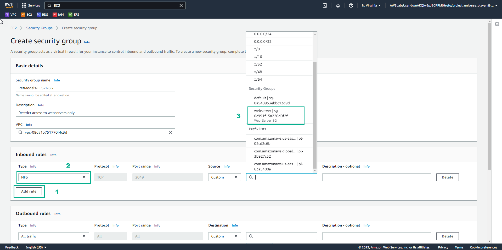

6. In the Create security group interface

- Select Create security group

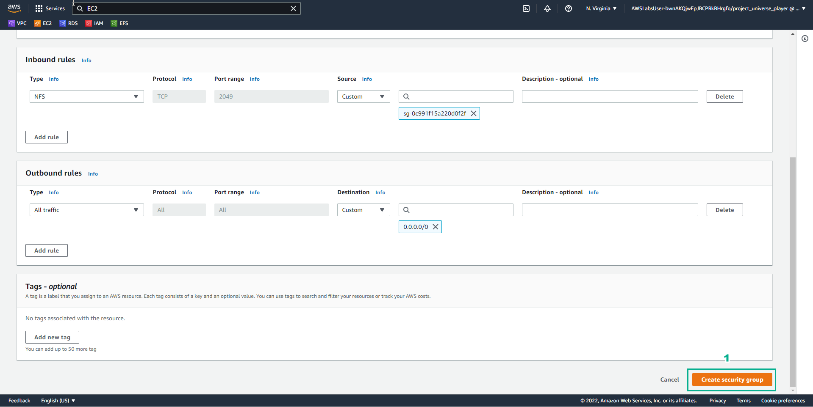

7. In the Security groups interface

- View Security group name
- View the Inbound rules

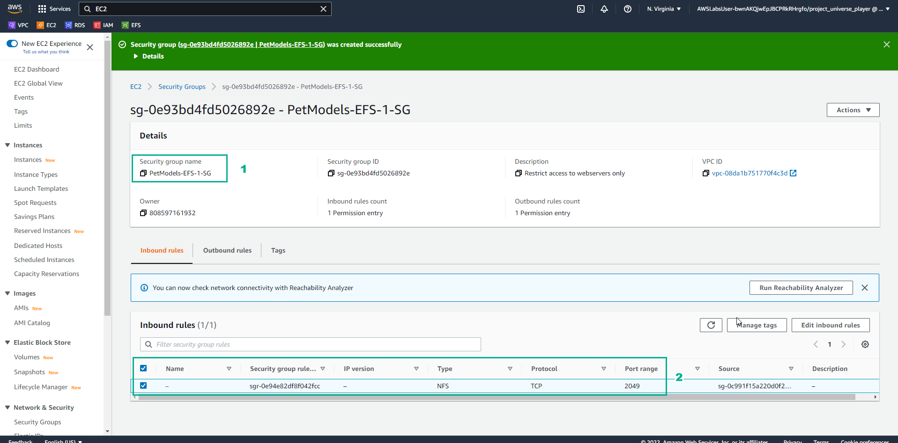

8. In the AWS Console interface

- Find EFS
- Select EFS

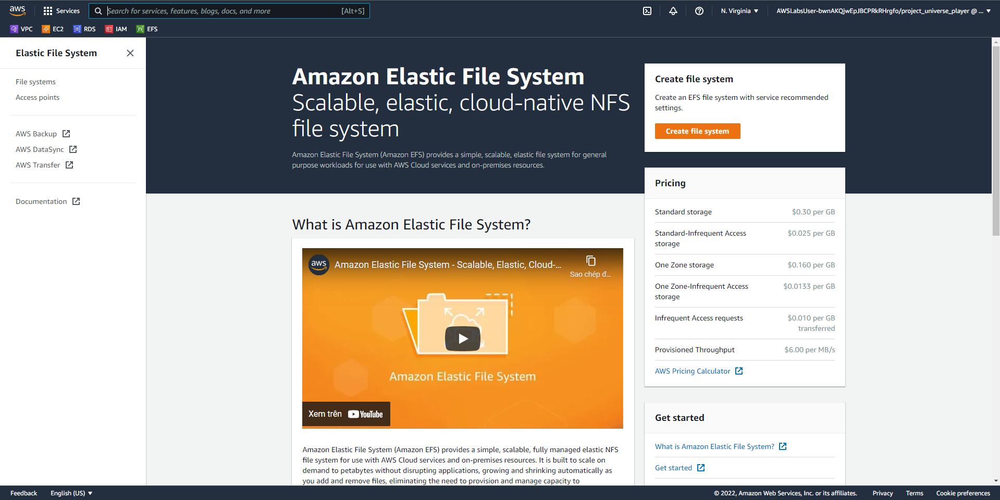

9. In the EFS interface

- Select Create file system

10. In the Create file system interface

- Name, enter PetModels-EFS-1
- VPC, select PetModels
- Select Regional
- Select Customize

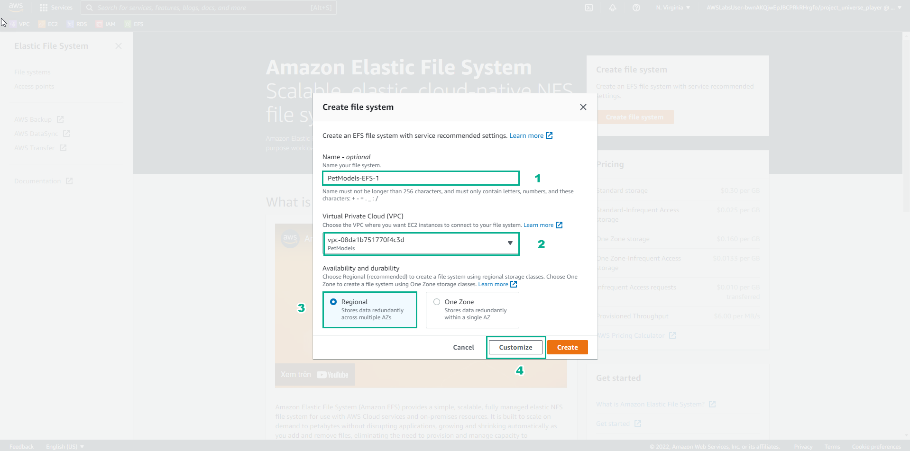

11. In the File Systems interface

- In Automatic backups, uncheck Enable automatic backups
- In Transition into A, select None

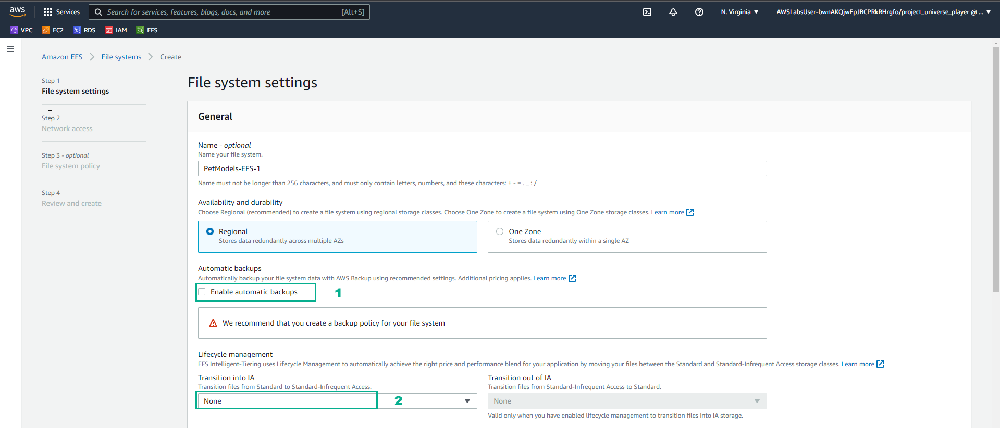

12. In the File systems interface

- Select Next

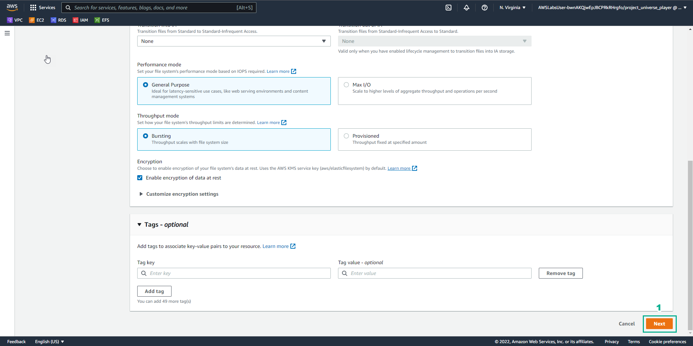

13. In the Network access interface

- Uncheck security group of us-east-1a
- Select Remove the remaining AZs

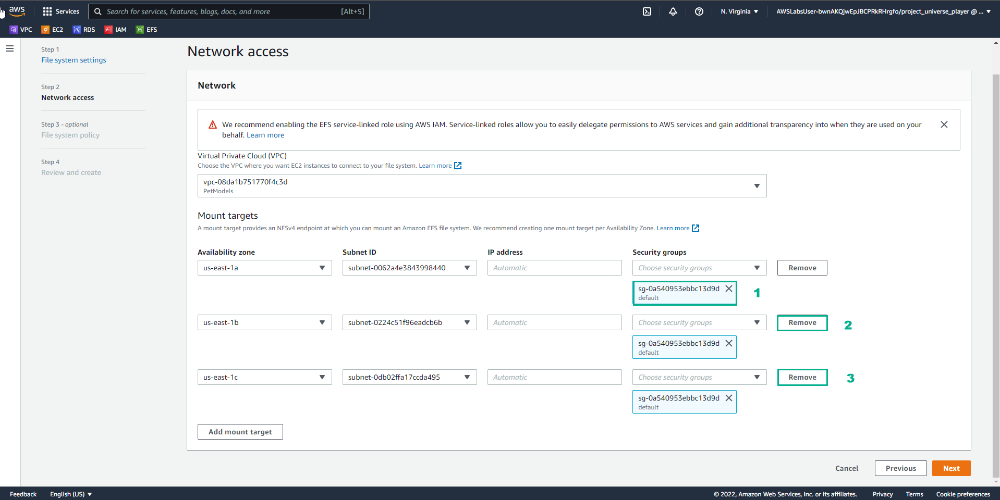

14. In the Network access interface

- Select us-east-1a
- select Subnet ID
- Select Security group
- Select Next

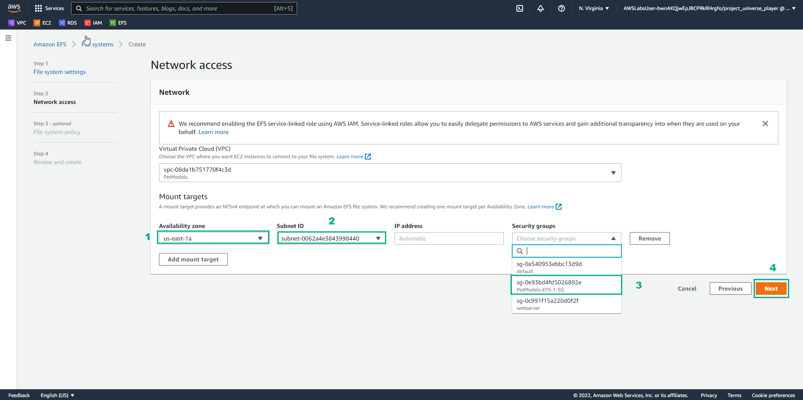

15. In the File system policy interface

- Select Next

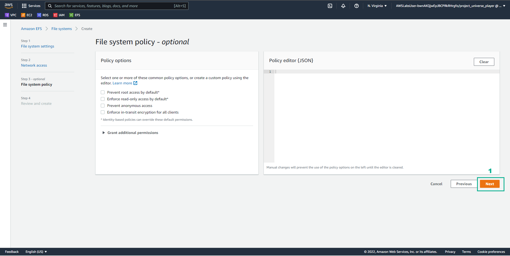

16. In the Create file system interface

- Select Create

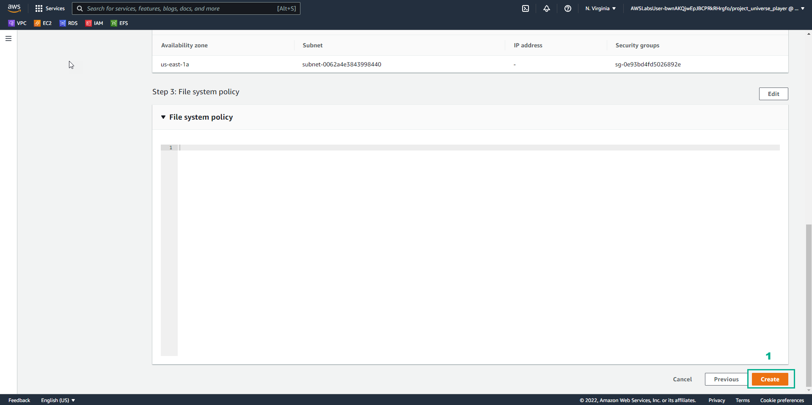

17. In the File System interface

- See the successful file system initialization
- Select PetModels-EFS-1

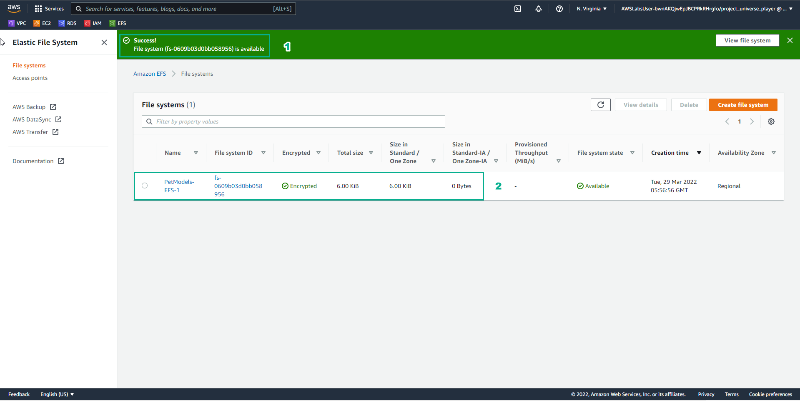

18. In the PetModels-EFS-1 interface

- Select Attach

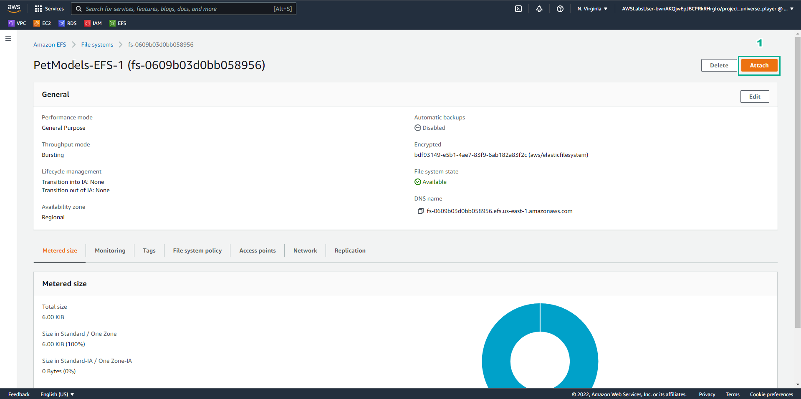

19. In the Attach interface

- Copy EFS mount helper
- Select Close

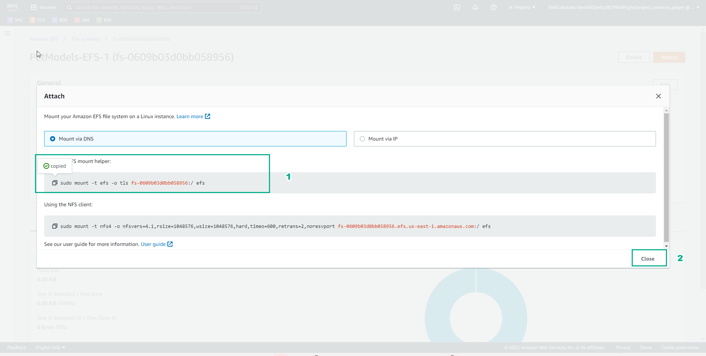

20. In the AWS Console interface

- Find EC2
- Select EC2

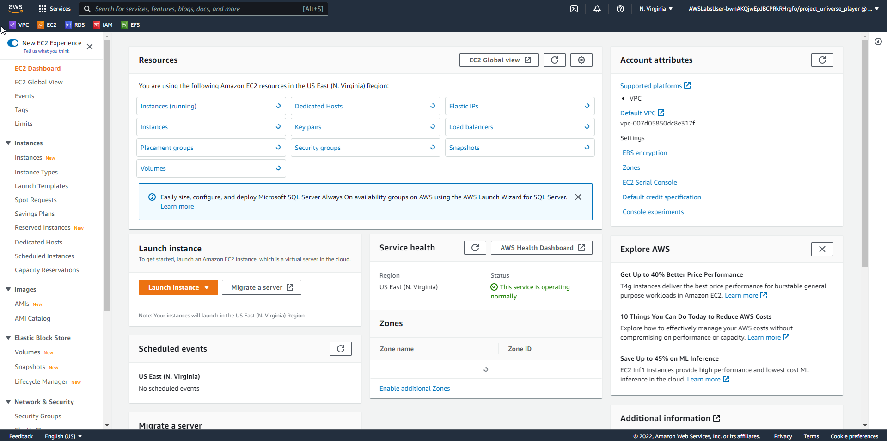

