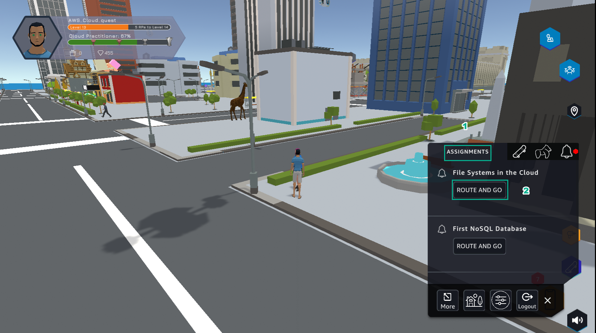
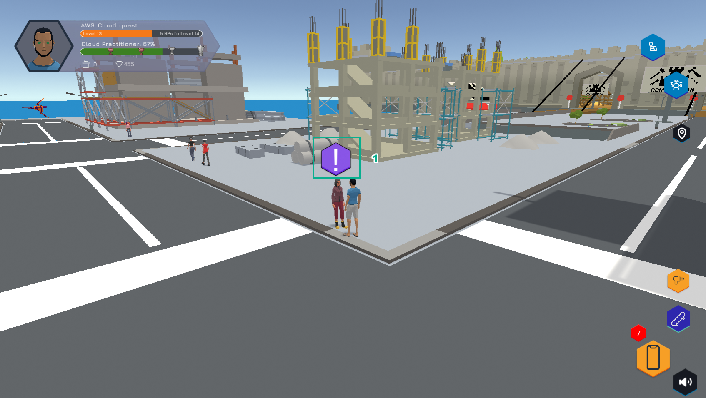
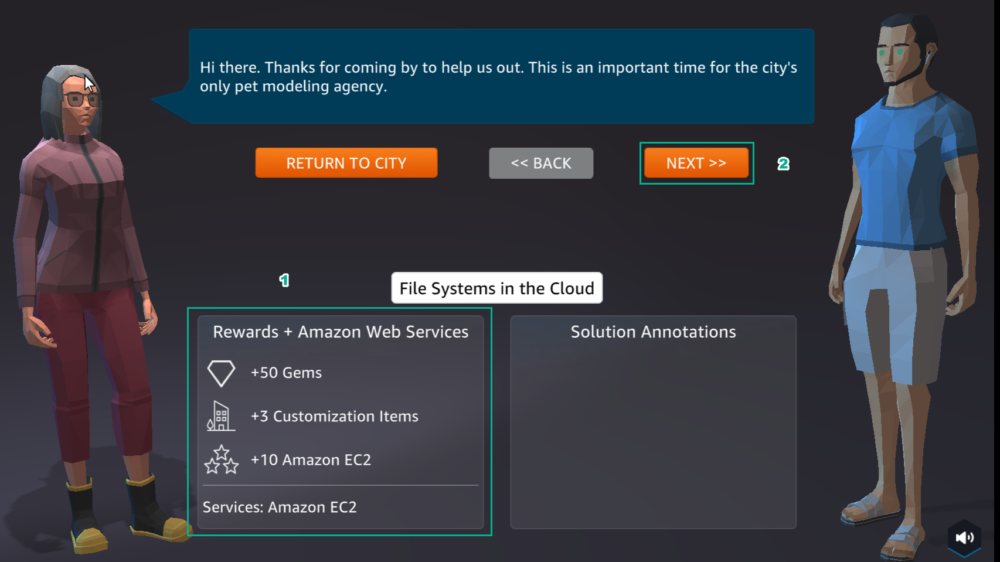
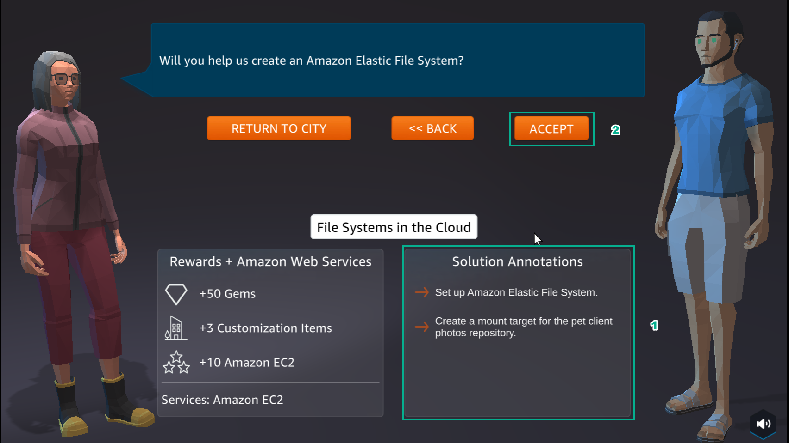
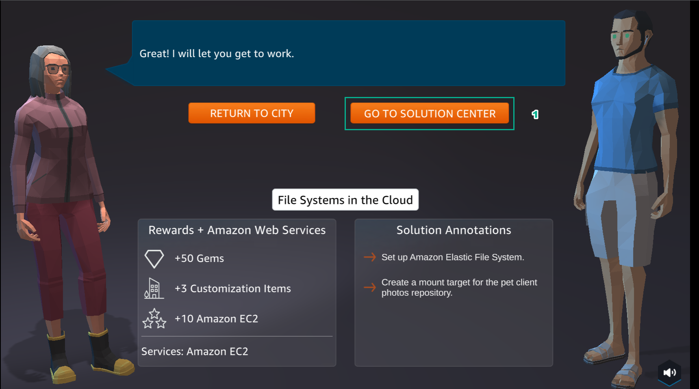

A9 - FILE SYSTEMS
============

**Overview**

Lab number 9 of AWS Cloud Quest: Cloud Practitioner is File System in the Cloud using Amazon EFS

1. In the city interface

- Select ASSIGNMENTS
- Select ROUTE AND GO

2. In the city interface

- Select the ! icon

3. In the File System in the Cloud interface

- View Rewards
- Select NEXT

4. In the File Systems in the Cloud interface

- See Solution Annotations
- Select ACCEPT

5. In the File Systems in the Cloud interface

- Select GO TO SOLUTION CENTER to prepare the next steps

.. toctree::
   :maxdepth: 1
   

   a9_learn
   a9_plan
   a9_practice
   a9_diy

