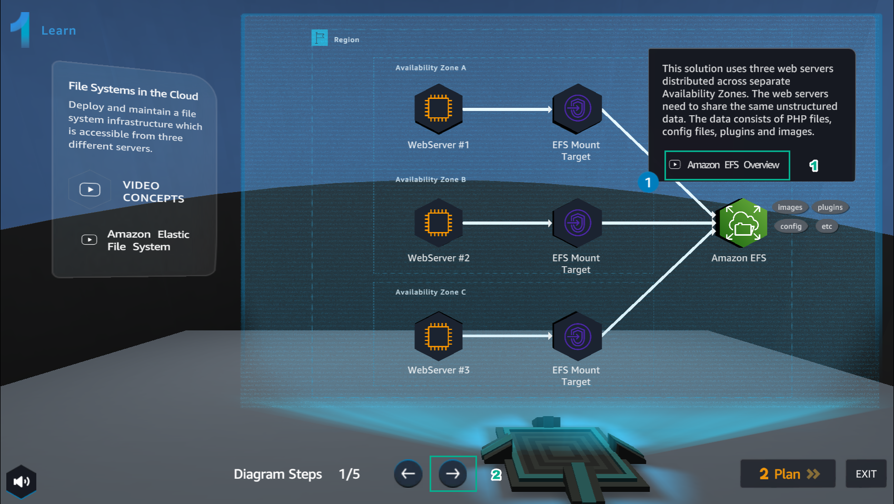
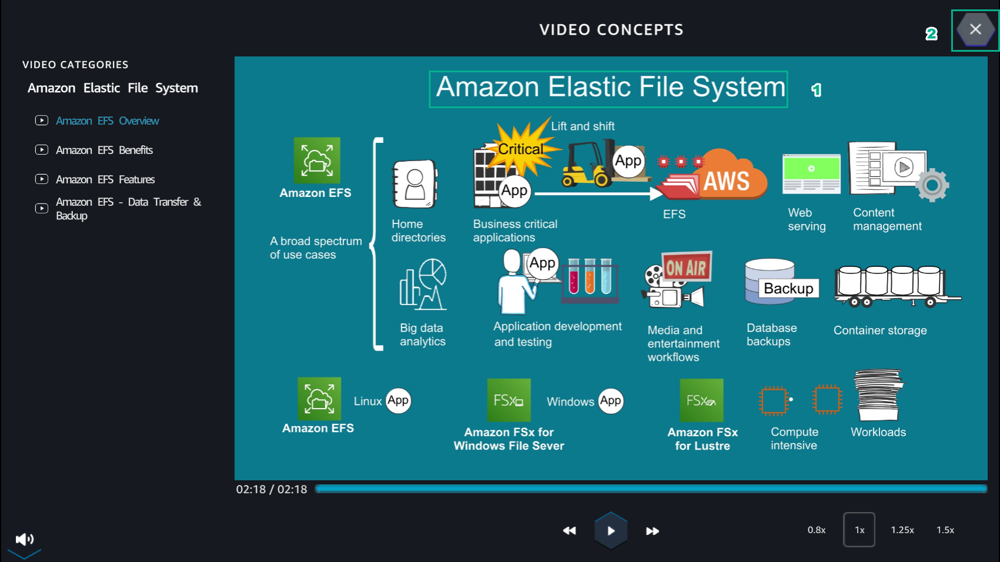
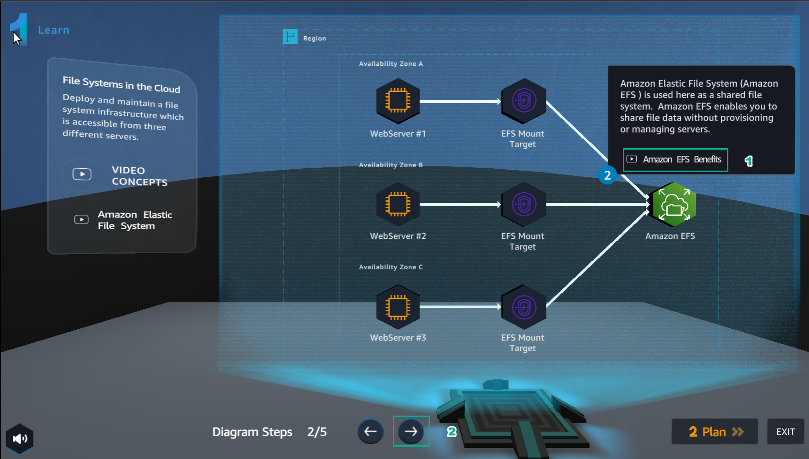
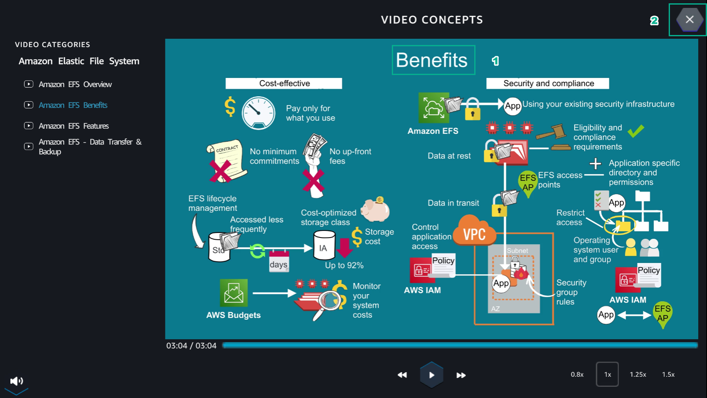
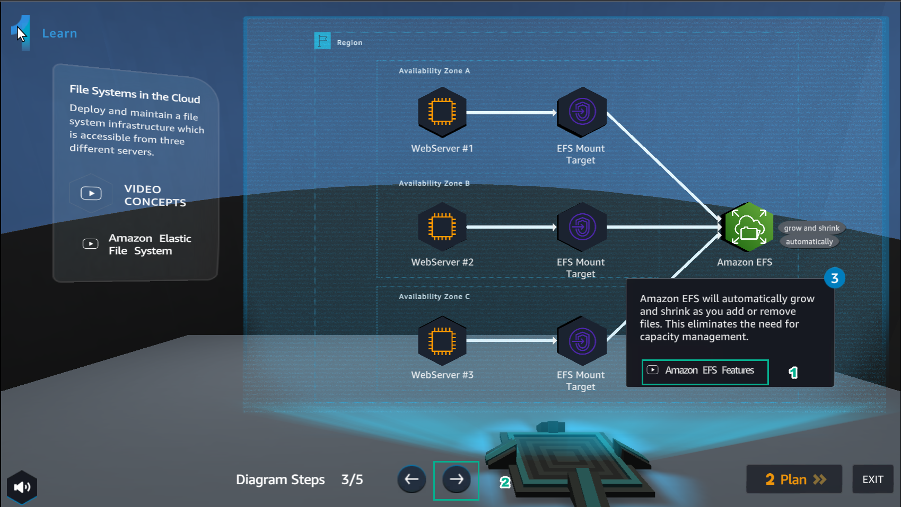
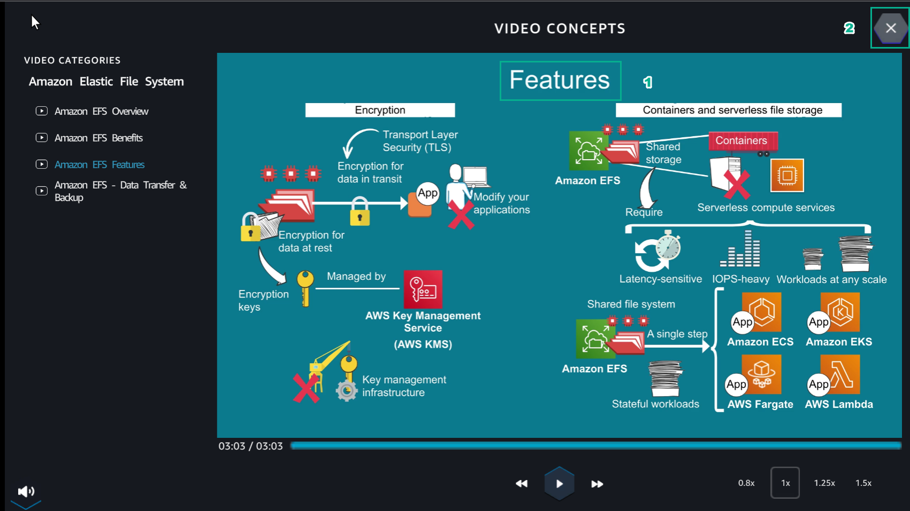
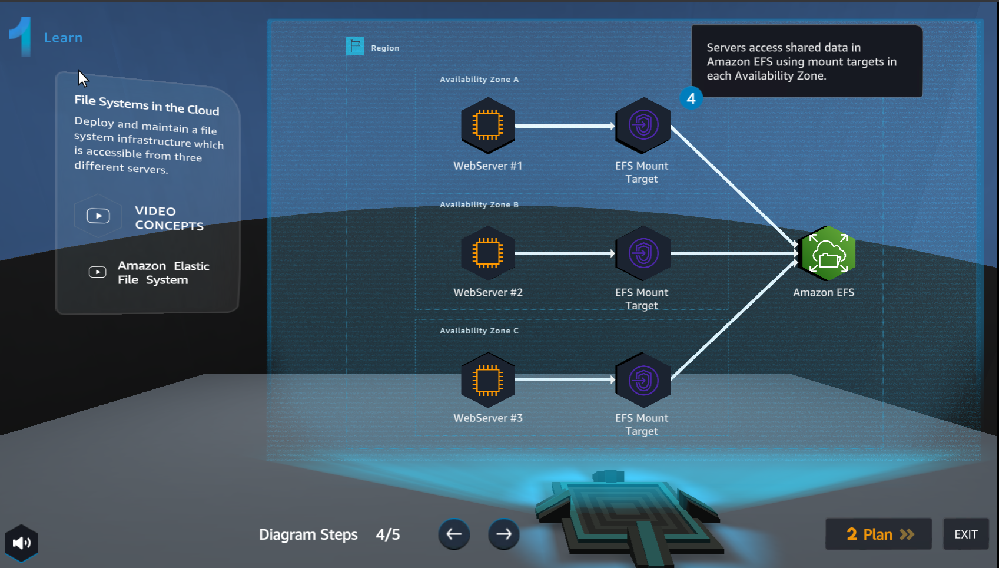
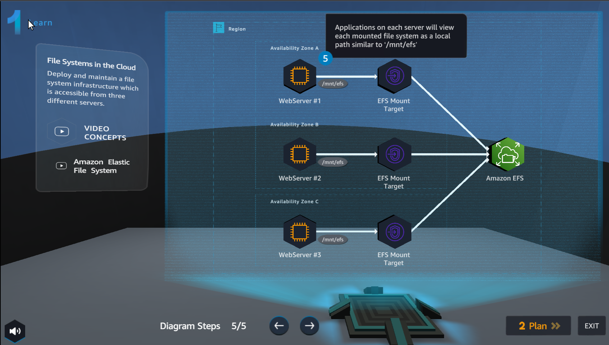

Learn
========

.. admonition:: Info

  Learn helps players to understand more theory about

1. In the Learn interface

- Select Amazon EFS Overview

2. In the VIDEO CONCEPTS interface

- Watch video Amazon EFS Overview
- Select X to exit

3. In the Learn interface

- Select Amazon EFS Benefits

4. In the VIDEO CONCEPTS interface

- Watch video Amazon EFS Benefits
- Select X to exit

5. In the Learn interface

- Select Amazon EFS Features

6. In the VIDEO CONCEPTS interface

- Watch video Amazon EFS Features

7. In the Learn interface

- See step 4 of Diagram Steps

8. In the Learn interface

- See step 5 of Diagram Steps

