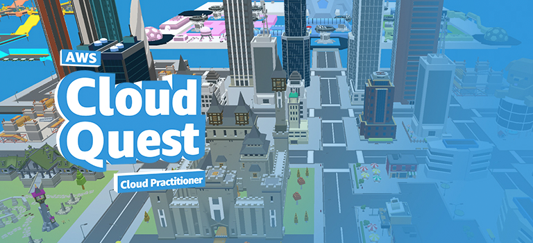

.. raw:: html

   <h1 class="center-title">INTRODUCTION</h1>

**AWS Cloud Quest: Cloud Practitioner** is an interactive, educational game created by Amazon Web Services (AWS) designed to teach cloud computing fundamentals. The game uses a role-playing approach, where players take on the role of a character solving real-world business challenges with AWS cloud services.

This game is ideal for beginners who want to get hands-on experience with AWS and gain foundational knowledge about cloud technologies. It provides a playful and engaging way to learn about cloud concepts while solving practical tasks and problems.

Main Features:

- **Interactive Learning**: Players complete quests and challenges that help reinforce AWS concepts.
- **Core AWS Services**: Learn about essential AWS services like EC2, S3, Lambda, RDS, IAM, and more.
- **Gamified Experience**: Enjoy the fun and immersive RPG-style game design.
- **Cloud Best Practices**: Understand how to use AWS effectively and securely in real-world scenarios.

With AWS Cloud Quest, users will also be prepared for the **AWS Certified Cloud Practitioner** exam, which is a foundational-level certification in cloud computing.

How It Works

In the game, you’ll:
1. Start by creating an AWS account.
2. Complete quests related to AWS services and cloud concepts.
3. Earn rewards and unlock more advanced lessons as you progress.
4. Solve cloud-related challenges, such as deploying servers, managing databases, and understanding security and pricing models.

By the end of the game, players will have the practical knowledge needed to pursue AWS certifications and begin their journey into the cloud computing world.

---

.. note::

   AWS Cloud Quest is regularly updated to incorporate the latest advancements in cloud technologies. This makes it an excellent resource for staying up to date with current cloud practices.

