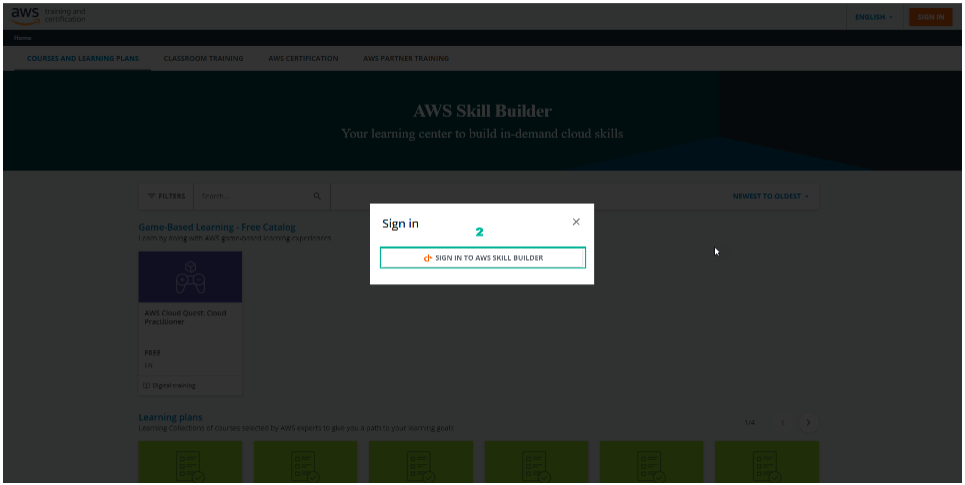
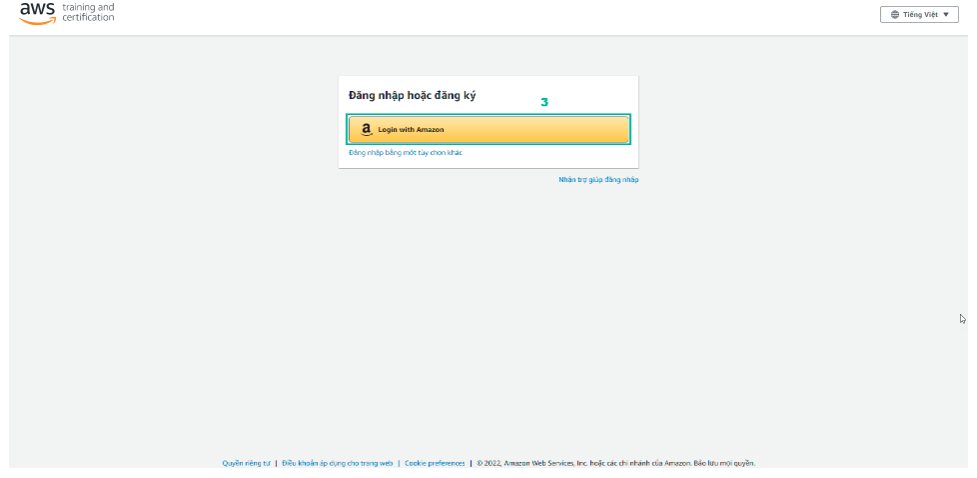
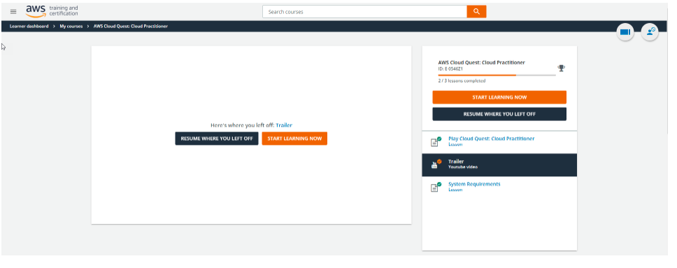

Login on Amazon account
===============

There are four options for logging into AWS Training and Certification:

- Login with Amazon  
- AWS Partner  
- Organization SSO  
- Amazon Employee  

.. note::

   This lab uses the **Login with Amazon** method.

Steps to Sign In to AWS Training and Certification

1. Go to https://skillbuilder.aws/
2. Click **SIGN IN TO AWS SKILL BUILDER**

3. The AWS Training and Certification login interface appears. Select **Login with Amazon**

4. The Amazon login page appears:

   - Enter **Email or mobile phone number**
   - Enter **Password**
   - Then, select **Sign-In**

5. After logging in, the AWS Training and Certification interface appears.

.. note::

   Note: During the login process, as shown in the picture, select Allow

